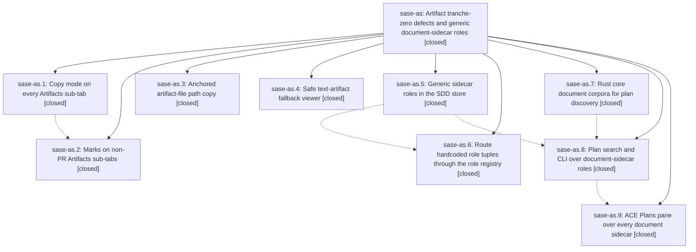

# Bead: sase-as — Artifact tranche-zero defects and generic document-sidecar roles

[Bead Pages](../README.md) / sase-as

**Status:** ✓ closed · **Resolution:** done · **Type:** plan · **Tier:** epic
**Owner:** `bryanbugyi34@gmail.com` · **Assignee:** `sase-as.land`
**Created:** 2026-07-29 14:30:48 UTC · **Closed:** 2026-07-29 16:08:58 UTC
**Plan:** [202607/artifact\_tranche\_zero\_and\_generic\_sidecar\_roles.md](https://github.com/sase-org/sase--plans/blob/main/202607/artifact_tranche_zero_and_generic_sidecar_roles.md)

## Description

Copy mode and marks work on every Artifacts sub-tab, artifact-file path copies are unambiguous, the text-artifact fallback viewer is safe without `bat`, and no SASE code names the `research` sidecar: every user-defined document sidecar gets the behavior `research` has today.

## Notes

[2026-07-29T16:08:58Z · sase-as.land] Land verification: read the source for all 9 phases and confirmed each is really implemented — copy_tab_content/toggle_mark/clear_marks admitted in NON_PRS_ARTIFACT_ACTIONS with sub-tab-first dispatch (_handle_artifacts_copy_key, action_toggle_mark) and artifacts_{commits,plans,chats,bugs} copy-key blocks kept in sync between mode_keymaps.py and default_config.yml; marks keyed on ArtifactEntryTarget with marked-set bulk copy; _artifact_file_clipboard_path now prefers the stored path, always anchors, names the origin, and _workspace_relative_path is gone; the cat fallback replaced by the bounded, NUL/decode-ratio-refusing, control-neutralizing artifact_text_dump module; SddStoreRecord.sidecars role map with plans-only materialization; no ('plans','research','beads') tuples left and the only remaining 'research' literals are the documented shipped-preset/legacy-layout/seed-config exceptions; sase-core commit 13cb8b7 adding (root, kind) document corpora released as v0.12.10; role-labeled corpora in the plan-search facade with project-aware --kind validation (verified live: 'sase plan search --kind designs' errors naming valid values); ACE Plans pane over document_sidecar_roles with per-role error isolation and a kind facet. Integration with post-start commits: bumped sase-core-rs 0.12.9 -> 0.12.10 in pyproject.toml plus uv.lock, because sase-ar.land's 17fc09cd set the floor at 0.12.9 while this epic's facade passes document_corpora as an 11th positional argument that 0.12.9's binding rejects; updated tests/test_sase_core_rs_telemetry_smoke_tool.py's declared-minimum pin, which 17fc09cd had left asserting 0.12.8 (already red on master); added the missing PROMPT link to this epic's plan file, clearing its two plan-link validation errors; and accepted 3 AXE description PNG goldens made stale by closed epic sase-ar's structured chop-result card. just check is green through fmt/keep-sorted/ruff/mypy/pyscripts/symvision/toobig; full suite 23,683 passed / 7 skipped with one load-sensitive stall-watchdog flake that passes in isolation. Remaining repo-validation failure belongs to in-progress epic sase-at (202607/notification_release_report.md missing its prompt link).

## Phases

| Bead | Title | Status | Size | Agents | Commits |
|---|---|---|---|---:|---:|
| [sase-as.1](sase-as.1.md) | Copy mode on every Artifacts sub-tab | ✓ closed | medium | 1 | 1 |
| [sase-as.2](sase-as.2.md) | Marks on non-PR Artifacts sub-tabs | ✓ closed | medium | 1 | 1 |
| [sase-as.3](sase-as.3.md) | Anchored artifact-file path copy | ✓ closed | small | 1 | 1 |
| [sase-as.4](sase-as.4.md) | Safe text-artifact fallback viewer | ✓ closed | small | 1 | 1 |
| [sase-as.5](sase-as.5.md) | Generic sidecar roles in the SDD store | ✓ closed | medium | 1 | 1 |
| [sase-as.6](sase-as.6.md) | Route hardcoded role tuples through the role registry | ✓ closed | medium | 1 | 1 |
| [sase-as.7](sase-as.7.md) | Rust core document corpora for plan discovery | ✓ closed | medium | 1 | 1 |
| [sase-as.8](sase-as.8.md) | Plan search and CLI over document-sidecar roles | ✓ closed | medium | 1 | 1 |
| [sase-as.9](sase-as.9.md) | ACE Plans pane over every document sidecar | ✓ closed | medium | 1 | 1 |

## Lineage

## Agents

| Agent | Bead | Commits |
|---|---|---:|
| [bbugyi200.athena.sase-as.1](https://github.com/sase-org/sase--agents/blob/main/agents/bbugyi200.athena.sase-as.1/README.md) | [sase-as.1](sase-as.1.md) | 1 |
| [bbugyi200.athena.sase-as.2](https://github.com/sase-org/sase--agents/blob/main/agents/bbugyi200.athena.sase-as.2/README.md) | [sase-as.2](sase-as.2.md) | 1 |
| [bbugyi200.athena.sase-as.3](https://github.com/sase-org/sase--agents/blob/main/agents/bbugyi200.athena.sase-as.3/README.md) | [sase-as.3](sase-as.3.md) | 1 |
| [bbugyi200.athena.sase-as.4](https://github.com/sase-org/sase--agents/blob/main/agents/bbugyi200.athena.sase-as.4/README.md) | [sase-as.4](sase-as.4.md) | 1 |
| [bbugyi200.athena.sase-as.5](https://github.com/sase-org/sase--agents/blob/main/agents/bbugyi200.athena.sase-as.5/README.md) | [sase-as.5](sase-as.5.md) | 1 |
| [bbugyi200.athena.sase-as.6](https://github.com/sase-org/sase--agents/blob/main/agents/bbugyi200.athena.sase-as.6/README.md) | [sase-as.6](sase-as.6.md) | 1 |
| [bbugyi200.athena.sase-as.7](https://github.com/sase-org/sase--agents/blob/main/agents/bbugyi200.athena.sase-as.7/README.md) | [sase-as.7](sase-as.7.md) | 1 |
| [bbugyi200.athena.sase-as.8](https://github.com/sase-org/sase--agents/blob/main/agents/bbugyi200.athena.sase-as.8/README.md) | [sase-as.8](sase-as.8.md) | 1 |
| [bbugyi200.athena.sase-as.9](https://github.com/sase-org/sase--agents/blob/main/agents/bbugyi200.athena.sase-as.9/README.md) | [sase-as.9](sase-as.9.md) | 1 |
| [bbugyi200.athena.sase-as.land](https://github.com/sase-org/sase--agents/blob/main/agents/bbugyi200.athena.sase-as.land/README.md) | [sase-as](README.md) | 2 |

## Commits

| Commit | Subject | Bead | Committed (UTC) |
|---|---|---|---|
| [`sase-core@13cb8b7`](https://github.com/sase-org/sase-core/commit/13cb8b72e5bdae6ad3ebb7af0cee597cc79f4cd2) | feat(plan): support explicit document corpora | [sase-as.7](sase-as.7.md) | 2026-07-29 14:53:39 |
| [`02e8384`](https://github.com/sase-org/sase/commit/02e83845b1ef0fa7e173915a1a010fe27cfa047a) | fix(ace): safely dump text artifact fallback | [sase-as.4](sase-as.4.md) | 2026-07-29 14:56:58 |
| [`69d403c`](https://github.com/sase-org/sase/commit/69d403c4c7f17f665cccaffd52dc910be8177c99) | fix(ace): anchor artifact-file path copy | [sase-as.3](sase-as.3.md) | 2026-07-29 14:58:27 |
| [`7d41d17`](https://github.com/sase-org/sase/commit/7d41d17a02a44aea76dbe7f19d800bb24d0889c9) | feat(ace): add copy mode to artifact sub-tabs | [sase-as.1](sase-as.1.md) | 2026-07-29 15:03:16 |
| [`70a22c3`](https://github.com/sase-org/sase/commit/70a22c347e617988e3a25b62975ab12837ea4444) | feat(sdd): support generic sidecar roles | [sase-as.5](sase-as.5.md) | 2026-07-29 15:07:29 |
| [`5f554c3`](https://github.com/sase-org/sase/commit/5f554c3ea4112ef6e472ef5eced04978776298d5) | feat(plan-search): support generic document sidecar roles | [sase-as.8](sase-as.8.md) | 2026-07-29 15:25:44 |
| [`107904b`](https://github.com/sase-org/sase/commit/107904b6bea97c5d036921b2fbbc7ee92e7ceb0e) | feat(sdd): route document sidecars through role registry | [sase-as.6](sase-as.6.md) | 2026-07-29 15:32:05 |
| [`d867a44`](https://github.com/sase-org/sase/commit/d867a44ff21343d9a193f9480c46435f881ef5fd) | feat(ace): support marks across artifact panes | [sase-as.2](sase-as.2.md) | 2026-07-29 15:40:10 |
| [`880c9c8`](https://github.com/sase-org/sase/commit/880c9c891757ac2c1e3a29e6fc98f3ef2b056c31) | feat(ace): browse all document sidecars | [sase-as.9](sase-as.9.md) | 2026-07-29 15:47:26 |
| [`f3420f5`](https://github.com/sase-org/sase/commit/f3420f5d00c9cf889415d4e5db1c26a2be402023) | build(deps): require sase-core-rs\>=0.12.10 for document corpora | [sase-as](README.md) | 2026-07-29 16:10:41 |
| [`sase--plans@54d6f8a`](https://github.com/sase-org/sase--plans/commit/54d6f8a2fb97b91bf114aeae012902ba5e54604b) | docs(plans): mark the artifact tranche-zero plan done | [sase-as](README.md) | 2026-07-29 16:11:42 |
