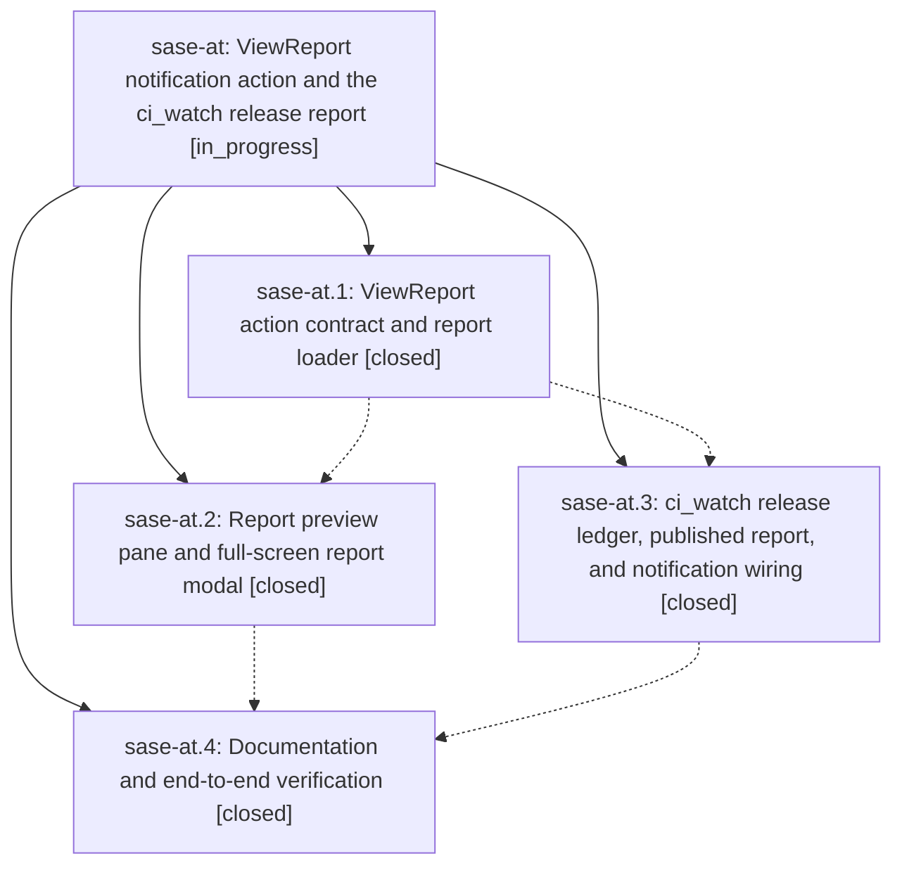

# Bead: sase-at — ViewReport notification action and the ci\_watch release report

[Bead Pages](../README.md) / sase-at

**Status:** ◐ in_progress · **Type:** plan · **Tier:** epic
**Owner:** `bryanbugyi34@gmail.com` · **Assignee:** `sase-at.land`
**Created:** 2026-07-29 14:54:50 UTC
**Plan:** [202607/notification\_release\_report.md](https://github.com/sase-org/sase--plans/blob/main/202607/notification_release_report.md)

## Description

Selecting a ci_watch release notification in ACE opens a beautiful, current report of recently merged and still pending release PRs instead of raising "Unsupported notification action: (none)", and any producer can attach a structured report to a notification through a generic, fail-closed ViewReport action.

## Phases

| Bead | Title | Status | Size | Agents | Commits |
|---|---|---|---|---:|---:|
| [sase-at.1](sase-at.1.md) | ViewReport action contract and report loader | ✓ closed | medium | 1 | 1 |
| [sase-at.2](sase-at.2.md) | Report preview pane and full-screen report modal | ✓ closed | medium | 1 | 1 |
| [sase-at.3](sase-at.3.md) | ci\_watch release ledger, published report, and notification wiring | ✓ closed | medium | 1 | 0 |
| [sase-at.4](sase-at.4.md) | Documentation and end-to-end verification | ✓ closed | small | 1 | 1 |

## Lineage

## Agents

| Agent | Bead | Commits |
|---|---|---:|
| [bbugyi200.athena.sase-at.1](https://github.com/sase-org/sase--agents/blob/main/agents/bbugyi200.athena.sase-at.1/README.md) | [sase-at.1](sase-at.1.md) | 1 |
| [bbugyi200.athena.sase-at.2](https://github.com/sase-org/sase--agents/blob/main/agents/bbugyi200.athena.sase-at.2/README.md) | [sase-at.2](sase-at.2.md) | 1 |
| [bbugyi200.athena.sase-at.3](https://github.com/sase-org/sase--agents/blob/main/agents/bbugyi200.athena.sase-at.3/README.md) | [sase-at.3](sase-at.3.md) | 0 |
| [bbugyi200.athena.sase-at.4](https://github.com/sase-org/sase--agents/blob/main/agents/bbugyi200.athena.sase-at.4/README.md) | [sase-at.4](sase-at.4.md) | 1 |
| [bbugyi200.athena.sase-at.land](https://github.com/sase-org/sase--agents/blob/main/agents/bbugyi200.athena.sase-at.land/README.md) | [sase-at](README.md) | 0 |

## Commits

| Commit | Subject | Bead | Committed (UTC) |
|---|---|---|---|
| [`73cc28b`](https://github.com/sase-org/sase/commit/73cc28b7c5e6df26486971d62e2a4ac55debcf26) | feat(notifications): add generic report action contract | [sase-at.1](sase-at.1.md) | 2026-07-29 15:13:58 |
| [`1a4ad18`](https://github.com/sase-org/sase/commit/1a4ad1828148b7ae17fd9eaca457c82793224246) | feat(tui): add notification report viewer | [sase-at.2](sase-at.2.md) | 2026-07-29 15:42:29 |
| [`7396862`](https://github.com/sase-org/sase/commit/7396862437c034428ca25b4244beb4f0f92d325b) | docs: document the ViewReport notification action | [sase-at.4](sase-at.4.md) | 2026-07-29 16:30:51 |
