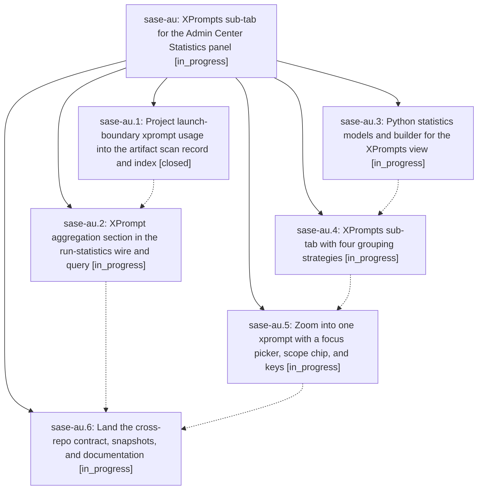

# Bead: sase-au — XPrompts sub-tab for the Admin Center Statistics panel

[Bead Pages](../README.md) / sase-au

**Status:** ◐ in_progress · **Type:** plan · **Tier:** epic
**Owner:** `bryanbugyi34@gmail.com` · **Assignee:** `sase-au.land`
**Created:** 2026-07-29 16:25:59 UTC
**Plan:** [202607/xprompt\_statistics.md](https://github.com/sase-org/sase--plans/blob/main/202607/xprompt_statistics.md)

## Description

The SASE Admin Center Statistics tab has an XPrompts sub-tab that reports which xprompts agent prompts actually used and how often, lets `g` regroup those counts by model, project, and co-usage, and lets the user zoom into one xprompt for a full breakdown of its models, projects, partner xprompts, and usage over time.

## Phases

| Bead | Title | Status | Size | Agents | Commits |
|---|---|---|---|---:|---:|
| [sase-au.1](sase-au.1.md) | Project launch-boundary xprompt usage into the artifact scan record and index | ✓ closed | medium | 1 | 1 |
| [sase-au.2](sase-au.2.md) | XPrompt aggregation section in the run-statistics wire and query | ◐ in_progress | medium | 0 | 0 |
| [sase-au.3](sase-au.3.md) | Python statistics models and builder for the XPrompts view | ◐ in_progress | medium | 0 | 0 |
| [sase-au.4](sase-au.4.md) | XPrompts sub-tab with four grouping strategies | ◐ in_progress | medium | 0 | 0 |
| [sase-au.5](sase-au.5.md) | Zoom into one xprompt with a focus picker, scope chip, and keys | ◐ in_progress | medium | 0 | 0 |
| [sase-au.6](sase-au.6.md) | Land the cross-repo contract, snapshots, and documentation | ◐ in_progress | medium | 0 | 0 |

## Lineage

## Agents

| Agent | Bead | Commits |
|---|---|---:|
| bbugyi200.athena.sase-au.1 | [sase-au.1](sase-au.1.md) | 1 |

## Commits

| Commit | Subject | Bead | Committed (UTC) |
|---|---|---|---|
| [`c3e88cf`](https://github.com/sase-org/sase-core/commit/c3e88cf66f2207c75672800cf9f722170c63fc69) | feat(scan): project xprompt usage into artifact records | [sase-au.1](sase-au.1.md) | 2026-07-29 16:37:17 |
