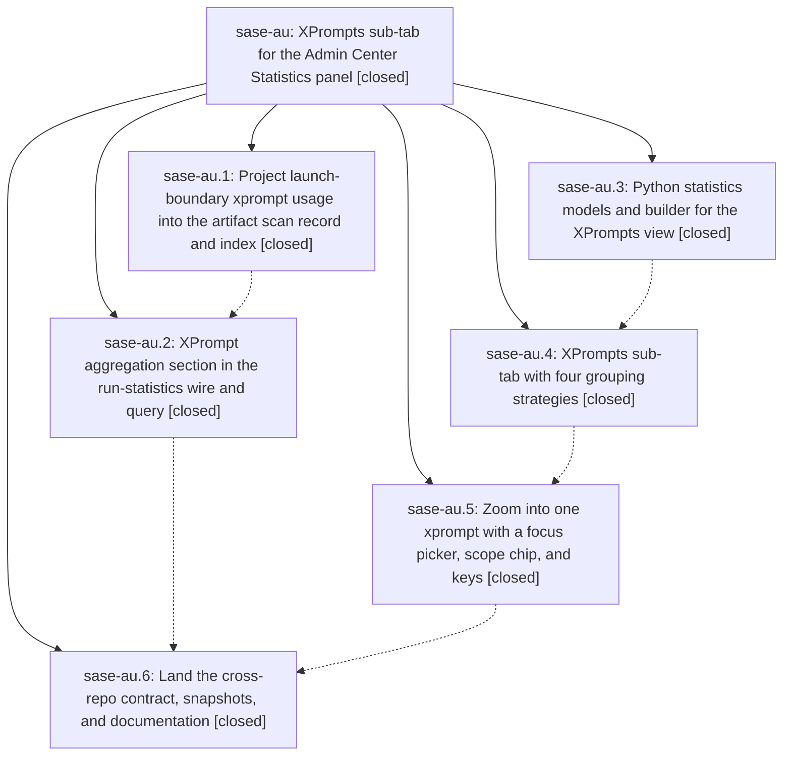

# Bead: sase-au — XPrompts sub-tab for the Admin Center Statistics panel

[Bead Pages](../README.md) / sase-au

**Status:** ✓ closed · **Resolution:** done · **Type:** plan · **Tier:** epic
**Owner:** `bryanbugyi34@gmail.com` · **Assignee:** `sase-au.land`
**Created:** 2026-07-29 16:25:59 UTC · **Closed:** 2026-07-29 19:20:31 UTC
**Plan:** [202607/xprompt\_statistics.md](https://github.com/sase-org/sase--plans/blob/main/202607/xprompt_statistics.md)

## Description

The SASE Admin Center Statistics tab has an XPrompts sub-tab that reports which xprompts agent prompts actually used and how often, lets `g` regroup those counts by model, project, and co-usage, and lets the user zoom into one xprompt for a full breakdown of its models, projects, partner xprompts, and usage over time.

## Notes

[2026-07-29T19:20:31Z · sase-au.land] Land verification: read the source and the epic's five commits plus the two sase-core commits (0.12.11). Confirmed core-scan (UsedXPromptWire on the scan record, xprompts.json in MARKER_FILES, xprompts_sig column, index schema 18->19 with migrate_record_json_refresh_v19), core-stats (run-statistics wire schema 4, the three request knobs, ranked rows with bounded model/project/partner cross-tabs, focused payload with providers/tribes/buckets, older-payload serde round-trip), py-stats (query knobs, XPrompt* view models, build_xprompts_view, StatisticsViews wiring, xprompt_focus on load_statistics_view), tui-view (ninth VIEW_ORDER entry after activity, statistics_pane_xprompts.py with the four g groupings, legends, unavailable/empty/truncation states, _project_cell display names), tui-focus (picker modal, x/X across app_keymaps, metadata, default_config.yml, sase.schema.json and docs/ace.md, scope chip, focused body, help controls and XPrompt methodology), and land (sase-core-rs floor 0.12.12 >= the 0.12.11 that carries both core phases, AGENT_ARTIFACT_INDEX_SCHEMA_VERSION 19, contract probe, four PNG snapshots, docs). Integration with work that landed alongside the epic: sase-av.2 had already raised the core floor past what land needed; sase-av.4's launch-time reference expansion sits downstream of the launch-boundary write_used_xprompts capture in run_agent_runner_setup, so the counting scope is intact; both epics' probes coexist in tools/validate_sase_core_rs. Two real gaps found and fixed here: (1) the four XPrompts PNG goldens were rendered before the concurrent numbered-Statistics-subtabs change (216d027d8) landed, so all four were stale on the tab strip and hint line -- regenerated and visually reviewed each one; (2) the plan's normative Python mirror of AgentArtifactRecordWire.used_xprompts was never added, leaving verify_agent_artifact_index blind to xprompt-only staleness -- added UsedXPromptWire, the converter branch, exports, and round-trip tests, and confirmed a real scan projects it (5,394 of 5,475 records). Also documented the numbered Statistics sub-tab jump in the Statistics tab section of docs/ace.md. just check: all static gates pass and the suite reaches 23,796 passed / 7 skipped, with one unrelated agent-retry countdown timing flake that passes in isolation.

## Phases

| Bead | Title | Status | Size | Agents | Commits |
|---|---|---|---|---:|---:|
| [sase-au.1](sase-au.1.md) | Project launch-boundary xprompt usage into the artifact scan record and index | ✓ closed | medium | 1 | 1 |
| [sase-au.2](sase-au.2.md) | XPrompt aggregation section in the run-statistics wire and query | ✓ closed | medium | 1 | 1 |
| [sase-au.3](sase-au.3.md) | Python statistics models and builder for the XPrompts view | ✓ closed | medium | 1 | 1 |
| [sase-au.4](sase-au.4.md) | XPrompts sub-tab with four grouping strategies | ✓ closed | medium | 1 | 1 |
| [sase-au.5](sase-au.5.md) | Zoom into one xprompt with a focus picker, scope chip, and keys | ✓ closed | medium | 1 | 1 |
| [sase-au.6](sase-au.6.md) | Land the cross-repo contract, snapshots, and documentation | ✓ closed | medium | 1 | 1 |

## Lineage

## Agents

| Agent | Bead | Commits |
|---|---|---:|
| [bbugyi200.athena.sase-au.1](https://github.com/sase-org/sase--agents/blob/main/agents/bbugyi200.athena.sase-au.1/README.md) | [sase-au.1](sase-au.1.md) | 1 |
| [bbugyi200.athena.sase-au.2](https://github.com/sase-org/sase--agents/blob/main/agents/bbugyi200.athena.sase-au.2/README.md) | [sase-au.2](sase-au.2.md) | 1 |
| [bbugyi200.athena.sase-au.3](https://github.com/sase-org/sase--agents/blob/main/agents/bbugyi200.athena.sase-au.3/README.md) | [sase-au.3](sase-au.3.md) | 1 |
| [bbugyi200.athena.sase-au.4](https://github.com/sase-org/sase--agents/blob/main/agents/bbugyi200.athena.sase-au.4/README.md) | [sase-au.4](sase-au.4.md) | 1 |
| [bbugyi200.athena.sase-au.5](https://github.com/sase-org/sase--agents/blob/main/agents/bbugyi200.athena.sase-au.5/README.md) | [sase-au.5](sase-au.5.md) | 1 |
| [bbugyi200.athena.sase-au.6](https://github.com/sase-org/sase--agents/blob/main/agents/bbugyi200.athena.sase-au.6/README.md) | [sase-au.6](sase-au.6.md) | 1 |
| [bbugyi200.athena.sase-au.land](https://github.com/sase-org/sase--agents/blob/main/agents/bbugyi200.athena.sase-au.land/README.md) | [sase-au](README.md) | 2 |

## Commits

| Commit | Subject | Bead | Committed (UTC) |
|---|---|---|---|
| [`sase-core@c3e88cf`](https://github.com/sase-org/sase-core/commit/c3e88cf66f2207c75672800cf9f722170c63fc69) | feat(scan): project xprompt usage into artifact records | [sase-au.1](sase-au.1.md) | 2026-07-29 16:37:17 |
| [`6d99736`](https://github.com/sase-org/sase/commit/6d99736516c426d900faa813f2584336fb3cffdc) | feat(stats): add XPrompt statistics view models | [sase-au.3](sase-au.3.md) | 2026-07-29 16:40:55 |
| [`sase-core@60eccf6`](https://github.com/sase-org/sase-core/commit/60eccf66f9a29a5fa3b5d6929ddbe66f5354bda7) | feat(stats): aggregate xprompt usage | [sase-au.2](sase-au.2.md) | 2026-07-29 16:51:12 |
| [`7ddfbb1`](https://github.com/sase-org/sase/commit/7ddfbb16a13bd0771d1bf3d47fc19beee3a31086) | feat(tui): add xprompt statistics view | [sase-au.4](sase-au.4.md) | 2026-07-29 17:13:25 |
| [`c81eb5d`](https://github.com/sase-org/sase/commit/c81eb5d429127ee80cf0098c0e20932b74cc0ffa) | feat(ace): focus statistics on an xprompt | [sase-au.5](sase-au.5.md) | 2026-07-29 17:49:00 |
| [`d0b2ed9`](https://github.com/sase-org/sase/commit/d0b2ed97cde8d15ab71afa62d7be06da1cb816f1) | feat(ace): finalize xprompt statistics contract | [sase-au.6](sase-au.6.md) | 2026-07-29 18:49:22 |
| [`f35c4ce`](https://github.com/sase-org/sase/commit/f35c4ce33185d857fac08c0b80b6e93ef4a2ea50) | fix(ace): mirror launch-boundary xprompt usage in the Python scan wire | [sase-au](README.md) | 2026-07-29 19:22:37 |
| [`sase--plans@67e6c8f`](https://github.com/sase-org/sase--plans/commit/67e6c8f3841e55e7283fd96d884508a33262ad6b) | docs(plans): mark the xprompt statistics plan done | [sase-au](README.md) | 2026-07-29 19:24:29 |
