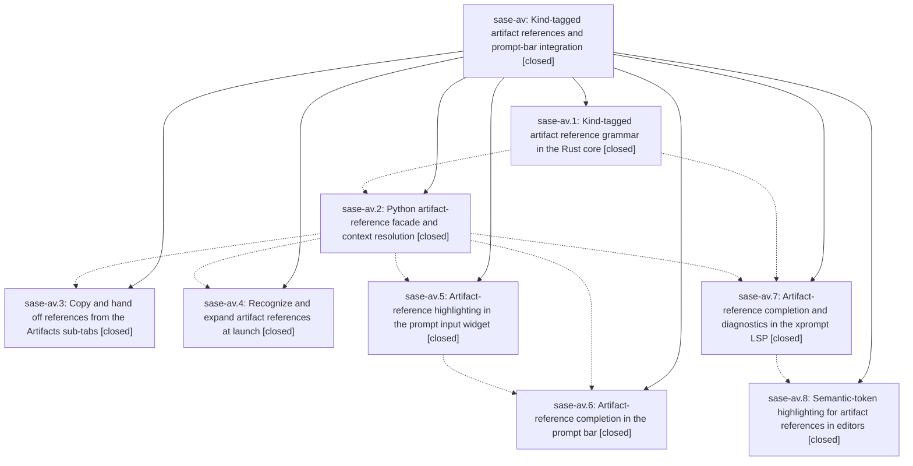

# Bead: sase-av — Kind-tagged artifact references and prompt-bar integration

[Bead Pages](../README.md) / sase-av

**Status:** ✓ closed · **Resolution:** done · **Type:** plan · **Tier:** epic
**Owner:** `bryanbugyi34@gmail.com` · **Assignee:** `sase-av.land`
**Created:** 2026-07-29 16:44:54 UTC · **Closed:** 2026-07-29 20:44:21 UTC
**Plan:** [202607/artifact\_refs\_and\_prompt\_bar.md](https://github.com/sase-org/sase--plans/blob/main/202607/artifact_refs_and_prompt_bar.md)

## Description

One reference grammar names every artifact SASE knows: `plans:` generalizes into `<kind>:<payload>` references covering commits, chats, bugs, artifact files, and every configured document-sidecar role, owned by the Rust core and spent in the ACE copy menus, the prompt bar (highlighted, completed, and expanded at launch), and external editors through LSP completion, diagnostics, and semantic tokens.

## Notes

[2026-07-29T20:44:21Z · sase-av.land] Verified all eight phases against the source and their commits (9988b6161, 46b40c5f6, de57f5a5f, d16fe1dcd, 3f6e4ea81, e55aab9c9, a0ca459ea here; 6c2adc4, 334b987, cea6266 in sase-core): the Rust artifact_ref grammar/scanner/PyO3 bindings, the Python facade and per-project context (end-to-end smoke resolved a plans: ref and rendered a commit: ref against this workspace, with 'research' appearing as a config-driven document kind and no code naming it), uniform %@/%! copy and hand-off across all four Artifacts sub-tabs with mode_keymaps/default_config/_COPY_LABELS/footer/help in sync and Reference-before-Path detail rows in Plans and Chats, launch expansion ahead of file references at preprocessing step 3 with the validate mirror reaching xprompt_handler, prompt-bar highlighting with its committed PNG golden, two-stage @kind:payload completion wired through all five completion surfaces plus auto_artifact_menu in schema and default config and history recording, the launcher-materialized LSP catalog with kind/payload completion and both malformed_artifact_ref and unresolved_artifact_ref diagnostics, and namespace/string/number semantic tokens that skip unknown kinds and literal zones. Rust side re-verified: 1029 sase_core lib tests and 83 sase_xprompt_lsp tests pass on sase-core master. Integration: reviewed every non-epic commit since the epic's first (216d027d8, d0b2ed97c, 7cf23657f, f35c4ce33, 64ffecf88) — numbered Statistics sub-tabs, the xprompt statistics contract, and the agents-panel unread fix share no surface with artifact references, and the four stale Statistics XPrompts PNG goldens sase-av.8 reported were already regenerated by f35c4ce33. Closed the one real gap sase-av.8 left open: src/sase/artifact_refs.py was 1115 lines and failed just check's toobig gate, so it is now the sase.artifact_refs package (_wire/_context/_bindings/_launch/_entries) with an unchanged public API; deleted dead render_artifact_ref, the ParsedArtifactRef and scan_artifact_ref_prompt aliases, and the unused ArtifactRefResolution.best_path; removed the ten expired sase-av epic-symbol entries from the Justfile, after which symvision reports every symbol used properly. just check now passes fmt, ruff, mypy, pyscripts, changelog, symvision, toobig, SASE validation and committed-plan validation; the only test-stage failures are pre-existing load-sensitive flakes (a different unrelated test each run, each passing in isolation, and also present in the pre-change baseline).

## Phases

| Bead | Title | Status | Size | Agents | Commits |
|---|---|---|---|---:|---:|
| [sase-av.1](sase-av.1.md) | Kind-tagged artifact reference grammar in the Rust core | ✓ closed | large | 2 | 1 |
| [sase-av.2](sase-av.2.md) | Python artifact-reference facade and context resolution | ✓ closed | medium | 1 | 1 |
| [sase-av.3](sase-av.3.md) | Copy and hand off references from the Artifacts sub-tabs | ✓ closed | medium | 1 | 1 |
| [sase-av.4](sase-av.4.md) | Recognize and expand artifact references at launch | ✓ closed | medium | 1 | 1 |
| [sase-av.5](sase-av.5.md) | Artifact-reference highlighting in the prompt input widget | ✓ closed | medium | 1 | 1 |
| [sase-av.6](sase-av.6.md) | Artifact-reference completion in the prompt bar | ✓ closed | large | 2 | 1 |
| [sase-av.7](sase-av.7.md) | Artifact-reference completion and diagnostics in the xprompt LSP | ✓ closed | large | 2 | 2 |
| [sase-av.8](sase-av.8.md) | Semantic-token highlighting for artifact references in editors | ✓ closed | medium | 1 | 2 |

## Lineage

## Agents

| Agent | Bead | Commits |
|---|---|---:|
| [bbugyi200.athena.sase-av.1--code](https://github.com/sase-org/sase--agents/blob/main/families/bbugyi200.athena.sase-av.1.md#member-code) | [sase-av.1](sase-av.1.md) | 1 |
| [bbugyi200.athena.sase-av.1--plan](https://github.com/sase-org/sase--agents/blob/main/families/bbugyi200.athena.sase-av.1.md#member-plan) | [sase-av.1](sase-av.1.md) | 0 |
| [bbugyi200.athena.sase-av.2](https://github.com/sase-org/sase--agents/blob/main/agents/bbugyi200.athena.sase-av.2/README.md) | [sase-av.2](sase-av.2.md) | 1 |
| [bbugyi200.athena.sase-av.3](https://github.com/sase-org/sase--agents/blob/main/agents/bbugyi200.athena.sase-av.3/README.md) | [sase-av.3](sase-av.3.md) | 1 |
| [bbugyi200.athena.sase-av.4](https://github.com/sase-org/sase--agents/blob/main/agents/bbugyi200.athena.sase-av.4/README.md) | [sase-av.4](sase-av.4.md) | 1 |
| [bbugyi200.athena.sase-av.5](https://github.com/sase-org/sase--agents/blob/main/agents/bbugyi200.athena.sase-av.5/README.md) | [sase-av.5](sase-av.5.md) | 1 |
| [bbugyi200.athena.sase-av.6--code](https://github.com/sase-org/sase--agents/blob/main/families/bbugyi200.athena.sase-av.6.md#member-code) | [sase-av.6](sase-av.6.md) | 1 |
| [bbugyi200.athena.sase-av.6--plan](https://github.com/sase-org/sase--agents/blob/main/families/bbugyi200.athena.sase-av.6.md#member-plan) | [sase-av.6](sase-av.6.md) | 0 |
| [bbugyi200.athena.sase-av.7--code](https://github.com/sase-org/sase--agents/blob/main/families/bbugyi200.athena.sase-av.7.md#member-code) | [sase-av.7](sase-av.7.md) | 2 |
| [bbugyi200.athena.sase-av.7--plan](https://github.com/sase-org/sase--agents/blob/main/families/bbugyi200.athena.sase-av.7.md#member-plan) | [sase-av.7](sase-av.7.md) | 0 |
| [bbugyi200.athena.sase-av.8](https://github.com/sase-org/sase--agents/blob/main/agents/bbugyi200.athena.sase-av.8/README.md) | [sase-av.8](sase-av.8.md) | 2 |
| [bbugyi200.athena.sase-av.land](https://github.com/sase-org/sase--agents/blob/main/agents/bbugyi200.athena.sase-av.land/README.md) | [sase-av](README.md) | 0 |

## Commits

| Commit | Subject | Bead | Committed (UTC) |
|---|---|---|---|
| [`sase-core@6c2adc4`](https://github.com/sase-org/sase-core/commit/6c2adc420a5ee24aecfe5fae305e2c869ab7b627) | feat: add core artifact reference APIs | [sase-av.1](sase-av.1.md) | 2026-07-29 17:15:02 |
| [`9988b61`](https://github.com/sase-org/sase/commit/9988b6161c9b47b3a657b49981fb11b1bf3e0c98) | feat(artifacts): add artifact reference facade | [sase-av.2](sase-av.2.md) | 2026-07-29 17:52:13 |
| [`46b40c5`](https://github.com/sase-org/sase/commit/46b40c5f6610b2ccd97d0e315b853a6563b2ab1a) | feat(artifacts): expand references during prompt launch | [sase-av.4](sase-av.4.md) | 2026-07-29 18:25:21 |
| [`de57f5a`](https://github.com/sase-org/sase/commit/de57f5a5f3e8563b48400f2843737ef7b4c8b33b) | feat(tui): highlight artifact references in prompts | [sase-av.5](sase-av.5.md) | 2026-07-29 18:32:47 |
| [`d16fe1d`](https://github.com/sase-org/sase/commit/d16fe1dcd9abe1bcc0e6b44af0bc98e2b0ad5788) | feat(ace): copy artifact references from artifact tabs | [sase-av.3](sase-av.3.md) | 2026-07-29 18:38:57 |
| [`sase-core@334b987`](https://github.com/sase-org/sase-core/commit/334b987ae09afc5960ae9f4728c9803088839f60) | feat(editor): complete artifact references in xprompt LSP | [sase-av.7](sase-av.7.md) | 2026-07-29 19:02:38 |
| [`3f6e4ea`](https://github.com/sase-org/sase/commit/3f6e4ea81a0ea13d5f0427358df02aa0c5cdde0a) | feat(editor): materialize artifact reference catalog for LSP | [sase-av.7](sase-av.7.md) | 2026-07-29 19:03:40 |
| [`e55aab9`](https://github.com/sase-org/sase/commit/e55aab9c92f73f5f902fa58ee39641da6a78686a) | feat(ace): add artifact reference prompt completion | [sase-av.6](sase-av.6.md) | 2026-07-29 19:07:54 |
| [`a0ca459`](https://github.com/sase-org/sase/commit/a0ca459ea1c0e9b4b938df8e42bcb1b0ba33d51d) | docs(editor): document artifact semantic highlighting | [sase-av.8](sase-av.8.md) | 2026-07-29 19:35:44 |
| [`sase-core@cea6266`](https://github.com/sase-org/sase-core/commit/cea62669565bcd7fc69e1872898bbae08255f170) | feat(lsp): highlight artifact references with semantic tokens | [sase-av.8](sase-av.8.md) | 2026-07-29 19:36:32 |
