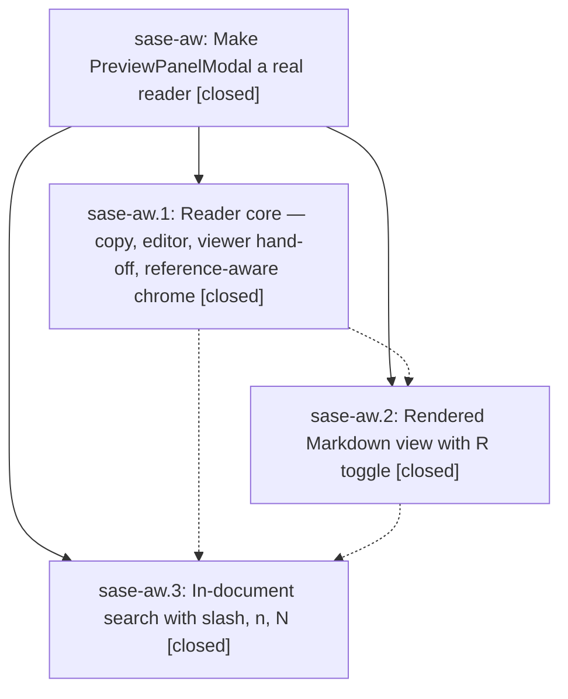

# Bead: sase-aw — Make PreviewPanelModal a real reader

[Bead Pages](../README.md) / sase-aw

**Status:** ✓ closed · **Resolution:** done · **Type:** plan · **Tier:** epic
**Owner:** `bryanbugyi34@gmail.com` · **Assignee:** `sase-aw.land`
**Created:** 2026-07-29 20:59:00 UTC · **Closed:** 2026-07-29 23:21:24 UTC
**Plan:** [202607/preview\_panel\_reader.md](https://github.com/sase-org/sase--plans/blob/main/202607/preview_panel_reader.md)

## Description

The full-screen preview modal that Plans, Chats, and the prompt bar open behaves like a real document reader: copy contents/path, the % copy menu, open in $EDITOR, hand off to the rich terminal viewer, rendered Markdown for documents, and in-document search — matching the standard CommitViewModal already sets.

## Notes

[2026-07-29T23:21:24Z · sase-aw.land] Verified all three child phases are closed with done resolutions and audited their notes against epic commits a4d026ba7, afad2e6ca, 0a7282f20, and cc7a347c3 plus the current source. Confirmed reference/default-view payload wiring for Plans and Chats; background contents/path copy and forwarded % copy mode; editor and shared rich-viewer handoffs; reference-aware title/dynamic footer; bounded rendered Markdown with frontmatter fencing; off-thread smartcase source search, all-line highlighting, centered wrapped-row n/N navigation, escape ladder, and capped-output warnings; plus docs/help and unit/pilot/PNG coverage. Audited every non-epic first-parent commit since phase 1 (f39b0c405, 53b34965f, 30e2ed37e, a79dad163, dc3462d48); their artifact persistence/CLI, completion, syntax-editing, and prompt-inventory changes neither duplicate nor conflict with the preview reader, so no integration edit was required. Re-fetched origin/master; 94 focused tests and 9 relevant PNG snapshots passed. Full just check passed fmt, Ruff, mypy, scripts, changelog, Symvision, and size gates; only unrelated plans-sidecar link validation errors remain in at_reference_completion_menu.md, copy_as_palette.md, and artifacts_files_subtab.md.

## Phases

| Bead | Title | Status | Size | Agents | Commits |
|---|---|---|---|---:|---:|
| [sase-aw.1](sase-aw.1.md) | Reader core — copy, editor, viewer hand-off, reference-aware chrome | ✓ closed | medium | 0 | 0 |
| [sase-aw.2](sase-aw.2.md) | Rendered Markdown view with R toggle | ✓ closed | small | 1 | 1 |
| [sase-aw.3](sase-aw.3.md) | In-document search with slash, n, N | ✓ closed | medium | 0 | 0 |

## Lineage

## Agents

| Agent | Bead | Commits |
|---|---|---:|
| bbugyi200.athena.sase-aw.2 | [sase-aw.2](sase-aw.2.md) | 1 |
| bbugyi200.athena.sase-aw.land | [sase-aw](README.md) | 1 |

## Commits

| Commit | Subject | Bead | Committed (UTC) |
|---|---|---|---|
| [`d2e7161`](https://github.com/sase-org/sase--plans/commit/d2e716190d5a47501cf035aeca53bf1131046b6c) | docs(sdd): restore prompt links in plan headers | [sase-aw.2](sase-aw.2.md) | 2026-07-29 22:12:56 |
| [`cd621f4`](https://github.com/sase-org/sase--plans/commit/cd621f4119887d459cb96e0251a19fbcaee002c5) | docs(plan): mark preview panel reader complete | [sase-aw](README.md) | 2026-07-29 23:23:45 |
