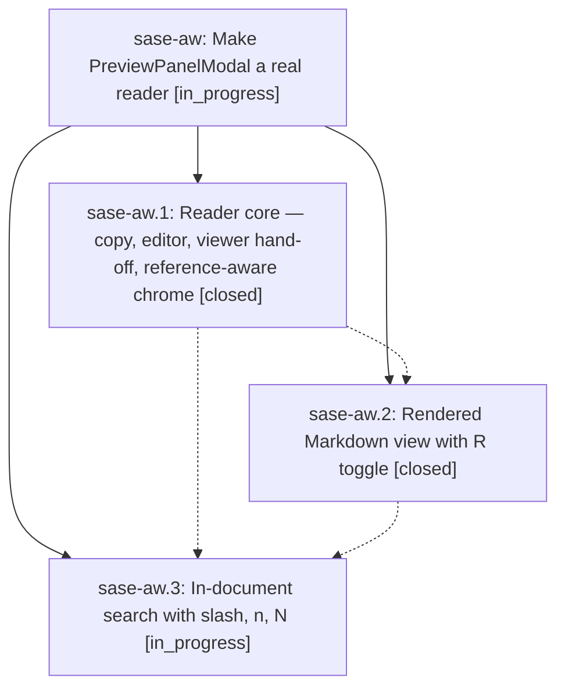

# Bead: sase-aw — Make PreviewPanelModal a real reader

[Bead Pages](../README.md) / sase-aw

**Status:** ◐ in_progress · **Type:** plan · **Tier:** epic
**Owner:** `bryanbugyi34@gmail.com` · **Assignee:** `sase-aw.land`
**Created:** 2026-07-29 20:59:00 UTC
**Plan:** [202607/preview\_panel\_reader.md](https://github.com/sase-org/sase--plans/blob/main/202607/preview_panel_reader.md)

## Description

The full-screen preview modal that Plans, Chats, and the prompt bar open behaves like a real document reader: copy contents/path, the % copy menu, open in $EDITOR, hand off to the rich terminal viewer, rendered Markdown for documents, and in-document search — matching the standard CommitViewModal already sets.

## Phases

| Bead | Title | Status | Size | Agents | Commits |
|---|---|---|---|---:|---:|
| [sase-aw.1](sase-aw.1.md) | Reader core — copy, editor, viewer hand-off, reference-aware chrome | ✓ closed | medium | 1 | 1 |
| [sase-aw.2](sase-aw.2.md) | Rendered Markdown view with R toggle | ✓ closed | small | 1 | 1 |
| [sase-aw.3](sase-aw.3.md) | In-document search with slash, n, N | ◐ in_progress | medium | 1 | 0 |

## Lineage

## Agents

| Agent | Bead | Commits |
|---|---|---:|
| [bbugyi200.athena.sase-aw.1](https://github.com/sase-org/sase--agents/blob/main/agents/bbugyi200.athena.sase-aw.1/README.md) | [sase-aw.1](sase-aw.1.md) | 1 |
| [bbugyi200.athena.sase-aw.2](https://github.com/sase-org/sase--agents/blob/main/agents/bbugyi200.athena.sase-aw.2/README.md) | [sase-aw.2](sase-aw.2.md) | 1 |
| [bbugyi200.athena.sase-aw.3](https://github.com/sase-org/sase--agents/blob/main/agents/bbugyi200.athena.sase-aw.3/README.md) | [sase-aw.3](sase-aw.3.md) | 0 |
| [bbugyi200.athena.sase-aw.land](https://github.com/sase-org/sase--agents/blob/main/agents/bbugyi200.athena.sase-aw.land/README.md) | [sase-aw](README.md) | 0 |

## Commits

| Commit | Subject | Bead | Committed (UTC) |
|---|---|---|---|
| [`a4d026b`](https://github.com/sase-org/sase/commit/a4d026ba78e0406fa2f13701d2c56afbfd4b72cc) | feat(ace): turn preview modal into artifact reader | [sase-aw.1](sase-aw.1.md) | 2026-07-29 21:23:54 |
| [`afad2e6`](https://github.com/sase-org/sase/commit/afad2e6ca1b5bce83e1facb22f584c137346bf40) | feat(ace): render plan previews as markdown | [sase-aw.2](sase-aw.2.md) | 2026-07-29 22:11:46 |
