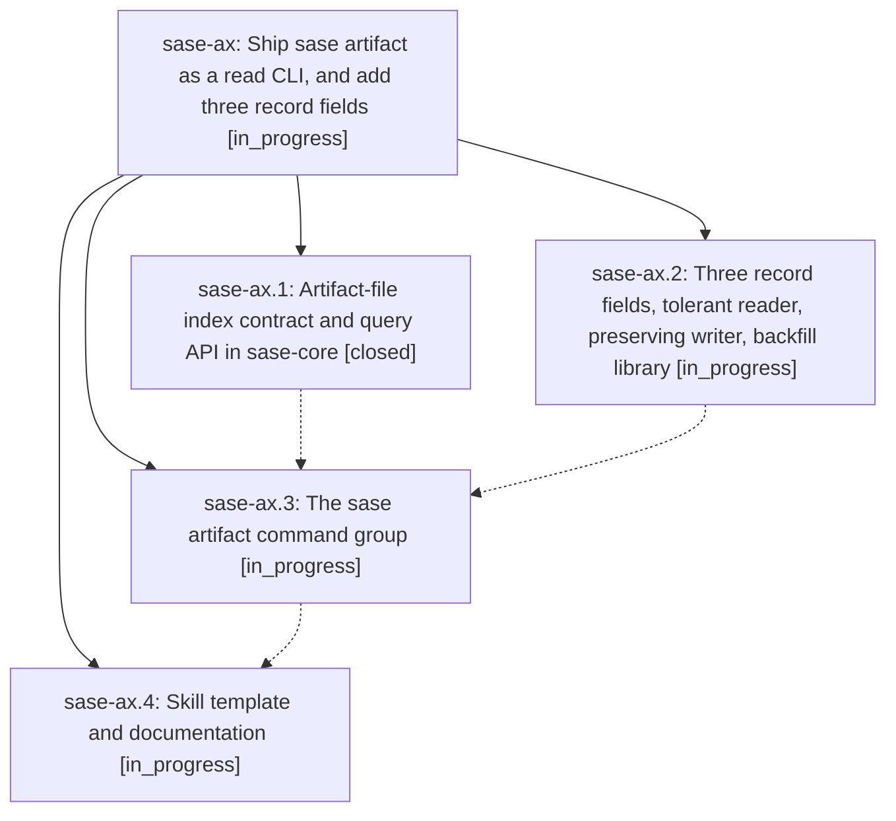

# Bead: sase-ax — Ship sase artifact as a read CLI, and add three record fields

[Bead Pages](../README.md) / sase-ax

**Status:** ◐ in_progress · **Type:** plan · **Tier:** epic
**Owner:** `bryanbugyi34@gmail.com` · **Assignee:** `sase-ax.land`
**Created:** 2026-07-29 21:06:31 UTC
**Plan:** [202607/artifact\_read\_cli.md](https://github.com/sase-org/sase--plans/blob/main/202607/artifact_read_cli.md)

## Description

Agents and humans can discover, inspect, resolve, and open any indexed artifact from the CLI, and every artifact-file record carries sha256, size_bytes, and mime_type with a safe, idempotent backfill.

## Phases

| Bead | Title | Status | Size | Agents | Commits |
|---|---|---|---|---:|---:|
| [sase-ax.1](sase-ax.1.md) | Artifact-file index contract and query API in sase-core | ✓ closed | medium | 1 | 1 |
| [sase-ax.2](sase-ax.2.md) | Three record fields, tolerant reader, preserving writer, backfill library | ◐ in_progress | medium | 0 | 0 |
| [sase-ax.3](sase-ax.3.md) | The sase artifact command group | ◐ in_progress | large | 0 | 0 |
| [sase-ax.4](sase-ax.4.md) | Skill template and documentation | ◐ in_progress | small | 0 | 0 |

## Lineage

## Agents

| Agent | Bead | Commits |
|---|---|---:|
| bbugyi200.athena.sase-ax.1 | [sase-ax.1](sase-ax.1.md) | 1 |

## Commits

| Commit | Subject | Bead | Committed (UTC) |
|---|---|---|---|
| [`ad900a7`](https://github.com/sase-org/sase-core/commit/ad900a770cabaa168a3ad521f724f42e8f9c3c25) | feat(artifact): add artifact file query API | [sase-ax.1](sase-ax.1.md) | 2026-07-29 21:20:30 |
