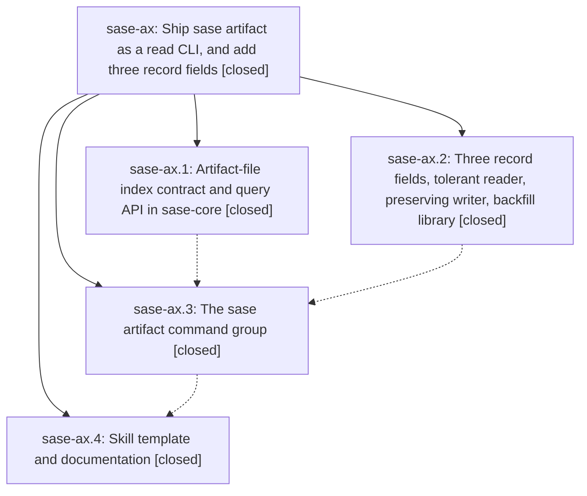

# Bead: sase-ax — Ship sase artifact as a read CLI, and add three record fields

[Bead Pages](../README.md) / sase-ax

**Status:** ✓ closed · **Resolution:** done · **Type:** plan · **Tier:** epic
**Owner:** `bryanbugyi34@gmail.com` · **Assignee:** `sase-ax.land`
**Created:** 2026-07-29 21:06:31 UTC · **Closed:** 2026-07-29 23:44:06 UTC
**Plan:** [202607/artifact\_read\_cli.md](https://github.com/sase-org/sase--plans/blob/main/202607/artifact_read_cli.md)

## Description

Agents and humans can discover, inspect, resolve, and open any indexed artifact from the CLI, and every artifact-file record carries sha256, size_bytes, and mime_type with a safe, idempotent backfill.

## Notes

[2026-07-29T23:44:06Z · sase-ax.land] Landing audit: verified all four closed child phases and their source commits: sase-core ad900a7 delivered the tolerant v1/v2 Rust query contract and binding; f39b0c40 delivered enrichment, preserving writes, and doctor/backfill APIs; 30e2ed37 delivered the canonical artifact CLI, compatibility alias, resolver/viewers, and tests; c40aa7f9 delivered the generated skill source and docs. Reviewed the later preview rendering/search, prompt stabilization, punctuation, and path-inventory warming changes and found no conflicts. Integrated prompt artifact completion with query_artifact_files on cache misses only, preserved mtime/size caching, project aliases plus unscoped rows, the 500-row bound, Rust ordering, and filesystem-free keystroke paths. Deployed sase_artifact_file from clean canonical c40aa7f9 to all five provider skill locations; sase skill init --diff is empty. Ran the real-index backfill and verified 4091 supported rows with no missing enrichment/stored files, duplicates, unsupported schemas, or malformed rows; missing recycled-workspace sources remain informational. Smoked bounded image listing with durable file refs and sase display names, and resolved plans:202607/artifact_read_cli.md. Focused integration tests passed 74/74; committed-plan validation passed 3304 files; full suite passed 23949 with 7 skipped. just check passed formatting, Ruff, mypy, scripts, changelog, Symvision, and toobig, then stopped only on six pre-existing prompt reverse-link errors in three unrelated July plans: artifacts_files_subtab, at_reference_completion_menu, and copy_as_palette.

[2026-07-29T23:46:22Z · sase-ax.land] Verified 74 focused tests, 23,949 full-suite passes with 7 skips, clean post-close Symvision, healthy 4,091-row artifact index, empty generated-skill drift, and only six unrelated pre-existing plan-link errors blocking just check.

## Phases

| Bead | Title | Status | Size | Agents | Commits |
|---|---|---|---|---:|---:|
| [sase-ax.1](sase-ax.1.md) | Artifact-file index contract and query API in sase-core | ✓ closed | medium | 0 | 0 |
| [sase-ax.2](sase-ax.2.md) | Three record fields, tolerant reader, preserving writer, backfill library | ✓ closed | medium | 0 | 0 |
| [sase-ax.3](sase-ax.3.md) | The sase artifact command group | ✓ closed | large | 0 | 0 |
| [sase-ax.4](sase-ax.4.md) | Skill template and documentation | ✓ closed | small | 0 | 0 |

## Lineage

## Agents

| Agent | Bead | Commits |
|---|---|---:|
| bbugyi200.athena.sase-ax.land--code | [sase-ax](README.md) | 1 |

## Commits

| Commit | Subject | Bead | Committed (UTC) |
|---|---|---|---|
| [`ef19f49`](https://github.com/sase-org/sase--plans/commit/ef19f49def836e8d86906b1dbc88b80d0ce9841a) | docs: mark artifact CLI epic done | [sase-ax](README.md) | 2026-07-29 23:47:54 |
