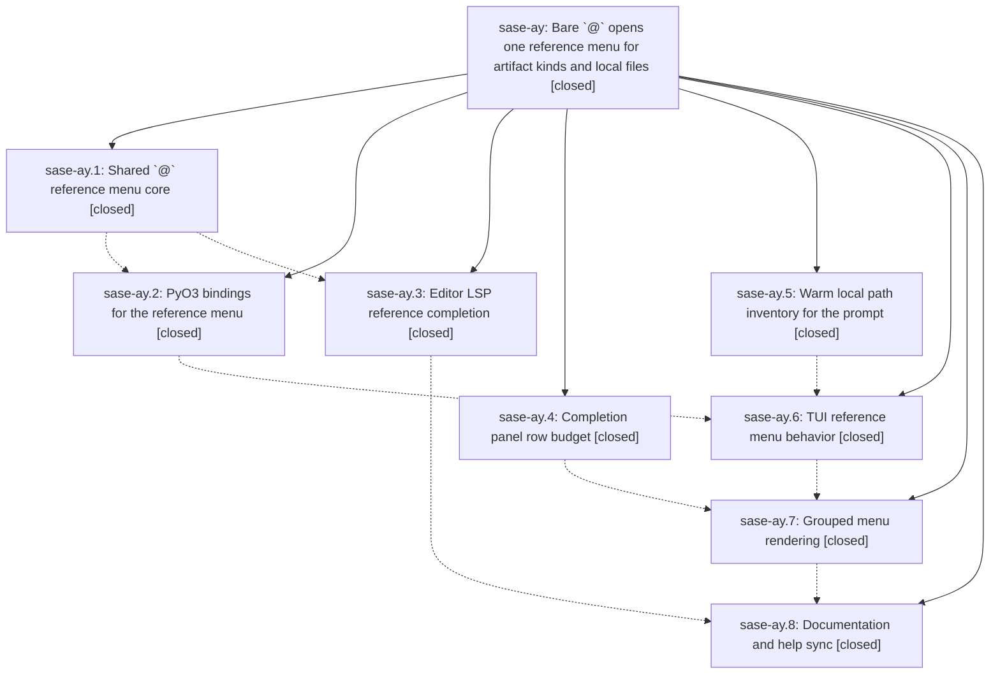

# Bead: sase-ay — Bare \`@\` opens one reference menu for artifact kinds and local files

[Bead Pages](../README.md) / sase-ay

**Status:** ✓ closed · **Resolution:** done · **Type:** plan · **Tier:** epic
**Owner:** `bryanbugyi34@gmail.com` · **Assignee:** `sase-ay.land`
**Created:** 2026-07-29 22:22:57 UTC · **Closed:** 2026-07-30 00:47:40 UTC
**Plan:** [202607/at\_reference\_completion\_menu.md](https://github.com/sase-org/sase--plans/blob/main/202607/at_reference_completion_menu.md)

## Description

Typing `@` in the ACE prompt input or in an LSP-backed editor immediately opens a single reference menu whose artifact-kind rows and local file-path rows are visibly grouped, with menu policy shared by Rust core so both frontends agree, and with no filesystem work on the keystroke path.

## Notes

[2026-07-30T00:47:40Z · sase-ay.land] Landed epic sase-ay. Verified all 8 phases against source, not just notes: Rust core crates/sase_core/src/editor/at_reference.rs (bare-@ context, path-shaped tokens, pure grouped menu builder, 200-row group caps, leading-group shared extension), PyO3 at_reference_context/at_reference_menu bindings, and LSP at_reference_completion_response with sigil-inclusive filter_text plus 0:/1: group sort_text — all three shipped in sase-core v0.12.15 (93e6a69, e1d7ed4, dba90da). Python side verified: file_completion.completion_visible_rows/completion_scroll_offset derive the row budget from real panel capacity (8 content rows, minus 1 for the overflow line, minus 1 more for a group rule) so a 15-row menu keeps its highlight on screen; prompt_path_inventory.py provides mtime+inode-token snapshots loaded only on the prompt-path-inventory worker with warm-on-focus from prompt_input_bar and the stack renderer; artifact_ref_completion.py is now a mapping layer over the binding; Enter ownership falls through to submit only for an un-narrowed bare-@ menu; directory rows drill down and file rows insert the @ sigil; grouped rendering, the padded '-- files . <base-dir>' rule, adaptive Kind-stage titles, and the at_reference_completion_panel_120x40.png golden are all present; docs/ace.md, docs/configuration.md, docs/editor.md, and the help-modal '@ -> Artifact kinds + local files' entry are in sync. Exercised the facade directly: bare @ returns artifacts-then-files, @pl narrows both groups, @src/ returns files only with the directory preserved in the insertion, @.h reveals dotfiles, and @foo!/mail@example.com/word@ correctly yield no context. Integration with work that landed during the epic: fixed the version window the binding phase was supposed to bump -- pyproject.toml pinned sase-core-rs>=0.12.14 (bumped by non-epic sase-ax commit 30e2ed37e) while at_reference_context/at_reference_menu only exist in 0.12.15, so CI's published-core-minimum-smoke job (tools/check_sase_core_rs_bindings against the declared minimum) would have failed and a fresh PyPI install would have broken the @ menu at runtime; bumped to >=0.12.15, refreshed uv.lock, and updated the pin-tracking assertion in tests/test_sase_core_rs_telemetry_smoke_tool.py. Confirmed sase-ax's af4295179 (warm artifact completion through the Rust query facade) already integrates cleanly on top of the sase-ay.6 rewrite, that Ctrl+T dispatch puts the @ menu ahead of the path-like-token provider, that no legacy artifact-ref completion callers remain in this repo, and that sase-nvim needs no change because its default 'auto' backend prefers the LSP. Also added the epic plan's missing reciprocal PROMPT link (sase validate now reports only the two unrelated sase-b0/sase-az plan-link errors) and documented the group-rule row reservation in docs/ace.md. just lint is fully green including symvision (the sase-ay(PromptPathRow) epic-symbol whitelist entry was already retired in sase-ay.6); just test: 23,990 passed with two pre-existing parallel-only flakes (test_stall_watchdog, test_artifact_files_modal_copy) that both pass in isolation and touch no epic code.

## Phases

| Bead | Title | Status | Size | Agents | Commits |
|---|---|---|---|---:|---:|
| [sase-ay.1](sase-ay.1.md) | Shared \`@\` reference menu core | ✓ closed | medium | 0 | 0 |
| [sase-ay.2](sase-ay.2.md) | PyO3 bindings for the reference menu | ✓ closed | small | 0 | 0 |
| [sase-ay.3](sase-ay.3.md) | Editor LSP reference completion | ✓ closed | medium | 0 | 0 |
| [sase-ay.4](sase-ay.4.md) | Completion panel row budget | ✓ closed | small | 0 | 0 |
| [sase-ay.5](sase-ay.5.md) | Warm local path inventory for the prompt | ✓ closed | medium | 0 | 0 |
| [sase-ay.6](sase-ay.6.md) | TUI reference menu behavior | ✓ closed | medium | 0 | 0 |
| [sase-ay.7](sase-ay.7.md) | Grouped menu rendering | ✓ closed | medium | 0 | 0 |
| [sase-ay.8](sase-ay.8.md) | Documentation and help sync | ✓ closed | small | 0 | 0 |

## Lineage

## Agents

| Agent | Bead | Commits |
|---|---|---:|
| bbugyi200.athena.sase-ay.land | [sase-ay](README.md) | 1 |

## Commits

| Commit | Subject | Bead | Committed (UTC) |
|---|---|---|---|
| [`16d740d`](https://github.com/sase-org/sase--plans/commit/16d740dee829d2bbfa8f36f8a0d31b123e5499ba) | docs(plans): close out the \`@\` reference menu plan | [sase-ay](README.md) | 2026-07-30 00:53:09 |
