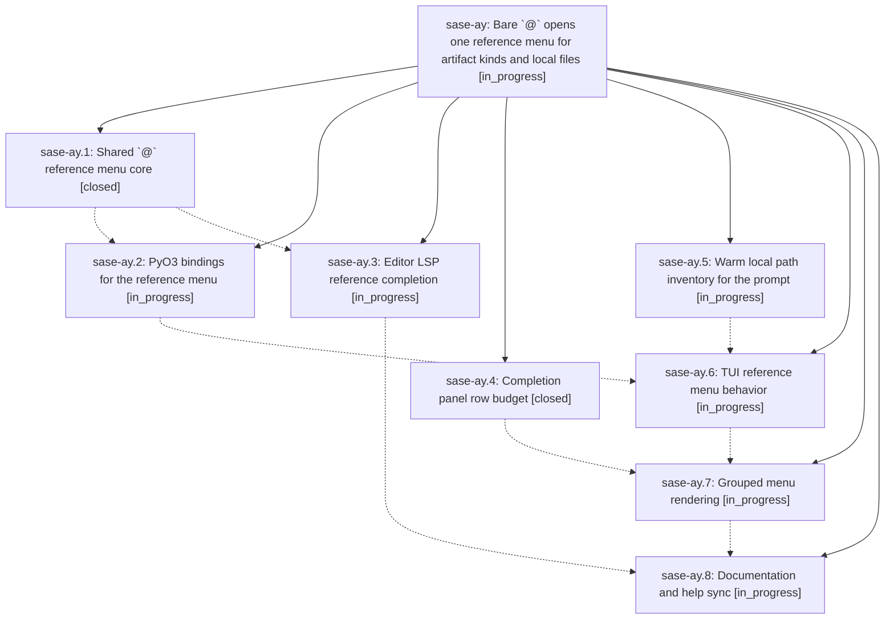

# Bead: sase-ay — Bare \`@\` opens one reference menu for artifact kinds and local files

[Bead Pages](../README.md) / sase-ay

**Status:** ◐ in_progress · **Type:** plan · **Tier:** epic
**Owner:** `bryanbugyi34@gmail.com` · **Assignee:** `sase-ay.land`
**Created:** 2026-07-29 22:22:57 UTC
**Plan:** [202607/at\_reference\_completion\_menu.md](https://github.com/sase-org/sase--plans/blob/main/202607/at_reference_completion_menu.md)

## Description

Typing `@` in the ACE prompt input or in an LSP-backed editor immediately opens a single reference menu whose artifact-kind rows and local file-path rows are visibly grouped, with menu policy shared by Rust core so both frontends agree, and with no filesystem work on the keystroke path.

## Phases

| Bead | Title | Status | Size | Agents | Commits |
|---|---|---|---|---:|---:|
| [sase-ay.1](sase-ay.1.md) | Shared \`@\` reference menu core | ✓ closed | medium | 1 | 0 |
| [sase-ay.2](sase-ay.2.md) | PyO3 bindings for the reference menu | ◐ in_progress | small | 1 | 0 |
| [sase-ay.3](sase-ay.3.md) | Editor LSP reference completion | ◐ in_progress | medium | 1 | 0 |
| [sase-ay.4](sase-ay.4.md) | Completion panel row budget | ✓ closed | small | 1 | 1 |
| [sase-ay.5](sase-ay.5.md) | Warm local path inventory for the prompt | ◐ in_progress | medium | 1 | 0 |
| [sase-ay.6](sase-ay.6.md) | TUI reference menu behavior | ◐ in_progress | medium | 1 | 0 |
| [sase-ay.7](sase-ay.7.md) | Grouped menu rendering | ◐ in_progress | medium | 1 | 0 |
| [sase-ay.8](sase-ay.8.md) | Documentation and help sync | ◐ in_progress | small | 1 | 0 |

## Lineage

## Agents

| Agent | Bead | Commits |
|---|---|---:|
| [bbugyi200.athena.sase-ay.1](https://github.com/sase-org/sase--agents/blob/main/agents/bbugyi200.athena.sase-ay.1/README.md) | [sase-ay.1](sase-ay.1.md) | 0 |
| [bbugyi200.athena.sase-ay.2](https://github.com/sase-org/sase--agents/blob/main/agents/bbugyi200.athena.sase-ay.2/README.md) | [sase-ay.2](sase-ay.2.md) | 0 |
| [bbugyi200.athena.sase-ay.3](https://github.com/sase-org/sase--agents/blob/main/agents/bbugyi200.athena.sase-ay.3/README.md) | [sase-ay.3](sase-ay.3.md) | 0 |
| [bbugyi200.athena.sase-ay.4](https://github.com/sase-org/sase--agents/blob/main/agents/bbugyi200.athena.sase-ay.4/README.md) | [sase-ay.4](sase-ay.4.md) | 1 |
| [bbugyi200.athena.sase-ay.5](https://github.com/sase-org/sase--agents/blob/main/agents/bbugyi200.athena.sase-ay.5/README.md) | [sase-ay.5](sase-ay.5.md) | 0 |
| [bbugyi200.athena.sase-ay.6](https://github.com/sase-org/sase--agents/blob/main/agents/bbugyi200.athena.sase-ay.6/README.md) | [sase-ay.6](sase-ay.6.md) | 0 |
| [bbugyi200.athena.sase-ay.7](https://github.com/sase-org/sase--agents/blob/main/agents/bbugyi200.athena.sase-ay.7/README.md) | [sase-ay.7](sase-ay.7.md) | 0 |
| [bbugyi200.athena.sase-ay.8](https://github.com/sase-org/sase--agents/blob/main/agents/bbugyi200.athena.sase-ay.8/README.md) | [sase-ay.8](sase-ay.8.md) | 0 |
| [bbugyi200.athena.sase-ay.land](https://github.com/sase-org/sase--agents/blob/main/agents/bbugyi200.athena.sase-ay.land/README.md) | [sase-ay](README.md) | 0 |

## Commits

| Commit | Subject | Bead | Committed (UTC) |
|---|---|---|---|
| [`53b3496`](https://github.com/sase-org/sase/commit/53b34965f1cf960e92935ca1ec999ff9c24ec4f7) | fix(ace): keep completion panel rows within budget | [sase-ay.4](sase-ay.4.md) | 2026-07-29 22:49:21 |
