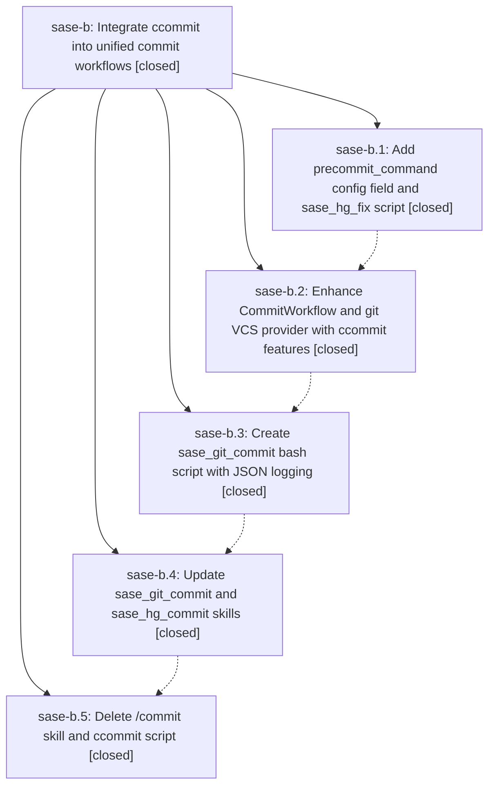

# Bead: sase-b — Integrate ccommit into unified commit workflows

[Bead Pages](../README.md) / sase-b

**Status:** ✓ closed · **Resolution:** (unrecorded) · **Type:** plan · **Tier:** epic
**Owner:** `bryanbugyi34@gmail.com`
**Created:** 2026-03-24 16:30:31 UTC · **Closed:** 2026-03-24 18:20:28 UTC
**Plan:** [202603/migrate\_ccommit.md](https://github.com/sase-org/sase--plans/blob/main/202603/migrate_ccommit.md)

## Phases

| Bead | Title | Status | Size | Agents | Commits |
|---|---|---|---|---:|---:|
| [sase-b.1](sase-b.1.md) | Add precommit\_command config field and sase\_hg\_fix script | ✓ closed | small | 0 | 0 |
| [sase-b.2](sase-b.2.md) | Enhance CommitWorkflow and git VCS provider with ccommit features | ✓ closed | small | 0 | 1 |
| [sase-b.3](sase-b.3.md) | Create sase\_git\_commit bash script with JSON logging | ✓ closed | small | 0 | 0 |
| [sase-b.4](sase-b.4.md) | Update sase\_git\_commit and sase\_hg\_commit skills | ✓ closed | small | 0 | 0 |
| [sase-b.5](sase-b.5.md) | Delete /commit skill and ccommit script | ✓ closed | small | 0 | 1 |

## Lineage

## Commits

| Commit | Subject | Bead | Committed (UTC) |
|---|---|---|---|
| [`c27e8ee`](https://github.com/sase-org/sase/commit/c27e8ee8c94ce3fc6b10c79867154c4495db193f) | feat: Add precommit, merge, push retry, bead lifecycle, and SASE\_PLAN to commit workflow (sase-b.2) | [sase-b.2](sase-b.2.md) | 2026-03-24 17:16:57 |
| [`4dc033b`](https://github.com/sase-org/sase/commit/4dc033b53ab335bb32ee74de23533534504a94e4) | chore: Remove ccommit references and use sase commit (sase-b.5) | [sase-b.5](sase-b.5.md) | 2026-03-24 18:14:52 |
