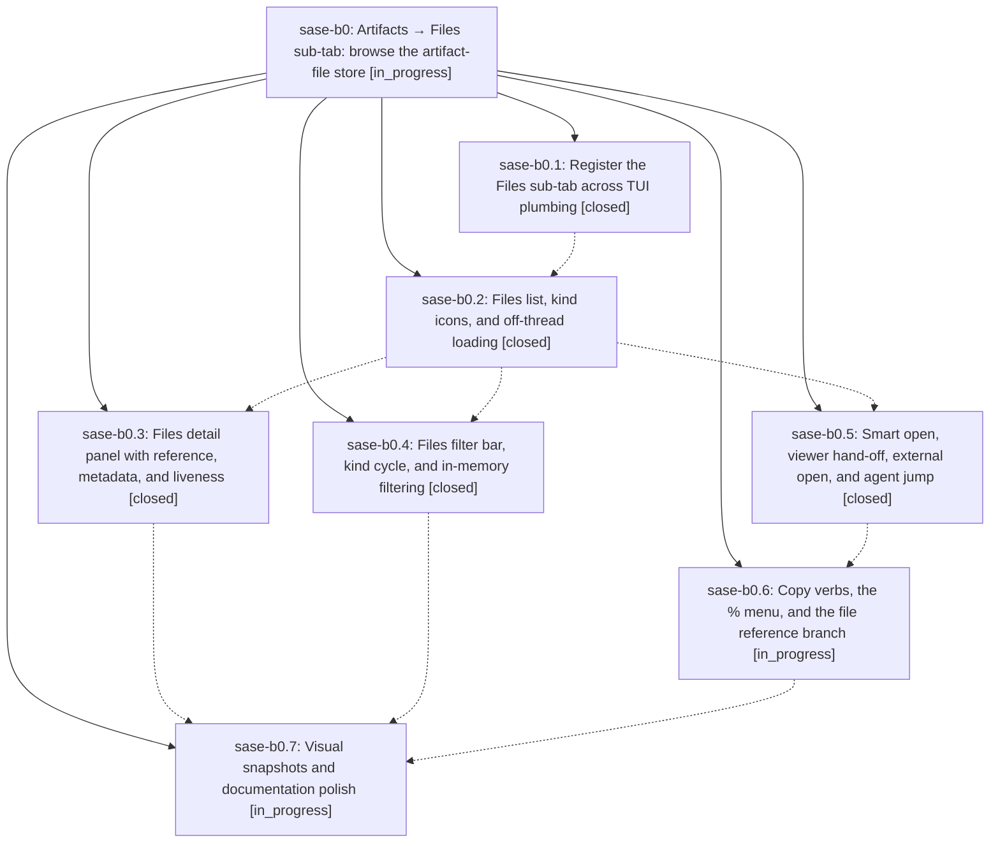

# Bead: sase-b0 — Artifacts → Files sub-tab: browse the artifact-file store

[Bead Pages](../README.md) / sase-b0

**Status:** ◐ in_progress · **Type:** plan · **Tier:** epic
**Owner:** `bryanbugyi34@gmail.com` · **Assignee:** `sase-b0.land`
**Created:** 2026-07-29 23:13:43 UTC
**Plan:** [202607/artifacts\_files\_subtab.md](https://github.com/sase-org/sase--plans/blob/main/202607/artifacts_files_subtab.md)

## Description

The ACE Artifacts tab gains a sixth "Files" sub-tab that makes every indexed artifact file browsable by kind, project, agent, origin, and time — with the same marks, copy mode, references, filters, and jump machinery as its sibling panes — and puts each file one keypress from the preview reader or the rich terminal viewer, so the 4,000-file store stops being reachable only through the one agent run that produced each file.

## Phases

| Bead | Title | Status | Size | Agents | Commits |
|---|---|---|---|---:|---:|
| [sase-b0.1](sase-b0.1.md) | Register the Files sub-tab across TUI plumbing | ✓ closed | medium | 1 | 1 |
| [sase-b0.2](sase-b0.2.md) | Files list, kind icons, and off-thread loading | ✓ closed | medium | 1 | 1 |
| [sase-b0.3](sase-b0.3.md) | Files detail panel with reference, metadata, and liveness | ✓ closed | medium | 1 | 1 |
| [sase-b0.4](sase-b0.4.md) | Files filter bar, kind cycle, and in-memory filtering | ✓ closed | medium | 1 | 1 |
| [sase-b0.5](sase-b0.5.md) | Smart open, viewer hand-off, external open, and agent jump | ✓ closed | medium | 1 | 1 |
| [sase-b0.6](sase-b0.6.md) | Copy verbs, the % menu, and the file reference branch | ◐ in_progress | medium | 1 | 0 |
| [sase-b0.7](sase-b0.7.md) | Visual snapshots and documentation polish | ◐ in_progress | small | 1 | 0 |

## Lineage

## Agents

| Agent | Bead | Commits |
|---|---|---:|
| [bbugyi200.athena.sase-b0.1](https://github.com/sase-org/sase--agents/blob/main/agents/bbugyi200.athena.sase-b0.1/README.md) | [sase-b0.1](sase-b0.1.md) | 1 |
| [bbugyi200.athena.sase-b0.2](https://github.com/sase-org/sase--agents/blob/main/agents/bbugyi200.athena.sase-b0.2/README.md) | [sase-b0.2](sase-b0.2.md) | 1 |
| [bbugyi200.athena.sase-b0.3](https://github.com/sase-org/sase--agents/blob/main/agents/bbugyi200.athena.sase-b0.3/README.md) | [sase-b0.3](sase-b0.3.md) | 1 |
| [bbugyi200.athena.sase-b0.4](https://github.com/sase-org/sase--agents/blob/main/agents/bbugyi200.athena.sase-b0.4/README.md) | [sase-b0.4](sase-b0.4.md) | 1 |
| [bbugyi200.athena.sase-b0.5](https://github.com/sase-org/sase--agents/blob/main/agents/bbugyi200.athena.sase-b0.5/README.md) | [sase-b0.5](sase-b0.5.md) | 1 |
| [bbugyi200.athena.sase-b0.6](https://github.com/sase-org/sase--agents/blob/main/agents/bbugyi200.athena.sase-b0.6/README.md) | [sase-b0.6](sase-b0.6.md) | 0 |
| [bbugyi200.athena.sase-b0.7](https://github.com/sase-org/sase--agents/blob/main/agents/bbugyi200.athena.sase-b0.7/README.md) | [sase-b0.7](sase-b0.7.md) | 0 |
| [bbugyi200.athena.sase-b0.land](https://github.com/sase-org/sase--agents/blob/main/agents/bbugyi200.athena.sase-b0.land/README.md) | [sase-b0](README.md) | 0 |

## Commits

| Commit | Subject | Bead | Committed (UTC) |
|---|---|---|---|
| [`49e6b4c`](https://github.com/sase-org/sase/commit/49e6b4cd17708195e8843d3806c98551f3846244) | feat(tui): scaffold artifacts files tab | [sase-b0.1](sase-b0.1.md) | 2026-07-29 23:50:34 |
| [`2edfc8b`](https://github.com/sase-org/sase/commit/2edfc8b7071b29aa44e8d58338184c1887c53ffe) | feat(ace): add artifact files list browsing | [sase-b0.2](sase-b0.2.md) | 2026-07-30 00:31:36 |
| [`f0c803a`](https://github.com/sase-org/sase/commit/f0c803af859c627c92f2e52e02f7e1628d71c4b4) | feat(ace): add artifact file detail panel | [sase-b0.3](sase-b0.3.md) | 2026-07-30 00:54:05 |
| [`842723f`](https://github.com/sase-org/sase/commit/842723f6f6db058f7d301d732e61bb24aaf052f5) | feat(ace): add artifact file filtering | [sase-b0.4](sase-b0.4.md) | 2026-07-30 01:01:36 |
| [`f5df5e1`](https://github.com/sase-org/sase/commit/f5df5e12221c5da96fdd9f542ce481ee2f327914) | feat(ace): add artifact file open actions | [sase-b0.5](sase-b0.5.md) | 2026-07-30 01:05:36 |
