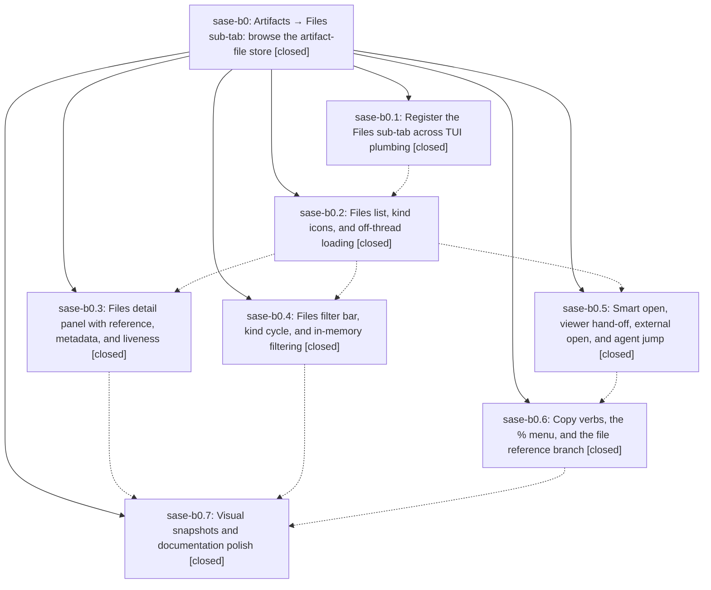

# Bead: sase-b0 — Artifacts → Files sub-tab: browse the artifact-file store

[Bead Pages](../README.md) / sase-b0

**Status:** ✓ closed · **Resolution:** done · **Type:** plan · **Tier:** epic
**Owner:** `bryanbugyi34@gmail.com` · **Assignee:** `sase-b0.land`
**Created:** 2026-07-29 23:13:43 UTC · **Closed:** 2026-07-30 02:47:59 UTC
**Plan:** [202607/artifacts\_files\_subtab.md](https://github.com/sase-org/sase--plans/blob/main/202607/artifacts_files_subtab.md)

## Description

The ACE Artifacts tab gains a sixth "Files" sub-tab that makes every indexed artifact file browsable by kind, project, agent, origin, and time — with the same marks, copy mode, references, filters, and jump machinery as its sibling panes — and puts each file one keypress from the preview reader or the rich terminal viewer, so the 4,000-file store stops being reachable only through the one agent run that produced each file.

## Notes

[2026-07-30T02:47:59Z · sase-b0.land] Land verification for the Artifacts -> Files sub-tab epic.

VERIFIED (all 7 phases closed): read each child bead's notes against the actual source and the epic's commits. Confirmed digit-6 registration with ARTIFACTS_SUBTAB_ORDER intact, off-thread two-phase loading via query_artifact_files, the detail panel's reference/metadata/origin/liveness rendering, the filter bar and kind cycle, smart open + viewer hand-off + external open + producing-agent jump, the y/Y copy verbs and the context-free 'file:' reference branch, and the docs plus populated PNG goldens. Every bead note was addressed by real code, not just reported.

INTEGRATED: the Copy-as palette (sase-az.3) landed mid-epic and froze _DISPATCH_ORDER['artifacts_files'] at the scaffold's three generic targets, silently dropping sase-b0.6's contents/path/source/label/json rows so their chords answered 'Unknown copy key'. I reproduced and fixed that; sase-az's land agent then pushed 86fb630bb with a superset fix, so I discarded my duplicate, rebased onto it, and confirmed all nine Files targets now appear. Three gaps remained on top of their fix, which this land pass closes:
  1. The palette previewed entry.path for %p while PDF rows deliberately copy their live Markdown source, so the preview disagreed with the copy. Extracted the rule into artifact_file_preferred_path_text, now shared by artifact_file_clipboard_path, the palette preview, and the modal's display path (removing a third copy of it).
  2. No guard existed against copy-target registry <-> _DISPATCH_ORDER drift, which is the exact root cause of the defect above. Added a parity test covering all eight groups.
  3. docs/ace.md's Files Pane prose omitted sase-az's new Markdown-link target and the preview/copy agreement.

EVIDENCE: just lint clean; full just test green at 24126 passed / 7 skipped, including the 383-test PNG visual suite. sase validate still reports 6 pre-existing plans-sidecar prompt-link errors across three plans; this pass fixes the 2 belonging to this epic's own plan file and leaves the 4 owned by other epics untouched.

## Phases

| Bead | Title | Status | Size | Agents | Commits |
|---|---|---|---|---:|---:|
| [sase-b0.1](sase-b0.1.md) | Register the Files sub-tab across TUI plumbing | ✓ closed | medium | 0 | 0 |
| [sase-b0.2](sase-b0.2.md) | Files list, kind icons, and off-thread loading | ✓ closed | medium | 0 | 0 |
| [sase-b0.3](sase-b0.3.md) | Files detail panel with reference, metadata, and liveness | ✓ closed | medium | 0 | 0 |
| [sase-b0.4](sase-b0.4.md) | Files filter bar, kind cycle, and in-memory filtering | ✓ closed | medium | 0 | 0 |
| [sase-b0.5](sase-b0.5.md) | Smart open, viewer hand-off, external open, and agent jump | ✓ closed | medium | 0 | 0 |
| [sase-b0.6](sase-b0.6.md) | Copy verbs, the % menu, and the file reference branch | ✓ closed | medium | 0 | 0 |
| [sase-b0.7](sase-b0.7.md) | Visual snapshots and documentation polish | ✓ closed | small | 0 | 0 |

## Lineage

## Agents

| Agent | Bead | Commits |
|---|---|---:|
| bbugyi200.athena.sase-b0.land | [sase-b0](README.md) | 1 |

## Commits

| Commit | Subject | Bead | Committed (UTC) |
|---|---|---|---|
| [`0e9a47b`](https://github.com/sase-org/sase--plans/commit/0e9a47b37264331843ddfdd6e78491579280e04c) | docs(plans): mark Artifacts Files sub-tab complete | [sase-b0](README.md) | 2026-07-30 02:51:18 |
