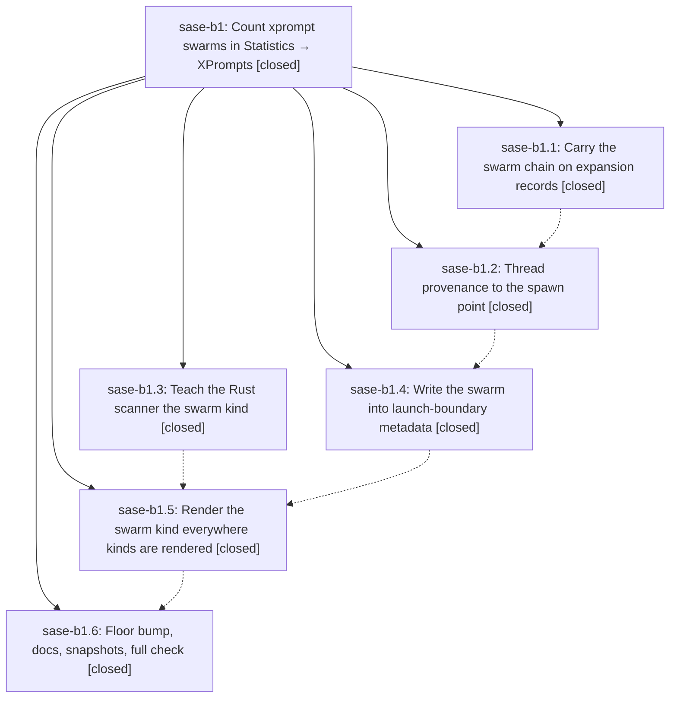

# Bead: sase-b1 — Count xprompt swarms in Statistics → XPrompts

[Bead Pages](../README.md) / sase-b1

**Status:** ✓ closed · **Resolution:** done · **Type:** plan · **Tier:** epic
**Owner:** `bryanbugyi34@gmail.com` · **Assignee:** `sase-b1.land`
**Created:** 2026-07-30 01:09:41 UTC · **Closed:** 2026-07-30 03:18:28 UTC
**Plan:** [202607/xprompt\_swarm\_stats.md](https://github.com/sase-org/sase--plans/blob/main/202607/xprompt_swarm_stats.md)

## Description

Every agent launched by an xprompt swarm records that swarm at its launch boundary, so swarms such as #research_swarm appear as first-class rows in the Admin Center Statistics XPrompts sub-tab, are focusable there, and are visible in the Agents-tab XPROMPTS panel.

## Notes

[2026-07-30T03:18:28Z · sase-b1.land] Verified all six phases against the source, not just the phase notes. swarm-provenance: _ExpandedXpromptSwarmSegment.swarm_xprompts is populated in all four expansion branches and inherited unchanged by pass-through/fast-path segments (xprompt_swarm.py). launch-env-plumbing: the chain reaches every spawn path — multi-segment via segment_swarm_xprompts in multi_prompt_launch_execution slot_env, single-segment via extra_env in both launch_cwd_agents.py and ACE _launch_body_impl.py, and repeat/alt-fanout inherit through extra_env; launch_spawn._remove_inherited_swarm_xprompts_env runs before env_delta so nested launches are scrubbed while explicit launches survive. core-swarm-kind: sase-core 009036d published in v0.12.16; cargo tests launch_xprompts_preserves_swarm_kind and aggregates_swarm_xprompt_kind_through_stats_wire pass against the installed 0.12.17. runner-capture: derived records prepend with kind=swarm, catalog tags, empty args, upgrade-in-place instead of duplicating, and the step_only/xprompts_<step>.json contract is untouched. tui-labels + docs-and-goldens: KIND_LABELS covers the table and focus header, the Agents-tab panel has its own glyph and swarm counting, the help modal states the forward-only contract, docs/ace.md documents kinds/attribution/Refs==Runs, the sase-core-rs floor is >=0.12.16, and the four PNG goldens are refreshed. Ran a live end-to-end: #sase/reads expands to 4 segments each carrying ('sase/reads',), a nested swarm yields ('outer_swarm','sase/reads') outer-to-inner, the child collects exactly one kind=swarm record with empty args, a prompt still containing the reference upgrades in place rather than duplicating, and a plain prompt writes no swarm record. Integration: reviewed the nine non-epic commits that landed during the epic (fec7898b2, 1bfd6ff86, 132bd79c7, 7994afadc, 85b5b6421, 86fb630bb, 278e16952, 3173dae12, 8fa0f573a) — all ACE Files sub-tab, artifact-file copy palette, and artifact entity references, with no overlap with xprompt kinds, launch provenance, or the Statistics XPrompts view. Found and fixed one duplication the epic left behind: statistics_xprompt_picker_modal._row_label carried its own inline kind map instead of the shared map, so the focus picker was a third kind-rendering site that would silently diverge; renamed _KIND_LABELS to KIND_LABELS and had the picker import it, with a regression test. Also confirmed build_preview_plan is display-only (approved launches go through launch_agents_from_cwd) and bead-work segments pass segment_swarm_xprompts=None safely. Separately fixed a pre-existing symvision failure on master from interleaved commit 3173dae12 (four private symbols in _artifact_ref_entity_catalogs.py imported by artifact_ref_completion.py, now public) that was blocking just check. just check passes all gates and just test-visual passes 390/390. No sase-b1 epic-symbol whitelist entries exist in the Justfile.

## Phases

| Bead | Title | Status | Size | Agents | Commits |
|---|---|---|---|---:|---:|
| [sase-b1.1](sase-b1.1.md) | Carry the swarm chain on expansion records | ✓ closed | small | 0 | 0 |
| [sase-b1.2](sase-b1.2.md) | Thread provenance to the spawn point | ✓ closed | medium | 0 | 0 |
| [sase-b1.3](sase-b1.3.md) | Teach the Rust scanner the swarm kind | ✓ closed | small | 0 | 0 |
| [sase-b1.4](sase-b1.4.md) | Write the swarm into launch-boundary metadata | ✓ closed | medium | 0 | 0 |
| [sase-b1.5](sase-b1.5.md) | Render the swarm kind everywhere kinds are rendered | ✓ closed | small | 0 | 0 |
| [sase-b1.6](sase-b1.6.md) | Floor bump, docs, snapshots, full check | ✓ closed | small | 1 | 1 |

## Lineage

## Agents

| Agent | Bead | Commits |
|---|---|---:|
| bbugyi200.athena.sase-b1.6 | [sase-b1.6](sase-b1.6.md) | 1 |
| bbugyi200.athena.sase-b1.land | [sase-b1](README.md) | 1 |

## Commits

| Commit | Subject | Bead | Committed (UTC) |
|---|---|---|---|
| [`605f113`](https://github.com/sase-org/sase--plans/commit/605f11382296a5879b404efcb313b5339a4574f5) | fix: add missing PROMPT links to three plans | [sase-b1.6](sase-b1.6.md) | 2026-07-30 02:55:28 |
| [`2845e96`](https://github.com/sase-org/sase--plans/commit/2845e96f90da3c86d60394cfa9deda935e47f26f) | docs(plans): mark the xprompt swarm stats plan done | [sase-b1](README.md) | 2026-07-30 03:23:05 |
