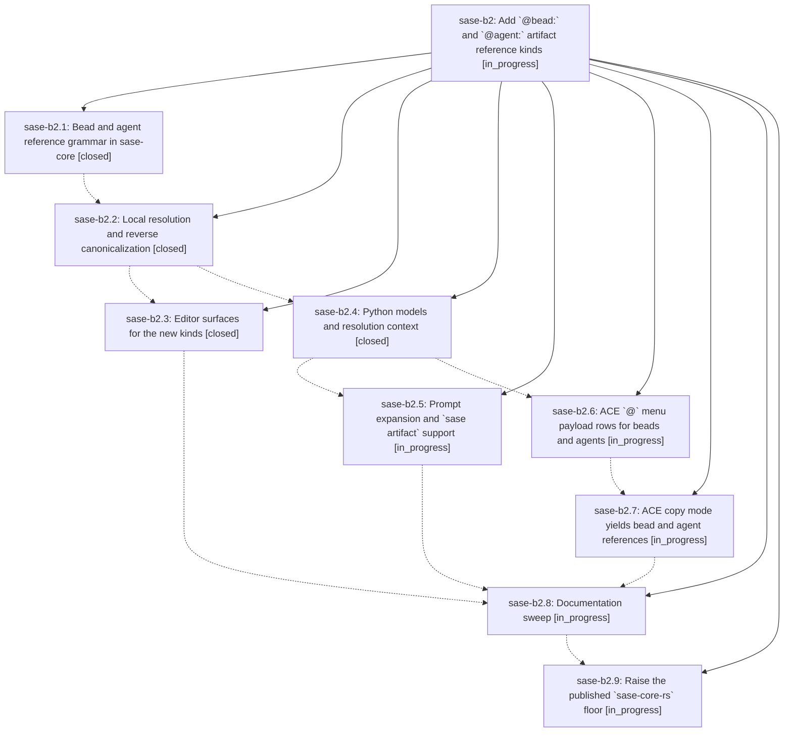

# Bead: sase-b2 — Add \`@bead:\` and \`@agent:\` artifact reference kinds

[Bead Pages](../README.md) / sase-b2

**Status:** ◐ in_progress · **Type:** plan · **Tier:** epic
**Owner:** `bryanbugyi34@gmail.com` · **Assignee:** `sase-b2.land`
**Created:** 2026-07-30 01:33:06 UTC
**Plan:** [202607/bead\_and\_agent\_artifact\_refs.md](https://github.com/sase-org/sase--plans/blob/main/202607/bead_and_agent_artifact_refs.md)

## Description

`@bead:sase-9z` and `@agent:9w` are first-class artifact references everywhere the existing four builtin kinds already work — prompt expansion, `sase artifact show/path/open`, the ACE `@` menu and prompt highlighting, the LSP, and ACE copy mode — resolving through generated bead and agent pages with loud, actionable diagnostics when a page has not been published yet.

## Phases

| Bead | Title | Status | Size | Agents | Commits |
|---|---|---|---|---:|---:|
| [sase-b2.1](sase-b2.1.md) | Bead and agent reference grammar in sase-core | ✓ closed | small | 1 | 0 |
| [sase-b2.2](sase-b2.2.md) | Local resolution and reverse canonicalization | ✓ closed | medium | 1 | 0 |
| [sase-b2.3](sase-b2.3.md) | Editor surfaces for the new kinds | ✓ closed | small | 1 | 0 |
| [sase-b2.4](sase-b2.4.md) | Python models and resolution context | ✓ closed | medium | 1 | 1 |
| [sase-b2.5](sase-b2.5.md) | Prompt expansion and \`sase artifact\` support | ◐ in_progress | small | 1 | 0 |
| [sase-b2.6](sase-b2.6.md) | ACE \`@\` menu payload rows for beads and agents | ◐ in_progress | medium | 1 | 0 |
| [sase-b2.7](sase-b2.7.md) | ACE copy mode yields bead and agent references | ◐ in_progress | medium | 1 | 0 |
| [sase-b2.8](sase-b2.8.md) | Documentation sweep | ◐ in_progress | small | 1 | 0 |
| [sase-b2.9](sase-b2.9.md) | Raise the published \`sase-core-rs\` floor | ◐ in_progress | small | 1 | 0 |

## Lineage

## Agents

| Agent | Bead | Commits |
|---|---|---:|
| [bbugyi200.athena.sase-b2.1](https://github.com/sase-org/sase--agents/blob/main/agents/bbugyi200.athena.sase-b2.1/README.md) | [sase-b2.1](sase-b2.1.md) | 0 |
| [bbugyi200.athena.sase-b2.2](https://github.com/sase-org/sase--agents/blob/main/agents/bbugyi200.athena.sase-b2.2/README.md) | [sase-b2.2](sase-b2.2.md) | 0 |
| [bbugyi200.athena.sase-b2.3](https://github.com/sase-org/sase--agents/blob/main/agents/bbugyi200.athena.sase-b2.3/README.md) | [sase-b2.3](sase-b2.3.md) | 0 |
| [bbugyi200.athena.sase-b2.4](https://github.com/sase-org/sase--agents/blob/main/agents/bbugyi200.athena.sase-b2.4/README.md) | [sase-b2.4](sase-b2.4.md) | 1 |
| [bbugyi200.athena.sase-b2.5](https://github.com/sase-org/sase--agents/blob/main/agents/bbugyi200.athena.sase-b2.5/README.md) | [sase-b2.5](sase-b2.5.md) | 0 |
| [bbugyi200.athena.sase-b2.6](https://github.com/sase-org/sase--agents/blob/main/agents/bbugyi200.athena.sase-b2.6/README.md) | [sase-b2.6](sase-b2.6.md) | 0 |
| [bbugyi200.athena.sase-b2.7](https://github.com/sase-org/sase--agents/blob/main/agents/bbugyi200.athena.sase-b2.7/README.md) | [sase-b2.7](sase-b2.7.md) | 0 |
| [bbugyi200.athena.sase-b2.8](https://github.com/sase-org/sase--agents/blob/main/agents/bbugyi200.athena.sase-b2.8/README.md) | [sase-b2.8](sase-b2.8.md) | 0 |
| [bbugyi200.athena.sase-b2.9](https://github.com/sase-org/sase--agents/blob/main/agents/bbugyi200.athena.sase-b2.9/README.md) | [sase-b2.9](sase-b2.9.md) | 0 |
| [bbugyi200.athena.sase-b2.land](https://github.com/sase-org/sase--agents/blob/main/agents/bbugyi200.athena.sase-b2.land/README.md) | [sase-b2](README.md) | 0 |

## Commits

| Commit | Subject | Bead | Committed (UTC) |
|---|---|---|---|
| [`85b5b64`](https://github.com/sase-org/sase/commit/85b5b642167aa400538f77121546a705f93fbe9f) | feat(artifact-refs): add bead and agent resolution context | [sase-b2.4](sase-b2.4.md) | 2026-07-30 02:23:26 |
