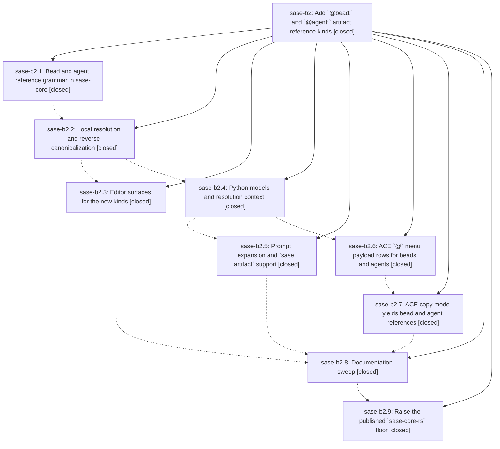

# Bead: sase-b2 — Add \`@bead:\` and \`@agent:\` artifact reference kinds

[Bead Pages](../README.md) / sase-b2

**Status:** ✓ closed · **Resolution:** done · **Type:** plan · **Tier:** epic
**Owner:** `bryanbugyi34@gmail.com` · **Assignee:** `sase-b2.land`
**Created:** 2026-07-30 01:33:06 UTC · **Closed:** 2026-07-30 04:04:39 UTC
**Plan:** [202607/bead\_and\_agent\_artifact\_refs.md](https://github.com/sase-org/sase--plans/blob/main/202607/bead_and_agent_artifact_refs.md)

## Description

`@bead:sase-9z` and `@agent:9w` are first-class artifact references everywhere the existing four builtin kinds already work — prompt expansion, `sase artifact show/path/open`, the ACE `@` menu and prompt highlighting, the LSP, and ACE copy mode — resolving through generated bead and agent pages with loud, actionable diagnostics when a page has not been published yet.

## Notes

[2026-07-30T04:04:39Z · sase-b2.land] Fixed workspace-derived artifact-reference project resolution by preferring the project name, matching GitHub provider slugs across multi-project contexts, and logging best-effort inventory/entity lookup failures. Verified focused regression tests, live bead and agent page resolution, populated entity/repository context, and a green just check.

[2026-07-30T04:11:19Z · sase-b2.land] Finalizer reconfirmed live bead and agent artifact resolution; just check and standalone Symvision passed

## Phases

| Bead | Title | Status | Size | Agents | Commits |
|---|---|---|---|---:|---:|
| [sase-b2.1](sase-b2.1.md) | Bead and agent reference grammar in sase-core | ✓ closed | small | 1 | 1 |
| [sase-b2.2](sase-b2.2.md) | Local resolution and reverse canonicalization | ✓ closed | medium | 1 | 1 |
| [sase-b2.3](sase-b2.3.md) | Editor surfaces for the new kinds | ✓ closed | small | 1 | 1 |
| [sase-b2.4](sase-b2.4.md) | Python models and resolution context | ✓ closed | medium | 1 | 1 |
| [sase-b2.5](sase-b2.5.md) | Prompt expansion and \`sase artifact\` support | ✓ closed | small | 1 | 1 |
| [sase-b2.6](sase-b2.6.md) | ACE \`@\` menu payload rows for beads and agents | ✓ closed | medium | 1 | 1 |
| [sase-b2.7](sase-b2.7.md) | ACE copy mode yields bead and agent references | ✓ closed | medium | 1 | 1 |
| [sase-b2.8](sase-b2.8.md) | Documentation sweep | ✓ closed | small | 1 | 1 |
| [sase-b2.9](sase-b2.9.md) | Raise the published \`sase-core-rs\` floor | ✓ closed | small | 1 | 1 |

## Lineage

## Agents

| Agent | Bead | Commits |
|---|---|---:|
| [bbugyi200.athena.sase-b2.1](https://github.com/sase-org/sase--agents/blob/main/agents/bbugyi200.athena.sase-b2.1/README.md) | [sase-b2.1](sase-b2.1.md) | 1 |
| [bbugyi200.athena.sase-b2.2](https://github.com/sase-org/sase--agents/blob/main/agents/bbugyi200.athena.sase-b2.2/README.md) | [sase-b2.2](sase-b2.2.md) | 1 |
| [bbugyi200.athena.sase-b2.3](https://github.com/sase-org/sase--agents/blob/main/agents/bbugyi200.athena.sase-b2.3/README.md) | [sase-b2.3](sase-b2.3.md) | 1 |
| [bbugyi200.athena.sase-b2.4](https://github.com/sase-org/sase--agents/blob/main/agents/bbugyi200.athena.sase-b2.4/README.md) | [sase-b2.4](sase-b2.4.md) | 1 |
| [bbugyi200.athena.sase-b2.5](https://github.com/sase-org/sase--agents/blob/main/agents/bbugyi200.athena.sase-b2.5/README.md) | [sase-b2.5](sase-b2.5.md) | 1 |
| [bbugyi200.athena.sase-b2.6](https://github.com/sase-org/sase--agents/blob/main/agents/bbugyi200.athena.sase-b2.6/README.md) | [sase-b2.6](sase-b2.6.md) | 1 |
| [bbugyi200.athena.sase-b2.7](https://github.com/sase-org/sase--agents/blob/main/agents/bbugyi200.athena.sase-b2.7/README.md) | [sase-b2.7](sase-b2.7.md) | 1 |
| [bbugyi200.athena.sase-b2.8](https://github.com/sase-org/sase--agents/blob/main/agents/bbugyi200.athena.sase-b2.8/README.md) | [sase-b2.8](sase-b2.8.md) | 1 |
| [bbugyi200.athena.sase-b2.9](https://github.com/sase-org/sase--agents/blob/main/agents/bbugyi200.athena.sase-b2.9/README.md) | [sase-b2.9](sase-b2.9.md) | 1 |
| [bbugyi200.athena.sase-b2.land--code](https://github.com/sase-org/sase--agents/blob/main/families/bbugyi200.athena.sase-b2.land.md#member-code) | [sase-b2](README.md) | 2 |
| [bbugyi200.athena.sase-b2.land--plan](https://github.com/sase-org/sase--agents/blob/main/families/bbugyi200.athena.sase-b2.land.md#member-plan) | [sase-b2](README.md) | 0 |

## Commits

| Commit | Subject | Bead | Committed (UTC) |
|---|---|---|---|
| [`sase-core@c1ae5f5`](https://github.com/sase-org/sase-core/commit/c1ae5f55f85b93658588eb90a700d5fa5c5054cb) | feat(artifact-ref): add bead and agent reference grammar | [sase-b2.1](sase-b2.1.md) | 2026-07-30 01:48:13 |
| [`sase-core@858d24c`](https://github.com/sase-org/sase-core/commit/858d24c8dddec225961734cfbd74bd37da2a976d) | feat(artifact-ref): resolve bead and agent page references | [sase-b2.2](sase-b2.2.md) | 2026-07-30 02:04:04 |
| [`sase-core@aaa4e05`](https://github.com/sase-org/sase-core/commit/aaa4e0506fb4d1e5f84a8f71c715c3bb48b668d9) | feat(artifact-ref): complete bead and agent page references | [sase-b2.3](sase-b2.3.md) | 2026-07-30 02:12:58 |
| [`85b5b64`](https://github.com/sase-org/sase/commit/85b5b642167aa400538f77121546a705f93fbe9f) | feat(artifact-refs): add bead and agent resolution context | [sase-b2.4](sase-b2.4.md) | 2026-07-30 02:23:26 |
| [`278e169`](https://github.com/sase-org/sase/commit/278e16952b95de02025a6f21f438db530362bc7d) | feat: support entity artifact references in prompt paths | [sase-b2.5](sase-b2.5.md) | 2026-07-30 02:38:21 |
| [`3173dae`](https://github.com/sase-org/sase/commit/3173dae12003cace00cb98563e8c134398bd87fc) | feat(ace): add bead and agent completion catalogs | [sase-b2.6](sase-b2.6.md) | 2026-07-30 02:41:25 |
| [`751f469`](https://github.com/sase-org/sase/commit/751f4695712a5cc7d6e68d6c30b930157e6cda84) | feat(ace): copy bead and agent references | [sase-b2.7](sase-b2.7.md) | 2026-07-30 03:02:05 |
| [`34b2f7f`](https://github.com/sase-org/sase/commit/34b2f7f2fdb1038d2c0ff3b82300a9b199b34732) | docs: document bead and agent artifact refs | [sase-b2.8](sase-b2.8.md) | 2026-07-30 03:31:40 |
| [`40f61ab`](https://github.com/sase-org/sase/commit/40f61abb525eec988a3959c1449543502b7a0112) | build(deps): raise the sase-core-rs floor to 0.12.17 | [sase-b2.9](sase-b2.9.md) | 2026-07-30 03:42:42 |
| [`a78894e`](https://github.com/sase-org/sase/commit/a78894e7c409ce576b873af1526570b71d367cce) | fix: resolve artifact entities for workspace projects | [sase-b2](README.md) | 2026-07-30 04:12:07 |
| [`sase--plans@89a96ab`](https://github.com/sase-org/sase--plans/commit/89a96ab7fa7298cca69dc69a62259461019c27be) | docs: mark bead and agent artifact plan done | [sase-b2](README.md) | 2026-07-30 04:13:10 |
