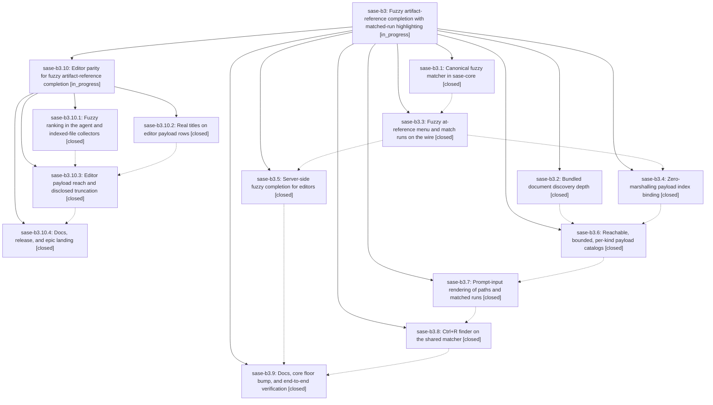

# Bead: sase-b3 — Fuzzy artifact-reference completion with matched-run highlighting

[Bead Pages](../README.md) / sase-b3

**Status:** ◐ in_progress · **Type:** plan · **Tier:** epic
**Owner:** `bryanbugyi34@gmail.com` · **Assignee:** `sase-b3.land`
**Created:** 2026-07-30 08:18:13 UTC
**Plan:** [202607/fuzzy\_artifact\_ref\_completion.md](https://github.com/sase-org/sase--plans/blob/main/202607/fuzzy_artifact_ref_completion.md)

## Description

Typing an artifact reference finds the file by any memorable fragment of its path or title in both the ACE prompt input and external editors, every candidate a reference can name is actually reachable, and every row shows exactly which characters the query matched.

## Phases

| Bead | Title | Status | Size | Agents | Commits |
|---|---|---|---|---:|---:|
| [sase-b3.1](sase-b3.1.md) | Canonical fuzzy matcher in sase-core | ✓ closed | medium | 0 | 0 |
| [sase-b3.2](sase-b3.2.md) | Bundled document discovery depth | ✓ closed | small | 0 | 0 |
| [sase-b3.3](sase-b3.3.md) | Fuzzy at-reference menu and match runs on the wire | ✓ closed | medium | 0 | 0 |
| [sase-b3.4](sase-b3.4.md) | Zero-marshalling payload index binding | ✓ closed | medium | 0 | 0 |
| [sase-b3.5](sase-b3.5.md) | Server-side fuzzy completion for editors | ✓ closed | small | 0 | 0 |
| [sase-b3.6](sase-b3.6.md) | Reachable, bounded, per-kind payload catalogs | ✓ closed | medium | 0 | 0 |
| [sase-b3.7](sase-b3.7.md) | Prompt-input rendering of paths and matched runs | ✓ closed | medium | 0 | 0 |
| [sase-b3.8](sase-b3.8.md) | Ctrl+R finder on the shared matcher | ✓ closed | small | 0 | 0 |
| [sase-b3.9](sase-b3.9.md) | Docs, core floor bump, and end-to-end verification | ✓ closed | small | 1 | 1 |

## Lineage

## Agents

| Agent | Bead | Commits |
|---|---|---:|
| bbugyi200.athena.sase-b3.10.4 | [sase-b3.10.4](sase-b3.10.4.md) | 1 |
| bbugyi200.athena.sase-b3.9 | [sase-b3.9](sase-b3.9.md) | 1 |

## Commits

| Commit | Subject | Bead | Committed (UTC) |
|---|---|---|---|
| [`2e0f6a0`](https://github.com/sase-org/sase-nvim/commit/2e0f6a08a437b171e69e15c17a5300b75c37c395) | docs: document fuzzy artifact reference completion | [sase-b3.9](sase-b3.9.md) | 2026-07-30 10:35:51 |
| [`caf0d51`](https://github.com/sase-org/sase-nvim/commit/caf0d51d5da86980f68a852a69d83ef01720ae8a) | test: cover fuzzy agent-reference completion end to end | [sase-b3.10.4](sase-b3.10.4.md) | 2026-07-30 12:00:58 |
