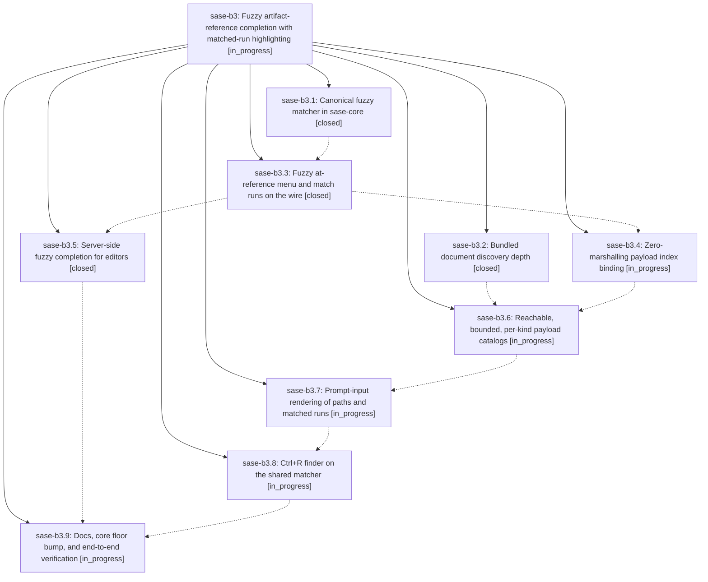

# Bead: sase-b3 — Fuzzy artifact-reference completion with matched-run highlighting

[Bead Pages](../README.md) / sase-b3

**Status:** ◐ in_progress · **Type:** plan · **Tier:** epic
**Owner:** `bryanbugyi34@gmail.com` · **Assignee:** `sase-b3.land`
**Created:** 2026-07-30 08:18:13 UTC
**Plan:** [202607/fuzzy\_artifact\_ref\_completion.md](https://github.com/sase-org/sase--plans/blob/main/202607/fuzzy_artifact_ref_completion.md)

## Description

Typing an artifact reference finds the file by any memorable fragment of its path or title in both the ACE prompt input and external editors, every candidate a reference can name is actually reachable, and every row shows exactly which characters the query matched.

## Phases

| Bead | Title | Status | Size | Agents | Commits |
|---|---|---|---|---:|---:|
| [sase-b3.1](sase-b3.1.md) | Canonical fuzzy matcher in sase-core | ✓ closed | medium | 1 | 1 |
| [sase-b3.2](sase-b3.2.md) | Bundled document discovery depth | ✓ closed | small | 1 | 1 |
| [sase-b3.3](sase-b3.3.md) | Fuzzy at-reference menu and match runs on the wire | ✓ closed | medium | 1 | 1 |
| [sase-b3.4](sase-b3.4.md) | Zero-marshalling payload index binding | ◐ in_progress | medium | 0 | 0 |
| [sase-b3.5](sase-b3.5.md) | Server-side fuzzy completion for editors | ✓ closed | small | 1 | 1 |
| [sase-b3.6](sase-b3.6.md) | Reachable, bounded, per-kind payload catalogs | ◐ in_progress | medium | 0 | 0 |
| [sase-b3.7](sase-b3.7.md) | Prompt-input rendering of paths and matched runs | ◐ in_progress | medium | 0 | 0 |
| [sase-b3.8](sase-b3.8.md) | Ctrl+R finder on the shared matcher | ◐ in_progress | small | 0 | 0 |
| [sase-b3.9](sase-b3.9.md) | Docs, core floor bump, and end-to-end verification | ◐ in_progress | small | 0 | 0 |

## Lineage

## Agents

| Agent | Bead | Commits |
|---|---|---:|
| bbugyi200.athena.sase-b3.1 | [sase-b3.1](sase-b3.1.md) | 1 |
| bbugyi200.athena.sase-b3.2 | [sase-b3.2](sase-b3.2.md) | 1 |
| bbugyi200.athena.sase-b3.3 | [sase-b3.3](sase-b3.3.md) | 1 |
| bbugyi200.athena.sase-b3.5 | [sase-b3.5](sase-b3.5.md) | 1 |

## Commits

| Commit | Subject | Bead | Committed (UTC) |
|---|---|---|---|
| [`36f1d29`](https://github.com/sase-org/sase-core/commit/36f1d29d19b98174e2d0df4e525e67baacecc788) | feat(editor): add canonical fuzzy matcher | [sase-b3.1](sase-b3.1.md) | 2026-07-30 08:28:09 |
| [`1c7057f`](https://github.com/sase-org/sase-core/commit/1c7057fbd97519a4486ddeb9e07bd4d467090895) | fix(plan): discover bundled document corpora | [sase-b3.2](sase-b3.2.md) | 2026-07-30 08:29:59 |
| [`b5c99ce`](https://github.com/sase-org/sase-core/commit/b5c99ce08161800e65f8895b10eb5c594759986e) | feat(editor): fuzzy-match artifact reference menus | [sase-b3.3](sase-b3.3.md) | 2026-07-30 08:42:07 |
| [`374cfc3`](https://github.com/sase-org/sase-core/commit/374cfc37ede51b4b0f41dd0ce2e796597b1dbc97) | feat(lsp): serve server-ranked fuzzy artifact references | [sase-b3.5](sase-b3.5.md) | 2026-07-30 08:54:49 |
