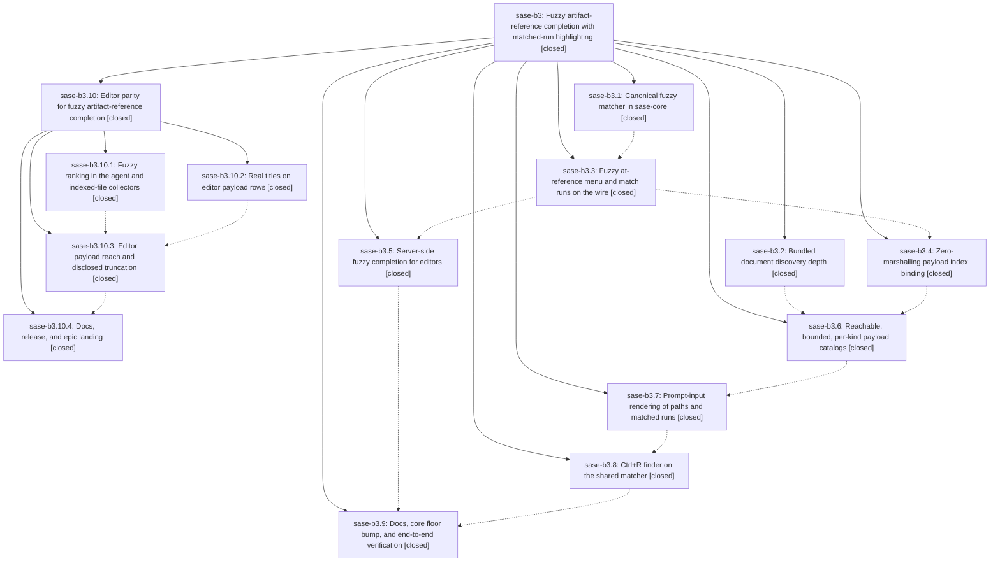

# Bead: sase-b3 — Fuzzy artifact-reference completion with matched-run highlighting

[Bead Pages](../README.md) / sase-b3

**Status:** ✓ closed · **Resolution:** done · **Type:** plan · **Tier:** epic
**Owner:** `bryanbugyi34@gmail.com` · **Assignee:** `sase-b3.land`
**Created:** 2026-07-30 08:18:13 UTC · **Closed:** 2026-07-30 12:34:02 UTC
**Plan:** [202607/fuzzy\_artifact\_ref\_completion.md](https://github.com/sase-org/sase--plans/blob/main/202607/fuzzy_artifact_ref_completion.md)

## Description

Typing an artifact reference finds the file by any memorable fragment of its path or title in both the ACE prompt input and external editors, every candidate a reference can name is actually reachable, and every row shows exactly which characters the query matched.

## Phases

| Bead | Title | Status | Size | Agents | Commits |
|---|---|---|---|---:|---:|
| [sase-b3.1](sase-b3.1.md) | Canonical fuzzy matcher in sase-core | ✓ closed | medium | 1 | 1 |
| [sase-b3.2](sase-b3.2.md) | Bundled document discovery depth | ✓ closed | small | 1 | 1 |
| [sase-b3.3](sase-b3.3.md) | Fuzzy at-reference menu and match runs on the wire | ✓ closed | medium | 1 | 1 |
| [sase-b3.4](sase-b3.4.md) | Zero-marshalling payload index binding | ✓ closed | medium | 1 | 1 |
| [sase-b3.5](sase-b3.5.md) | Server-side fuzzy completion for editors | ✓ closed | small | 1 | 1 |
| [sase-b3.6](sase-b3.6.md) | Reachable, bounded, per-kind payload catalogs | ✓ closed | medium | 1 | 1 |
| [sase-b3.7](sase-b3.7.md) | Prompt-input rendering of paths and matched runs | ✓ closed | medium | 1 | 1 |
| [sase-b3.8](sase-b3.8.md) | Ctrl+R finder on the shared matcher | ✓ closed | small | 1 | 1 |
| [sase-b3.9](sase-b3.9.md) | Docs, core floor bump, and end-to-end verification | ✓ closed | small | 1 | 3 |

## Lineage

## Agents

| Agent | Bead | Commits |
|---|---|---:|
| [bbugyi200.athena.sase-b3.1](https://github.com/sase-org/sase--agents/blob/main/agents/bbugyi200.athena.sase-b3.1/README.md) | [sase-b3.1](sase-b3.1.md) | 1 |
| [bbugyi200.athena.sase-b3.10.1](https://github.com/sase-org/sase--agents/blob/main/agents/bbugyi200.athena.sase-b3.10.1/README.md) | [sase-b3.10.1](sase-b3.10.1.md) | 1 |
| [bbugyi200.athena.sase-b3.10.2](https://github.com/sase-org/sase--agents/blob/main/agents/bbugyi200.athena.sase-b3.10.2/README.md) | [sase-b3.10.2](sase-b3.10.2.md) | 1 |
| [bbugyi200.athena.sase-b3.10.3](https://github.com/sase-org/sase--agents/blob/main/agents/bbugyi200.athena.sase-b3.10.3/README.md) | [sase-b3.10.3](sase-b3.10.3.md) | 1 |
| [bbugyi200.athena.sase-b3.10.4](https://github.com/sase-org/sase--agents/blob/main/agents/bbugyi200.athena.sase-b3.10.4/README.md) | [sase-b3.10.4](sase-b3.10.4.md) | 2 |
| [bbugyi200.athena.sase-b3.10.land--code](https://github.com/sase-org/sase--agents/blob/main/families/bbugyi200.athena.sase-b3.10.land.md#member-code) | [sase-b3.10](sase-b3.10.md) | 1 |
| [bbugyi200.athena.sase-b3.10.land--plan](https://github.com/sase-org/sase--agents/blob/main/families/bbugyi200.athena.sase-b3.10.land.md#member-plan) | [sase-b3.10](sase-b3.10.md) | 0 |
| [bbugyi200.athena.sase-b3.2](https://github.com/sase-org/sase--agents/blob/main/agents/bbugyi200.athena.sase-b3.2/README.md) | [sase-b3.2](sase-b3.2.md) | 1 |
| [bbugyi200.athena.sase-b3.3](https://github.com/sase-org/sase--agents/blob/main/agents/bbugyi200.athena.sase-b3.3/README.md) | [sase-b3.3](sase-b3.3.md) | 1 |
| [bbugyi200.athena.sase-b3.4](https://github.com/sase-org/sase--agents/blob/main/agents/bbugyi200.athena.sase-b3.4/README.md) | [sase-b3.4](sase-b3.4.md) | 1 |
| [bbugyi200.athena.sase-b3.5](https://github.com/sase-org/sase--agents/blob/main/agents/bbugyi200.athena.sase-b3.5/README.md) | [sase-b3.5](sase-b3.5.md) | 1 |
| [bbugyi200.athena.sase-b3.6](https://github.com/sase-org/sase--agents/blob/main/agents/bbugyi200.athena.sase-b3.6/README.md) | [sase-b3.6](sase-b3.6.md) | 1 |
| [bbugyi200.athena.sase-b3.7](https://github.com/sase-org/sase--agents/blob/main/agents/bbugyi200.athena.sase-b3.7/README.md) | [sase-b3.7](sase-b3.7.md) | 1 |
| [bbugyi200.athena.sase-b3.8](https://github.com/sase-org/sase--agents/blob/main/agents/bbugyi200.athena.sase-b3.8/README.md) | [sase-b3.8](sase-b3.8.md) | 1 |
| [bbugyi200.athena.sase-b3.9](https://github.com/sase-org/sase--agents/blob/main/agents/bbugyi200.athena.sase-b3.9/README.md) | [sase-b3.9](sase-b3.9.md) | 3 |
| [bbugyi200.athena.sase-b3.land](https://github.com/sase-org/sase--agents/blob/main/agents/bbugyi200.athena.sase-b3.land/README.md) | [sase-b3](README.md) | 0 |

## Commits

| Commit | Subject | Bead | Committed (UTC) |
|---|---|---|---|
| [`sase-core@36f1d29`](https://github.com/sase-org/sase-core/commit/36f1d29d19b98174e2d0df4e525e67baacecc788) | feat(editor): add canonical fuzzy matcher | [sase-b3.1](sase-b3.1.md) | 2026-07-30 08:28:09 |
| [`sase-core@1c7057f`](https://github.com/sase-org/sase-core/commit/1c7057fbd97519a4486ddeb9e07bd4d467090895) | fix(plan): discover bundled document corpora | [sase-b3.2](sase-b3.2.md) | 2026-07-30 08:29:59 |
| [`sase-core@b5c99ce`](https://github.com/sase-org/sase-core/commit/b5c99ce08161800e65f8895b10eb5c594759986e) | feat(editor): fuzzy-match artifact reference menus | [sase-b3.3](sase-b3.3.md) | 2026-07-30 08:42:07 |
| [`sase-core@374cfc3`](https://github.com/sase-org/sase-core/commit/374cfc37ede51b4b0f41dd0ce2e796597b1dbc97) | feat(lsp): serve server-ranked fuzzy artifact references | [sase-b3.5](sase-b3.5.md) | 2026-07-30 08:54:49 |
| [`sase-core@1290667`](https://github.com/sase-org/sase-core/commit/12906673cb769a4c2f9d9d499df4968e2132329c) | feat(editor): add indexed at-reference payload binding | [sase-b3.4](sase-b3.4.md) | 2026-07-30 09:02:20 |
| [`cbe3d21`](https://github.com/sase-org/sase/commit/cbe3d214af47a9e645bfac725cd64960f337409c) | perf(artifact-refs): cache bounded payload catalogs | [sase-b3.6](sase-b3.6.md) | 2026-07-30 09:31:13 |
| [`b6b51f2`](https://github.com/sase-org/sase/commit/b6b51f2399df191dc5a926a26a3040a74bda3b03) | feat(tui): highlight fuzzy artifact reference matches | [sase-b3.7](sase-b3.7.md) | 2026-07-30 09:53:01 |
| [`835536a`](https://github.com/sase-org/sase/commit/835536a846a55f596fa707145ca629a5bb46188f) | refactor(tui): reuse shared fuzzy matcher in finder | [sase-b3.8](sase-b3.8.md) | 2026-07-30 10:10:44 |
| [`43c5562`](https://github.com/sase-org/sase/commit/43c55620fd790c7390e743b203c6fcef6800f825) | docs: document fuzzy artifact reference completion | [sase-b3.9](sase-b3.9.md) | 2026-07-30 10:33:48 |
| [`c135dcb`](https://github.com/sase-org/sase/commit/c135dcbd62843e00697d89390dc53734de9098e0) | build(deps): raise the sase-core-rs floor to 0.12.18 | [sase-b3.9](sase-b3.9.md) | 2026-07-30 10:34:54 |
| [`sase--plans@6c21bbb`](https://github.com/sase-org/sase--plans/commit/6c21bbb69813313c3f2106a008e3e35f86bd4398) | docs: add the missing prompt link to the fuzzy completion plan | [sase-b3.9](sase-b3.9.md) | 2026-07-30 10:36:36 |
| [`sase-core@149aee8`](https://github.com/sase-org/sase-core/commit/149aee8f2a88ac282ba395a807a485f031ce11fa) | feat(editor): rank agent and indexed-file completions with the fuzzy matcher | [sase-b3.10.1](sase-b3.10.1.md) | 2026-07-30 11:12:07 |
| [`sase-core@dee5430`](https://github.com/sase-org/sase-core/commit/dee54308c88b7f9bdd5d249a5086c10f24805384) | fix(editor): preserve artifact reference titles in completions | [sase-b3.10.2](sase-b3.10.2.md) | 2026-07-30 11:16:10 |
| [`sase-core@24e773e`](https://github.com/sase-org/sase-core/commit/24e773ec2789199613e53b32d9169dce0423d6c7) | feat(editor): expand cached artifact payload inventory | [sase-b3.10.3](sase-b3.10.3.md) | 2026-07-30 11:38:37 |
| [`5ff7b8a`](https://github.com/sase-org/sase/commit/5ff7b8ab899d014b5f8d4d2be7af6fe0a865213a) | docs: correct artifact-reference completion reachability claims | [sase-b3.10.4](sase-b3.10.4.md) | 2026-07-30 11:59:54 |
| [`sase--plans@898f0fb`](https://github.com/sase-org/sase--plans/commit/898f0fb6a43a150f8d80c489ae2f22d55602d846) | docs: mark the editor artifact-ref parity plan done | [sase-b3.10.4](sase-b3.10.4.md) | 2026-07-30 12:01:56 |
| [`02de1fd`](https://github.com/sase-org/sase/commit/02de1fd2aceb105419a188fa9cd1d46c53782d7c) | build(deps): require sase-core-rs 0.12.19 | [sase-b3.10](sase-b3.10.md) | 2026-07-30 12:30:20 |
