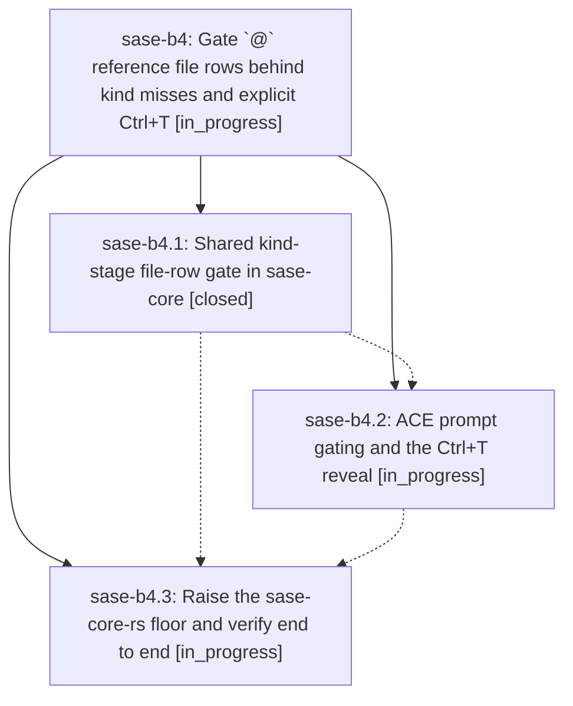

# Bead: sase-b4 — Gate \`@\` reference file rows behind kind misses and explicit Ctrl+T

[Bead Pages](../README.md) / sase-b4

**Status:** ◐ in_progress · **Type:** plan · **Tier:** epic
**Owner:** `bryanbugyi34@gmail.com` · **Assignee:** `sase-b4.land`
**Created:** 2026-07-30 11:14:59 UTC
**Plan:** [202607/at\_reference\_file\_row\_gate.md](https://github.com/sase-org/sase--plans/blob/main/202607/at_reference_file_row_gate.md)

## Description

The grouped `@` reference menu lists local file rows only when no artifact kind prefix-matches the typed text, or when the user explicitly asks for them (`Ctrl+T` in the ACE prompt, a manually invoked completion request over LSP). The rule is decided once in the shared Rust core so the TUI and every LSP client agree.

## Phases

| Bead | Title | Status | Size | Agents | Commits |
|---|---|---|---|---:|---:|
| [sase-b4.1](sase-b4.1.md) | Shared kind-stage file-row gate in sase-core | ✓ closed | medium | 1 | 1 |
| [sase-b4.2](sase-b4.2.md) | ACE prompt gating and the Ctrl+T reveal | ◐ in_progress | medium | 0 | 0 |
| [sase-b4.3](sase-b4.3.md) | Raise the sase-core-rs floor and verify end to end | ◐ in_progress | xsmall | 0 | 0 |

## Lineage

## Agents

| Agent | Bead | Commits |
|---|---|---:|
| bbugyi200.athena.sase-b4.1 | [sase-b4.1](sase-b4.1.md) | 1 |

## Commits

| Commit | Subject | Bead | Committed (UTC) |
|---|---|---|---|
| [`4e61ad0`](https://github.com/sase-org/sase-core/commit/4e61ad05ed30824e827e50a3d2d99cfca82200ef) | feat(editor): gate file reference rows behind explicit opt-in | [sase-b4.1](sase-b4.1.md) | 2026-07-30 11:27:44 |
