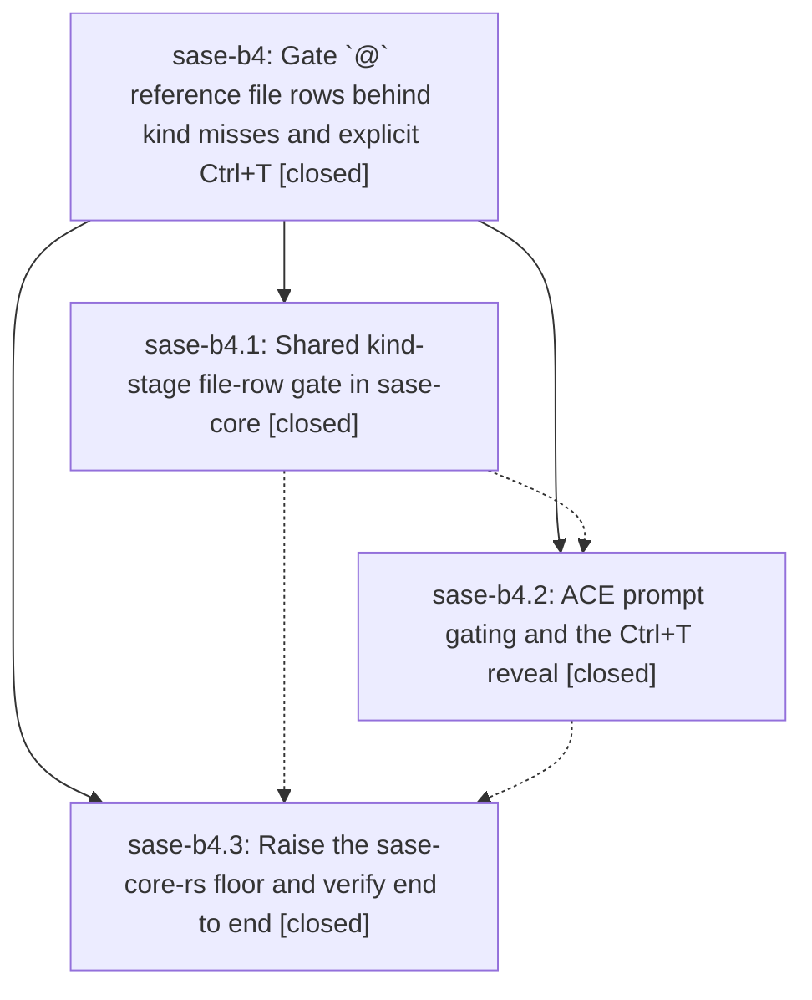

# Bead: sase-b4 — Gate \`@\` reference file rows behind kind misses and explicit Ctrl+T

[Bead Pages](../README.md) / sase-b4

**Status:** ✓ closed · **Resolution:** done · **Type:** plan · **Tier:** epic
**Owner:** `bryanbugyi34@gmail.com` · **Assignee:** `sase-b4.land`
**Created:** 2026-07-30 11:14:59 UTC · **Closed:** 2026-07-30 12:29:06 UTC
**Plan:** [202607/at\_reference\_file\_row\_gate.md](https://github.com/sase-org/sase--plans/blob/main/202607/at_reference_file_row_gate.md)

## Description

The grouped `@` reference menu lists local file rows only when no artifact kind prefix-matches the typed text, or when the user explicitly asks for them (`Ctrl+T` in the ACE prompt, a manually invoked completion request over LSP). The rule is decided once in the shared Rust core so the TUI and every LSP client agree.

## Notes

[2026-07-30T12:29:06Z · sase-b4.land] Verified the complete epic against current code and child evidence: sase-b4.1's shared Rust Kind-stage tier-0 file gate, files_suppressed wire, include_files binding option, and manual-invocation LSP mapping; sase-b4.2's Python/TUI plumbing, sticky per-menu Ctrl+T reveal, panel hint, docs, and regressions; and sase-b4.3's published sase-core-rs 0.12.19 floor in pyproject.toml/uv.lock plus exact-PyPI behavioral CI smoke. Reviewed later sase and sase-core commits, including the compatible cached LSP inventory work and 0.12.19 release, with no missing integration. PyPI minimum validation, a clean Python 3.12 exact-wheel smoke with all 215 required bindings, 101 focused tests, 392 visual tests (1 skipped), plan-link validation, and full just check all passed.

[2026-07-30T12:32:14Z · sase-b4.land] Finalizer re-confirmation: epic remains complete with the published 0.12.19 floor, exact-wheel behavioral smoke, focused and visual suites, plan-link validation, post-close Symvision, and full just check all verified.

## Phases

| Bead | Title | Status | Size | Agents | Commits |
|---|---|---|---|---:|---:|
| [sase-b4.1](sase-b4.1.md) | Shared kind-stage file-row gate in sase-core | ✓ closed | medium | 0 | 0 |
| [sase-b4.2](sase-b4.2.md) | ACE prompt gating and the Ctrl+T reveal | ✓ closed | medium | 0 | 0 |
| [sase-b4.3](sase-b4.3.md) | Raise the sase-core-rs floor and verify end to end | ✓ closed | xsmall | 0 | 0 |

## Lineage

## Agents

| Agent | Bead | Commits |
|---|---|---:|
| bbugyi200.athena.sase-b4.land--code | [sase-b4](README.md) | 1 |

## Commits

| Commit | Subject | Bead | Committed (UTC) |
|---|---|---|---|
| [`7bf2f17`](https://github.com/sase-org/sase--plans/commit/7bf2f173f906774f85b303f3791ba77c8c6b7c7e) | docs(plans): land the b4 release-floor plan | [sase-b4](README.md) | 2026-07-30 12:34:19 |
