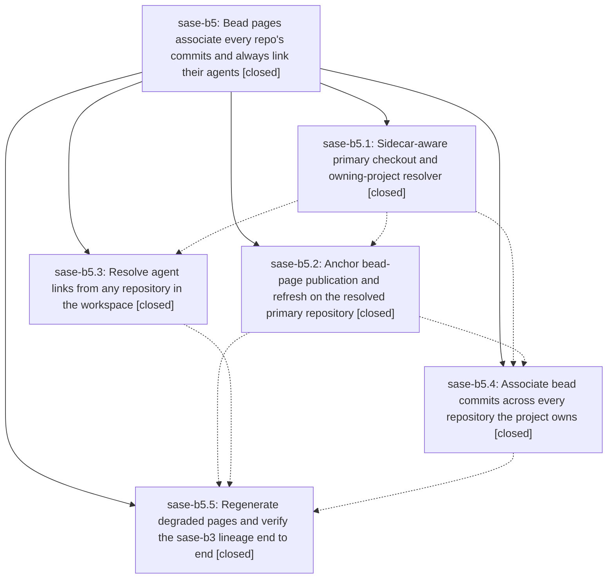

# Bead: sase-b5 — Bead pages associate every repo's commits and always link their agents

[Bead Pages](../README.md) / sase-b5

**Status:** ✓ closed · **Resolution:** done · **Type:** plan · **Tier:** epic
**Owner:** `bryanbugyi34@gmail.com` · **Assignee:** `sase-b5.land`
**Created:** 2026-07-30 11:19:49 UTC · **Closed:** 2026-07-30 13:42:03 UTC
**Plan:** [202607/bead\_page\_association\_anchors.md](https://github.com/sase-org/sase--plans/blob/main/202607/bead_page_association_anchors.md)

## Description

A published bead page lists every commit and agent actually associated with that bead lineage — no matter which of the project's repositories the commit landed in — links each commit to its own owning repository, links every agent to its agents-sidecar page, and can never again be emptied by a commit made outside the primary repository.

## Notes

[2026-07-30T13:42:03Z · sase-b5.land] Verified all five phases against source and commits (ad0f038, f1289a1, 5ba1f08, 8e7120e, f62e8cd): checkout_anchor.py resolves marker-first with a sase/repos strip fallback; publication, refresh, cli_pages, links, and workflow_publication all route through it; hosted agent remotes and SASE_AGENT footers resolve the owning project from the anchor; associations walk primary+sidecar+linked clones with per-repository commit URLs, non-primary-only label qualification, and repository-inclusive sort keys. Live evidence: plans-sidecar commit 9e4cba70 and sase-core commit ee287b0 now carry linked SASE_AGENT footers where pre-fix commits (db547d9c, 24e773e) carry bare ones; pages/sase-b3/README.md matches the plan's target state (b3.1-b3.5 one sase-core commit each, b3.6-b3.8 one primary each, b3.9 two primary plus one sase--plans), with every agent row linked. Independently reproduced the guard: audit_commit_link_attribution finds 29 misattributed links (23 sase--plans, 6 sase-core) on pre-repair page bytes and 0 today; sase doctor project.bead_pages reports OK; the repair commit changed 491 of 2381 pages, leaving 1890 byte-identical. 67 focused tests pass and a full refresh dry run reports only 3 unrelated in-flight sase-b7 pages. Integration: reviewed every non-epic commit since the epic began (9ba92b09, 5ff7b8ab, 7eef4dab, 63942523, 02de1fd2, 11cdd780, 2a334551, 70b8fe28, d309f953) - the only shared file is the Justfile symvision whitelist (additive sase-b7 entries), and sase-b7.2's artifact_capture_policy takes project and workspace_num explicitly rather than inferring them from cwd, so nothing duplicates or conflicts with the anchor. Follow-up recorded separately: the sibling plan-header projection (sdd/associations/_build.py, reached via refresh_committed_plan_header with an unanchored cp.cwd) still has all three root causes.

## Phases

| Bead | Title | Status | Size | Agents | Commits |
|---|---|---|---|---:|---:|
| [sase-b5.1](sase-b5.1.md) | Sidecar-aware primary checkout and owning-project resolver | ✓ closed | small | 1 | 2 |
| [sase-b5.2](sase-b5.2.md) | Anchor bead-page publication and refresh on the resolved primary repository | ✓ closed | small | 1 | 1 |
| [sase-b5.3](sase-b5.3.md) | Resolve agent links from any repository in the workspace | ✓ closed | medium | 1 | 1 |
| [sase-b5.4](sase-b5.4.md) | Associate bead commits across every repository the project owns | ✓ closed | medium | 1 | 1 |
| [sase-b5.5](sase-b5.5.md) | Regenerate degraded pages and verify the sase-b3 lineage end to end | ✓ closed | small | 1 | 1 |

## Lineage

## Agents

| Agent | Bead | Commits |
|---|---|---:|
| [bbugyi200.athena.sase-b5.1](https://github.com/sase-org/sase--agents/blob/main/agents/bbugyi200.athena.sase-b5.1/README.md) | [sase-b5.1](sase-b5.1.md) | 2 |
| [bbugyi200.athena.sase-b5.2](https://github.com/sase-org/sase--agents/blob/main/agents/bbugyi200.athena.sase-b5.2/README.md) | [sase-b5.2](sase-b5.2.md) | 1 |
| [bbugyi200.athena.sase-b5.3](https://github.com/sase-org/sase--agents/blob/main/agents/bbugyi200.athena.sase-b5.3/README.md) | [sase-b5.3](sase-b5.3.md) | 1 |
| [bbugyi200.athena.sase-b5.4](https://github.com/sase-org/sase--agents/blob/main/agents/bbugyi200.athena.sase-b5.4/README.md) | [sase-b5.4](sase-b5.4.md) | 1 |
| [bbugyi200.athena.sase-b5.5](https://github.com/sase-org/sase--agents/blob/main/agents/bbugyi200.athena.sase-b5.5/README.md) | [sase-b5.5](sase-b5.5.md) | 1 |
| [bbugyi200.athena.sase-b5.land](https://github.com/sase-org/sase--agents/blob/main/agents/bbugyi200.athena.sase-b5.land/README.md) | [sase-b5](README.md) | 2 |

## Commits

| Repo | Commit | Subject | Bead | Committed (UTC) |
|---|---|---|---|---|
| sase | [`ad0f038`](https://github.com/sase-org/sase/commit/ad0f038a05e9b840247a5c97822c2ee3ebb05830) | feat(sdd): add checkout anchor resolver | [sase-b5.1](sase-b5.1.md) | 2026-07-30 12:08:28 |
| sase--plans | [`218e78c`](https://github.com/sase-org/sase--plans/commit/218e78c4d802c357276be9866ed89786795914c7) | docs: add missing prompt backlinks | [sase-b5.1](sase-b5.1.md) | 2026-07-30 12:09:38 |
| sase | [`f1289a1`](https://github.com/sase-org/sase/commit/f1289a124ba4e94478b2ea0f973344c8a96ebc46) | fix: resolve agent links through checkout anchors | [sase-b5.3](sase-b5.3.md) | 2026-07-30 12:39:25 |
| sase | [`5ba1f08`](https://github.com/sase-org/sase/commit/5ba1f08d0262d14300f295b60b8fee2df3866d50) | fix: anchor bead page publication on primary checkout | [sase-b5.2](sase-b5.2.md) | 2026-07-30 12:39:39 |
| sase | [`8e7120e`](https://github.com/sase-org/sase/commit/8e7120ebe048dca1737c71592100244c8a52dc93) | feat(bead-pages): associate commits across project repositories | [sase-b5.4](sase-b5.4.md) | 2026-07-30 13:13:45 |
| sase | [`f62e8cd`](https://github.com/sase-org/sase/commit/f62e8cd01713c934cb6e5fcf0374667805a78ceb) | feat(bead-pages): guard against misattributed commit links | [sase-b5.5](sase-b5.5.md) | 2026-07-30 13:31:35 |
| sase | [`3475368`](https://github.com/sase-org/sase/commit/3475368f66c8cdacf59a26802ee50cdc53d23269) | refactor(sdd): make the checkout anchor dataclass module-private | [sase-b5](README.md) | 2026-07-30 13:59:24 |
| sase--plans | [`4905691`](https://github.com/sase-org/sase--plans/commit/4905691eb170c61e3d6b1d072b08b871510b2733) | docs(plans): land the bead-page association anchors plan | [sase-b5](README.md) | 2026-07-30 14:00:34 |
