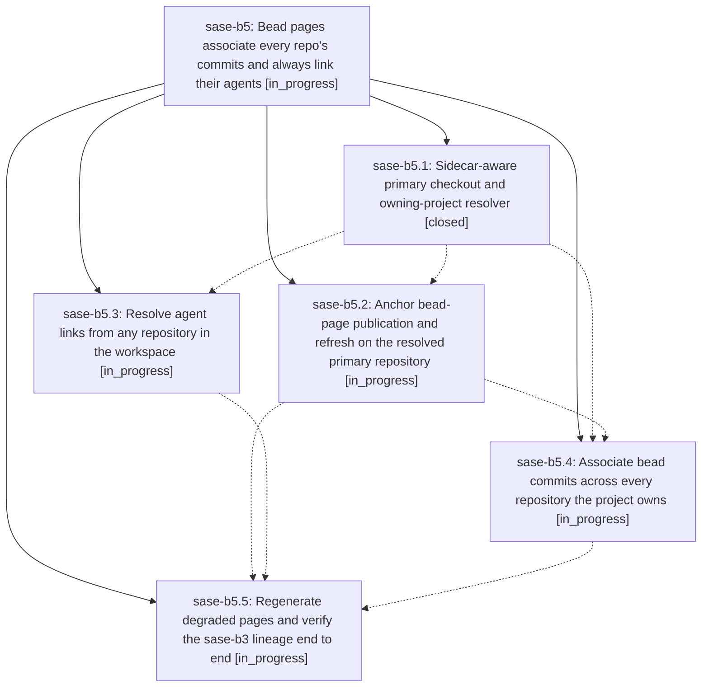

# Bead: sase-b5 — Bead pages associate every repo's commits and always link their agents

[Bead Pages](../README.md) / sase-b5

**Status:** ◐ in_progress · **Type:** plan · **Tier:** epic
**Owner:** `bryanbugyi34@gmail.com` · **Assignee:** `sase-b5.land`
**Created:** 2026-07-30 11:19:49 UTC
**Plan:** [202607/bead\_page\_association\_anchors.md](https://github.com/sase-org/sase--plans/blob/main/202607/bead_page_association_anchors.md)

## Description

A published bead page lists every commit and agent actually associated with that bead lineage — no matter which of the project's repositories the commit landed in — links each commit to its own owning repository, links every agent to its agents-sidecar page, and can never again be emptied by a commit made outside the primary repository.

## Phases

| Bead | Title | Status | Size | Agents | Commits |
|---|---|---|---|---:|---:|
| [sase-b5.1](sase-b5.1.md) | Sidecar-aware primary checkout and owning-project resolver | ✓ closed | small | 1 | 1 |
| [sase-b5.2](sase-b5.2.md) | Anchor bead-page publication and refresh on the resolved primary repository | ◐ in_progress | small | 0 | 0 |
| [sase-b5.3](sase-b5.3.md) | Resolve agent links from any repository in the workspace | ◐ in_progress | medium | 0 | 0 |
| [sase-b5.4](sase-b5.4.md) | Associate bead commits across every repository the project owns | ◐ in_progress | medium | 0 | 0 |
| [sase-b5.5](sase-b5.5.md) | Regenerate degraded pages and verify the sase-b3 lineage end to end | ◐ in_progress | small | 0 | 0 |

## Lineage

## Agents

| Agent | Bead | Commits |
|---|---|---:|
| bbugyi200.athena.sase-b5.1 | [sase-b5.1](sase-b5.1.md) | 1 |

## Commits

| Commit | Subject | Bead | Committed (UTC) |
|---|---|---|---|
| [`218e78c`](https://github.com/sase-org/sase--plans/commit/218e78c4d802c357276be9866ed89786795914c7) | docs: add missing prompt backlinks | [sase-b5.1](sase-b5.1.md) | 2026-07-30 12:09:38 |
