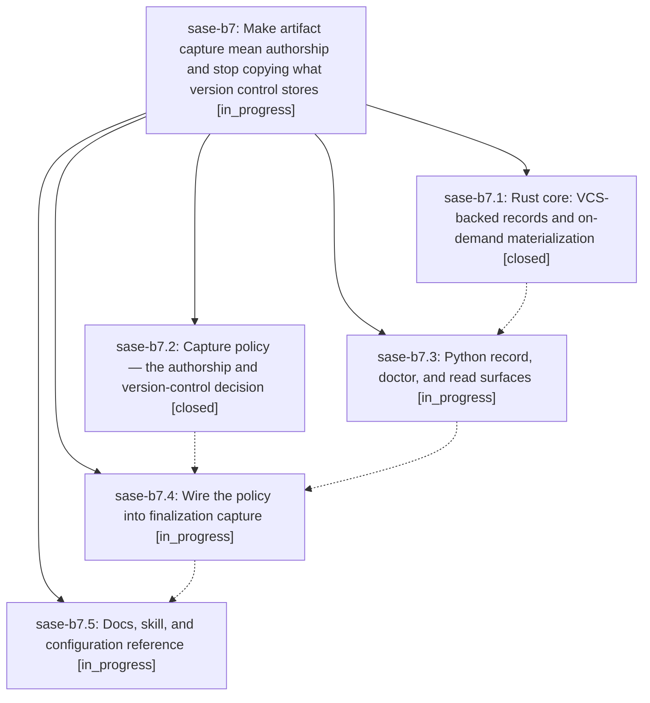

# Bead: sase-b7 — Make artifact capture mean authorship and stop copying what version control stores

[Bead Pages](../README.md) / sase-b7

**Status:** ◐ in_progress · **Type:** plan · **Tier:** epic
**Owner:** `bryanbugyi34@gmail.com` · **Assignee:** `sase-b7.land`
**Created:** 2026-07-30 12:52:41 UTC
**Plan:** [202607/vcs\_backed\_artifact\_capture.md](https://github.com/sase-org/sase--plans/blob/main/202607/vcs_backed_artifact_capture.md)

## Description

Automatic artifact capture keeps bytes only for files an agent authored that version control cannot reproduce. Files that version control can reproduce get a byte-free record carrying repo, commit, and path provenance, and every reader — CLI, Files pane, and prompt `@`-ref expansion — can still get their exact content on demand.

## Phases

| Bead | Title | Status | Size | Agents | Commits |
|---|---|---|---|---:|---:|
| [sase-b7.1](sase-b7.1.md) | Rust core: VCS-backed records and on-demand materialization | ✓ closed | medium | 1 | 1 |
| [sase-b7.2](sase-b7.2.md) | Capture policy — the authorship and version-control decision | ✓ closed | medium | 1 | 0 |
| [sase-b7.3](sase-b7.3.md) | Python record, doctor, and read surfaces | ◐ in_progress | medium | 1 | 0 |
| [sase-b7.4](sase-b7.4.md) | Wire the policy into finalization capture | ◐ in_progress | small | 1 | 0 |
| [sase-b7.5](sase-b7.5.md) | Docs, skill, and configuration reference | ◐ in_progress | small | 1 | 0 |

## Lineage

## Agents

| Agent | Bead | Commits |
|---|---|---:|
| [bbugyi200.athena.sase-b7.1](https://github.com/sase-org/sase--agents/blob/main/agents/bbugyi200.athena.sase-b7.1/README.md) | [sase-b7.1](sase-b7.1.md) | 1 |
| [bbugyi200.athena.sase-b7.2](https://github.com/sase-org/sase--agents/blob/main/agents/bbugyi200.athena.sase-b7.2/README.md) | [sase-b7.2](sase-b7.2.md) | 0 |
| [bbugyi200.athena.sase-b7.3](https://github.com/sase-org/sase--agents/blob/main/agents/bbugyi200.athena.sase-b7.3/README.md) | [sase-b7.3](sase-b7.3.md) | 0 |
| [bbugyi200.athena.sase-b7.4](https://github.com/sase-org/sase--agents/blob/main/agents/bbugyi200.athena.sase-b7.4/README.md) | [sase-b7.4](sase-b7.4.md) | 0 |
| [bbugyi200.athena.sase-b7.5](https://github.com/sase-org/sase--agents/blob/main/agents/bbugyi200.athena.sase-b7.5/README.md) | [sase-b7.5](sase-b7.5.md) | 0 |
| [bbugyi200.athena.sase-b7.land](https://github.com/sase-org/sase--agents/blob/main/agents/bbugyi200.athena.sase-b7.land/README.md) | [sase-b7](README.md) | 0 |

## Commits

| Commit | Subject | Bead | Committed (UTC) |
|---|---|---|---|
| [`sase-core@ee287b0`](https://github.com/sase-org/sase-core/commit/ee287b0523c8d611e9ce7935fc2a534287b7b104) | feat!: materialize VCS-backed artifact files | [sase-b7.1](sase-b7.1.md) | 2026-07-30 13:22:25 |
