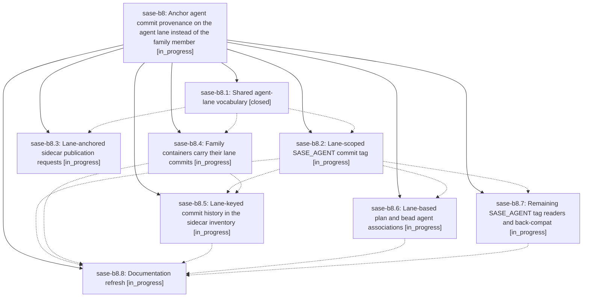

# Bead: sase-b8 — Anchor agent commit provenance on the agent lane instead of the family member

[Bead Pages](../README.md) / sase-b8

**Status:** ◐ in_progress · **Type:** plan · **Tier:** epic
**Owner:** `bryanbugyi34@gmail.com` · **Assignee:** `sase-b8.land`
**Created:** 2026-07-30 14:32:31 UTC
**Plan:** [202607/family\_scoped\_agent\_provenance.md](https://github.com/sase-org/sase--plans/blob/main/202607/family_scoped_agent_provenance.md)

## Description

Commits made by an agent family member are published, tagged, and linked as their family (`foo`, not `foo--code`), solo agents keep their current behavior exactly, and no commit provenance is lost anywhere that previously relied on the member-name `SASE_AGENT=` tag.

## Phases

| Bead | Title | Status | Size | Agents | Commits |
|---|---|---|---|---:|---:|
| [sase-b8.1](sase-b8.1.md) | Shared agent-lane vocabulary | ✓ closed | small | 1 | 1 |
| [sase-b8.2](sase-b8.2.md) | Lane-scoped SASE\_AGENT commit tag | ◐ in_progress | small | 1 | 0 |
| [sase-b8.3](sase-b8.3.md) | Lane-anchored sidecar publication requests | ◐ in_progress | small | 1 | 0 |
| [sase-b8.4](sase-b8.4.md) | Family containers carry their lane commits | ◐ in_progress | medium | 1 | 0 |
| [sase-b8.5](sase-b8.5.md) | Lane-keyed commit history in the sidecar inventory | ◐ in_progress | medium | 1 | 0 |
| [sase-b8.6](sase-b8.6.md) | Lane-based plan and bead agent associations | ◐ in_progress | medium | 1 | 0 |
| [sase-b8.7](sase-b8.7.md) | Remaining SASE\_AGENT tag readers and back-compat | ◐ in_progress | small | 1 | 0 |
| [sase-b8.8](sase-b8.8.md) | Documentation refresh | ◐ in_progress | small | 1 | 0 |

## Lineage

## Agents

| Agent | Bead | Commits |
|---|---|---:|
| [bbugyi200.athena.sase-b8.1](https://github.com/sase-org/sase--agents/blob/main/agents/bbugyi200.athena.sase-b8.1/README.md) | [sase-b8.1](sase-b8.1.md) | 1 |
| [bbugyi200.athena.sase-b8.2](https://github.com/sase-org/sase--agents/blob/main/agents/bbugyi200.athena.sase-b8.2/README.md) | [sase-b8.2](sase-b8.2.md) | 0 |
| [bbugyi200.athena.sase-b8.3](https://github.com/sase-org/sase--agents/blob/main/agents/bbugyi200.athena.sase-b8.3/README.md) | [sase-b8.3](sase-b8.3.md) | 0 |
| [bbugyi200.athena.sase-b8.4](https://github.com/sase-org/sase--agents/blob/main/agents/bbugyi200.athena.sase-b8.4/README.md) | [sase-b8.4](sase-b8.4.md) | 0 |
| [bbugyi200.athena.sase-b8.5](https://github.com/sase-org/sase--agents/blob/main/agents/bbugyi200.athena.sase-b8.5/README.md) | [sase-b8.5](sase-b8.5.md) | 0 |
| [bbugyi200.athena.sase-b8.6](https://github.com/sase-org/sase--agents/blob/main/agents/bbugyi200.athena.sase-b8.6/README.md) | [sase-b8.6](sase-b8.6.md) | 0 |
| [bbugyi200.athena.sase-b8.7](https://github.com/sase-org/sase--agents/blob/main/agents/bbugyi200.athena.sase-b8.7/README.md) | [sase-b8.7](sase-b8.7.md) | 0 |
| [bbugyi200.athena.sase-b8.8](https://github.com/sase-org/sase--agents/blob/main/agents/bbugyi200.athena.sase-b8.8/README.md) | [sase-b8.8](sase-b8.8.md) | 0 |
| [bbugyi200.athena.sase-b8.land](https://github.com/sase-org/sase--agents/blob/main/agents/bbugyi200.athena.sase-b8.land/README.md) | [sase-b8](README.md) | 0 |

## Commits

| Repo | Commit | Subject | Bead | Committed (UTC) |
|---|---|---|---|---|
| sase | [`c537f7e`](https://github.com/sase-org/sase/commit/c537f7e03de7315d07f041def613cbba0bcde354) | feat(agents): add shared agent-lane vocabulary | [sase-b8.1](sase-b8.1.md) | 2026-07-30 14:51:14 |
