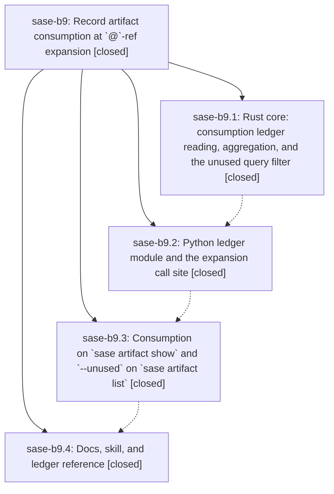

# Bead: sase-b9 — Record artifact consumption at \`@\`-ref expansion

[Bead Pages](../README.md) / sase-b9

**Status:** ✓ closed · **Resolution:** done · **Type:** plan · **Tier:** epic
**Owner:** `bryanbugyi34@gmail.com` · **Assignee:** `sase-b9.land`
**Created:** 2026-07-30 14:36:33 UTC · **Closed:** 2026-07-30 17:09:11 UTC
**Plan:** [202607/artifact\_consumption\_ledger.md](https://github.com/sase-org/sase--plans/blob/main/202607/artifact_consumption_ledger.md)

## Description

Every artifact reference an agent actually consumes at launch is recorded as a typed, attributable edge in a durable ledger, so `sase artifact show` reports who used a reference and `sase artifact list --unused` can name what nobody ever did.

## Phases

| Bead | Title | Status | Size | Agents | Commits |
|---|---|---|---|---:|---:|
| [sase-b9.1](sase-b9.1.md) | Rust core: consumption ledger reading, aggregation, and the unused query filter | ✓ closed | medium | 1 | 1 |
| [sase-b9.2](sase-b9.2.md) | Python ledger module and the expansion call site | ✓ closed | medium | 1 | 1 |
| [sase-b9.3](sase-b9.3.md) | Consumption on \`sase artifact show\` and \`--unused\` on \`sase artifact list\` | ✓ closed | medium | 1 | 1 |
| [sase-b9.4](sase-b9.4.md) | Docs, skill, and ledger reference | ✓ closed | small | 1 | 2 |

## Lineage

## Agents

| Agent | Bead | Commits |
|---|---|---:|
| [bbugyi200.athena.sase-b9.1](https://github.com/sase-org/sase--agents/blob/main/agents/bbugyi200.athena.sase-b9.1/README.md) | [sase-b9.1](sase-b9.1.md) | 1 |
| [bbugyi200.athena.sase-b9.2](https://github.com/sase-org/sase--agents/blob/main/agents/bbugyi200.athena.sase-b9.2/README.md) | [sase-b9.2](sase-b9.2.md) | 1 |
| [bbugyi200.athena.sase-b9.3](https://github.com/sase-org/sase--agents/blob/main/agents/bbugyi200.athena.sase-b9.3/README.md) | [sase-b9.3](sase-b9.3.md) | 1 |
| [bbugyi200.athena.sase-b9.4](https://github.com/sase-org/sase--agents/blob/main/agents/bbugyi200.athena.sase-b9.4/README.md) | [sase-b9.4](sase-b9.4.md) | 2 |
| [bbugyi200.athena.sase-b9.land](https://github.com/sase-org/sase--agents/blob/main/families/bbugyi200.athena.sase-b9.land.md) | [sase-b9](README.md) | 1 |

## Commits

| Repo | Commit | Subject | Bead | Committed (UTC) |
|---|---|---|---|---|
| sase-core | [`sase-core@1bd3670`](https://github.com/sase-org/sase-core/commit/1bd3670481a252fa449f6d5885673eb7ecbcc427) | feat: add artifact consumption ledger queries | [sase-b9.1](sase-b9.1.md) | 2026-07-30 14:49:24 |
| sase | [`3a0a92d`](https://github.com/sase-org/sase/commit/3a0a92d84cffe20b3f1a9e7f57f4eb57ecb190f9) | feat: record artifact consumption during prompt expansion | [sase-b9.2](sase-b9.2.md) | 2026-07-30 15:30:03 |
| sase | [`a4880ce`](https://github.com/sase-org/sase/commit/a4880ce321df4a9afdf1a2be5ce86eed8a5860fe) | feat(artifact): expose consumption read surfaces | [sase-b9.3](sase-b9.3.md) | 2026-07-30 16:01:51 |
| sase | [`0d01edb`](https://github.com/sase-org/sase/commit/0d01edb911a117c69515ba1947c8d0f904e3c458) | docs(artifacts): document artifact consumption ledger | [sase-b9.4](sase-b9.4.md) | 2026-07-30 16:39:50 |
| sase--plans | [`sase--plans@99dadd3`](https://github.com/sase-org/sase--plans/commit/99dadd3b3eb33be38a7b405fb43efa9b607427a7) | docs(plans): repair prompt links for artifact plans | [sase-b9.4](sase-b9.4.md) | 2026-07-30 16:46:57 |
| sase | [`d6eb412`](https://github.com/sase-org/sase/commit/d6eb4127138b071e02e179b4cd8bf0c1da7c9948) | fix(artifact): protect consumed files from retention | [sase-b9](README.md) | 2026-07-30 17:09:26 |
