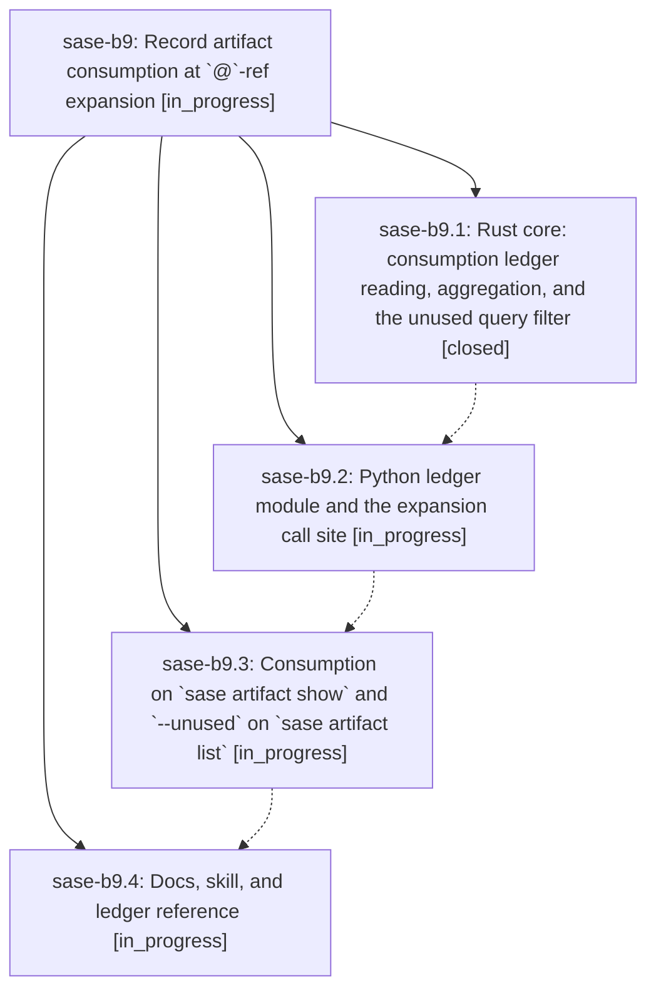

# Bead: sase-b9 — Record artifact consumption at \`@\`-ref expansion

[Bead Pages](../README.md) / sase-b9

**Status:** ◐ in_progress · **Type:** plan · **Tier:** epic
**Owner:** `bryanbugyi34@gmail.com` · **Assignee:** `sase-b9.land`
**Created:** 2026-07-30 14:36:33 UTC
**Plan:** [202607/artifact\_consumption\_ledger.md](https://github.com/sase-org/sase--plans/blob/main/202607/artifact_consumption_ledger.md)

## Description

Every artifact reference an agent actually consumes at launch is recorded as a typed, attributable edge in a durable ledger, so `sase artifact show` reports who used a reference and `sase artifact list --unused` can name what nobody ever did.

## Phases

| Bead | Title | Status | Size | Agents | Commits |
|---|---|---|---|---:|---:|
| [sase-b9.1](sase-b9.1.md) | Rust core: consumption ledger reading, aggregation, and the unused query filter | ✓ closed | medium | 1 | 1 |
| [sase-b9.2](sase-b9.2.md) | Python ledger module and the expansion call site | ◐ in_progress | medium | 1 | 0 |
| [sase-b9.3](sase-b9.3.md) | Consumption on \`sase artifact show\` and \`--unused\` on \`sase artifact list\` | ◐ in_progress | medium | 1 | 0 |
| [sase-b9.4](sase-b9.4.md) | Docs, skill, and ledger reference | ◐ in_progress | small | 1 | 0 |

## Lineage

## Agents

| Agent | Bead | Commits |
|---|---|---:|
| [bbugyi200.athena.sase-b9.1](https://github.com/sase-org/sase--agents/blob/main/agents/bbugyi200.athena.sase-b9.1/README.md) | [sase-b9.1](sase-b9.1.md) | 1 |
| [bbugyi200.athena.sase-b9.2](https://github.com/sase-org/sase--agents/blob/main/agents/bbugyi200.athena.sase-b9.2/README.md) | [sase-b9.2](sase-b9.2.md) | 0 |
| [bbugyi200.athena.sase-b9.3](https://github.com/sase-org/sase--agents/blob/main/agents/bbugyi200.athena.sase-b9.3/README.md) | [sase-b9.3](sase-b9.3.md) | 0 |
| [bbugyi200.athena.sase-b9.4](https://github.com/sase-org/sase--agents/blob/main/agents/bbugyi200.athena.sase-b9.4/README.md) | [sase-b9.4](sase-b9.4.md) | 0 |
| [bbugyi200.athena.sase-b9.land](https://github.com/sase-org/sase--agents/blob/main/agents/bbugyi200.athena.sase-b9.land/README.md) | [sase-b9](README.md) | 0 |

## Commits

| Repo | Commit | Subject | Bead | Committed (UTC) |
|---|---|---|---|---|
| sase-core | [`1bd3670`](https://github.com/sase-org/sase-core/commit/1bd3670481a252fa449f6d5885673eb7ecbcc427) | feat: add artifact consumption ledger queries | [sase-b9.1](sase-b9.1.md) | 2026-07-30 14:49:24 |
