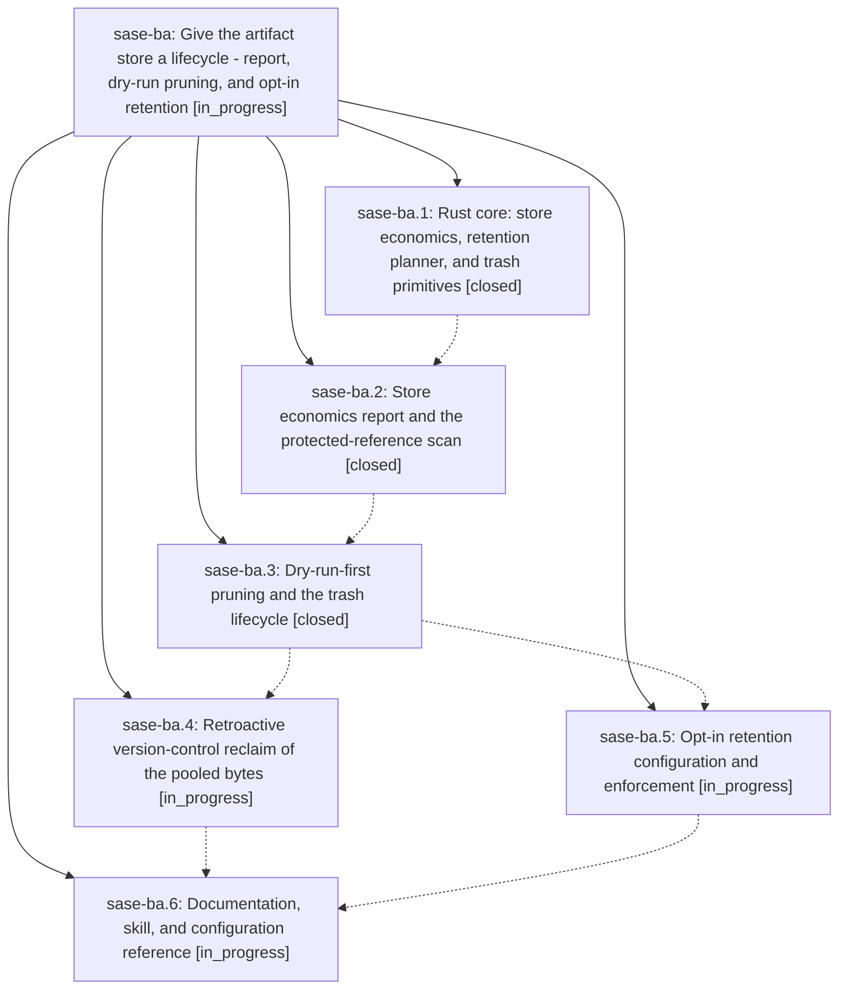

# Bead: sase-ba — Give the artifact store a lifecycle - report, dry-run pruning, and opt-in retention

[Bead Pages](../README.md) / sase-ba

**Status:** ◐ in_progress · **Type:** plan · **Tier:** epic
**Owner:** `bryanbugyi34@gmail.com` · **Assignee:** `sase-ba.land`
**Created:** 2026-07-30 14:39:40 UTC
**Plan:** [202607/artifact\_store\_lifecycle.md](https://github.com/sase-org/sase--plans/blob/main/202607/artifact_store_lifecycle.md)

## Description

The artifact-file store can be measured, drained, and bounded: `sase artifact stats` reports its economics, `sase artifact prune` and `sase artifact reclaim` are dry-run by default and route every removal through a restorable trash, an opt-in `artifacts.retention` policy keeps the store bounded going forward, and nothing an agent declared or a bead, plan, or ChangeSpec references is ever removed.

## Phases

| Bead | Title | Status | Size | Agents | Commits |
|---|---|---|---|---:|---:|
| [sase-ba.1](sase-ba.1.md) | Rust core: store economics, retention planner, and trash primitives | ✓ closed | medium | 1 | 1 |
| [sase-ba.2](sase-ba.2.md) | Store economics report and the protected-reference scan | ✓ closed | medium | 1 | 1 |
| [sase-ba.3](sase-ba.3.md) | Dry-run-first pruning and the trash lifecycle | ✓ closed | medium | 1 | 1 |
| [sase-ba.4](sase-ba.4.md) | Retroactive version-control reclaim of the pooled bytes | ◐ in_progress | medium | 1 | 0 |
| [sase-ba.5](sase-ba.5.md) | Opt-in retention configuration and enforcement | ◐ in_progress | small | 1 | 0 |
| [sase-ba.6](sase-ba.6.md) | Documentation, skill, and configuration reference | ◐ in_progress | small | 1 | 0 |

## Lineage

## Agents

| Agent | Bead | Commits |
|---|---|---:|
| [bbugyi200.athena.sase-ba.1](https://github.com/sase-org/sase--agents/blob/main/agents/bbugyi200.athena.sase-ba.1/README.md) | [sase-ba.1](sase-ba.1.md) | 1 |
| [bbugyi200.athena.sase-ba.2](https://github.com/sase-org/sase--agents/blob/main/agents/bbugyi200.athena.sase-ba.2/README.md) | [sase-ba.2](sase-ba.2.md) | 1 |
| [bbugyi200.athena.sase-ba.3](https://github.com/sase-org/sase--agents/blob/main/agents/bbugyi200.athena.sase-ba.3/README.md) | [sase-ba.3](sase-ba.3.md) | 1 |
| [bbugyi200.athena.sase-ba.4](https://github.com/sase-org/sase--agents/blob/main/agents/bbugyi200.athena.sase-ba.4/README.md) | [sase-ba.4](sase-ba.4.md) | 0 |
| [bbugyi200.athena.sase-ba.5](https://github.com/sase-org/sase--agents/blob/main/agents/bbugyi200.athena.sase-ba.5/README.md) | [sase-ba.5](sase-ba.5.md) | 0 |
| [bbugyi200.athena.sase-ba.6](https://github.com/sase-org/sase--agents/blob/main/agents/bbugyi200.athena.sase-ba.6/README.md) | [sase-ba.6](sase-ba.6.md) | 0 |
| [bbugyi200.athena.sase-ba.land](https://github.com/sase-org/sase--agents/blob/main/agents/bbugyi200.athena.sase-ba.land/README.md) | [sase-ba](README.md) | 0 |

## Commits

| Repo | Commit | Subject | Bead | Committed (UTC) |
|---|---|---|---|---|
| sase-core | [`sase-core@95f8440`](https://github.com/sase-org/sase-core/commit/95f8440f4212c272be32a967c98b34784d05e56b) | feat: add artifact store lifecycle primitives | [sase-ba.1](sase-ba.1.md) | 2026-07-30 15:09:03 |
| sase | [`18c01a1`](https://github.com/sase-org/sase/commit/18c01a15257c3cb5b3d8540b65a91eab69e5e065) | feat(artifact): add store lifecycle statistics | [sase-ba.2](sase-ba.2.md) | 2026-07-30 16:10:04 |
| sase | [`be4c199`](https://github.com/sase-org/sase/commit/be4c19969fc6ce227ee4e474d9952722ea172b02) | feat(artifact): add pruning and trash lifecycle | [sase-ba.3](sase-ba.3.md) | 2026-07-30 16:43:50 |
