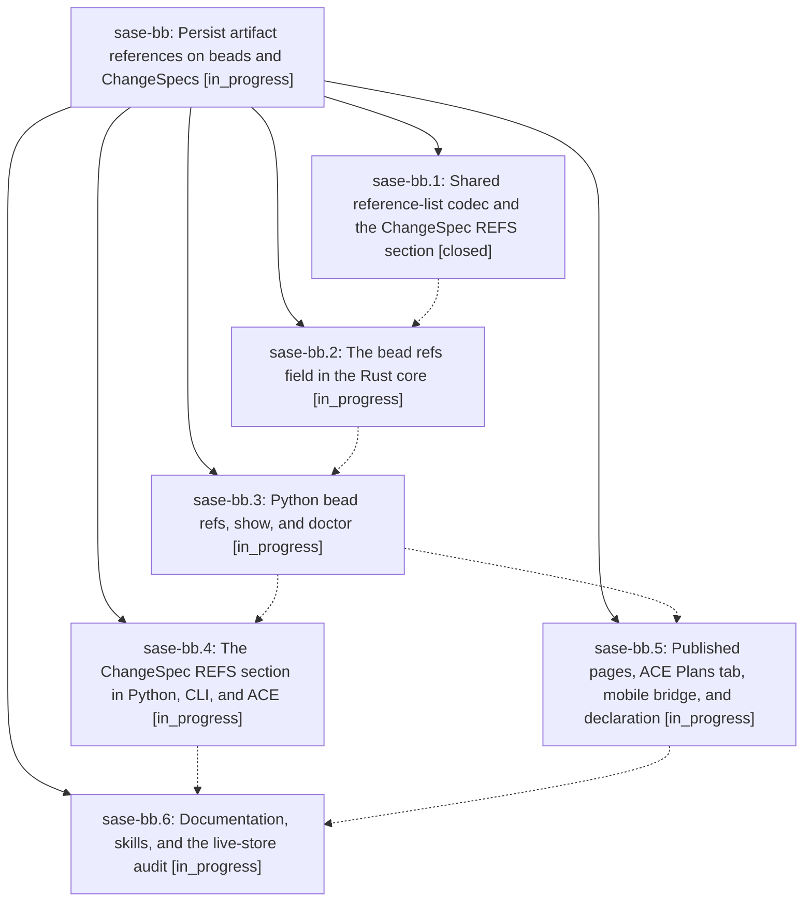

# Bead: sase-bb — Persist artifact references on beads and ChangeSpecs

[Bead Pages](../README.md) / sase-bb

**Status:** ◐ in_progress · **Type:** plan · **Tier:** epic
**Owner:** `bryanbugyi34@gmail.com` · **Assignee:** `sase-bb.land`
**Created:** 2026-07-30 14:53:32 UTC
**Plan:** [202607/spec\_artifact\_references.md](https://github.com/sase-org/sase--plans/blob/main/202607/spec_artifact_references.md)

## Description

A bead and a ChangeSpec each carry a durable, ordered list of canonical artifact references that survives machines, workspaces, and store rebuilds: one shared Rust codec parses, normalizes, and batch-resolves reference lists for every caller; `sase bead ref` and `sase changespec ref` attach and detach them; `sase bead show`, the ACE surfaces, bead pages, and the mobile bridge render the stable reference and where it currently resolves; and `sase bead doctor` and `sase doctor` report references that resolve nowhere instead of silently passing.

## Phases

| Bead | Title | Status | Size | Agents | Commits |
|---|---|---|---|---:|---:|
| [sase-bb.1](sase-bb.1.md) | Shared reference-list codec and the ChangeSpec REFS section | ✓ closed | medium | 1 | 2 |
| [sase-bb.2](sase-bb.2.md) | The bead refs field in the Rust core | ◐ in_progress | medium | 1 | 0 |
| [sase-bb.3](sase-bb.3.md) | Python bead refs, show, and doctor | ◐ in_progress | medium | 1 | 0 |
| [sase-bb.4](sase-bb.4.md) | The ChangeSpec REFS section in Python, CLI, and ACE | ◐ in_progress | medium | 1 | 0 |
| [sase-bb.5](sase-bb.5.md) | Published pages, ACE Plans tab, mobile bridge, and declaration | ◐ in_progress | small | 1 | 0 |
| [sase-bb.6](sase-bb.6.md) | Documentation, skills, and the live-store audit | ◐ in_progress | small | 1 | 0 |

## Lineage

## Agents

| Agent | Bead | Commits |
|---|---|---:|
| [bbugyi200.athena.sase-bb.1](https://github.com/sase-org/sase--agents/blob/main/agents/bbugyi200.athena.sase-bb.1/README.md) | [sase-bb.1](sase-bb.1.md) | 2 |
| [bbugyi200.athena.sase-bb.2](https://github.com/sase-org/sase--agents/blob/main/agents/bbugyi200.athena.sase-bb.2/README.md) | [sase-bb.2](sase-bb.2.md) | 0 |
| [bbugyi200.athena.sase-bb.3](https://github.com/sase-org/sase--agents/blob/main/agents/bbugyi200.athena.sase-bb.3/README.md) | [sase-bb.3](sase-bb.3.md) | 0 |
| [bbugyi200.athena.sase-bb.4](https://github.com/sase-org/sase--agents/blob/main/agents/bbugyi200.athena.sase-bb.4/README.md) | [sase-bb.4](sase-bb.4.md) | 0 |
| [bbugyi200.athena.sase-bb.5](https://github.com/sase-org/sase--agents/blob/main/agents/bbugyi200.athena.sase-bb.5/README.md) | [sase-bb.5](sase-bb.5.md) | 0 |
| [bbugyi200.athena.sase-bb.6](https://github.com/sase-org/sase--agents/blob/main/agents/bbugyi200.athena.sase-bb.6/README.md) | [sase-bb.6](sase-bb.6.md) | 0 |
| [bbugyi200.athena.sase-bb.land](https://github.com/sase-org/sase--agents/blob/main/agents/bbugyi200.athena.sase-bb.land/README.md) | [sase-bb](README.md) | 0 |

## Commits

| Repo | Commit | Subject | Bead | Committed (UTC) |
|---|---|---|---|---|
| sase-core | [`sase-core@a25d174`](https://github.com/sase-org/sase-core/commit/a25d174abcb17e181a4145f4c793a5968f126313) | feat!: add artifact reference list APIs | [sase-bb.1](sase-bb.1.md) | 2026-07-30 15:35:52 |
| sase | [`2433d6b`](https://github.com/sase-org/sase/commit/2433d6bb83edfddbd0b2b3d2e1974906faea3560) | feat!: support ChangeSpec reference lists | [sase-bb.1](sase-bb.1.md) | 2026-07-30 15:37:50 |
