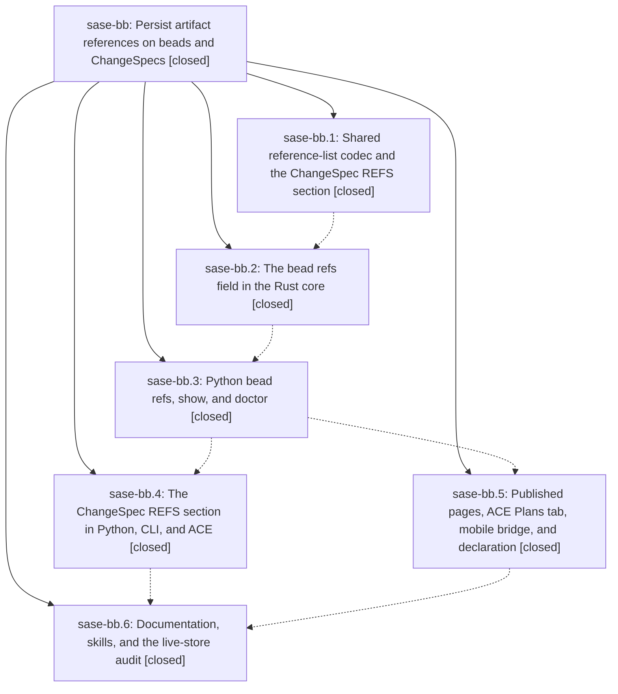

# Bead: sase-bb — Persist artifact references on beads and ChangeSpecs

[Bead Pages](../README.md) / sase-bb

**Status:** ✓ closed · **Resolution:** done · **Type:** plan · **Tier:** epic
**Owner:** `bryanbugyi34@gmail.com` · **Assignee:** `sase-bb.land`
**Created:** 2026-07-30 14:53:32 UTC · **Closed:** 2026-07-30 21:06:27 UTC
**Plan:** [202607/spec\_artifact\_references.md](https://github.com/sase-org/sase--plans/blob/main/202607/spec_artifact_references.md)

## Description

A bead and a ChangeSpec each carry a durable, ordered list of canonical artifact references that survives machines, workspaces, and store rebuilds: one shared Rust codec parses, normalizes, and batch-resolves reference lists for every caller; `sase bead ref` and `sase changespec ref` attach and detach them; `sase bead show`, the ACE surfaces, bead pages, and the mobile bridge render the stable reference and where it currently resolves; and `sase bead doctor` and `sase doctor` report references that resolve nowhere instead of silently passing.

## Notes

[2026-07-30T21:06:27Z · sase-bb.land] Verified all six phases against source and against the epic's commits (2433d6bb8, 4aee2f49f, 87ece3ee3, f921f428d, 84d47aa78 here; a25d174, 1355649, d9e4fca in sase-core 0.14.0/0.14.1). Core: artifact_ref/list.rs parse/normalize/resolve with the artifact index loaded at most once per batch, bead refs as ReferenceAdded/ReferenceRemoved events with SQLite migration and skip-when-empty JSONL, ref CLI group, search coverage, grouped reference_diagnostics with the unavailable-context note. Python: sase.artifact_ref_lists is the single list facade (no hand-rolled parse/render/dedupe anywhere), bead model/JSONL/DB/wire mirrors, resolved REFS in sase bead show, ref classified as a mutating fast-path verb; ChangeSpec REFS parse/persist, CHANGESPEC_SECTION_ORDER consolidated into ace/changespec/section_order.py with all four planned copies plus commit_tracking.py and commit_utils/entries.py importing it; sase changespec ref, ACE CLI/TUI/clipboard/search rendering, project.changespec_refs check; bead-page References, Plans-tab References row with refs joined into the filter corpus, mobile bridge, sase artifact create --bead; docs/beads.md, docs/change_spec.md, three skill templates; sase-nvim REFS syntax (0e720ef). Live audits: project.changespec_refs OK over 38 ChangeSpecs, sase bead doctor reports zero artifact-reference findings (only the pre-existing out-of-scope design warnings), and issues.jsonl has not churned. Integration with work that landed in parallel: the retention/protection cluster (be4c19969, 6999e31a3, d6eb41271, ac2d5b22c, be94f098a) documents that an id in a bead is protected, but collect_protected_artifact_ids scanned the beads sidecar under a suffix allowlist that excludes issues.jsonl, so a ref this epic stores was unprotected until a page publish -- sase artifact prune --apply could trash it and sase artifact reclaim --apply could change its id out from under the stored reference. Fixed by scanning the bead store projection by name, deliberately excluding events/ streams so a ReferenceRemoved payload cannot protect an id forever, with two regression tests. Also confirmed the projection-repair (9fdae1e1e) and file-hook (f40c517bf) work that landed on top of this epic still threads the doctor reference context and the --bead attach. Full suite: 24,505 passed, 7 skipped, one unrelated flaky bead concurrency test that passes in isolation; just check green through fmt/lint/symvision/toobig.

## Phases

| Bead | Title | Status | Size | Agents | Commits |
|---|---|---|---|---:|---:|
| [sase-bb.1](sase-bb.1.md) | Shared reference-list codec and the ChangeSpec REFS section | ✓ closed | medium | 1 | 2 |
| [sase-bb.2](sase-bb.2.md) | The bead refs field in the Rust core | ✓ closed | medium | 1 | 1 |
| [sase-bb.3](sase-bb.3.md) | Python bead refs, show, and doctor | ✓ closed | medium | 1 | 2 |
| [sase-bb.4](sase-bb.4.md) | The ChangeSpec REFS section in Python, CLI, and ACE | ✓ closed | medium | 1 | 2 |
| [sase-bb.5](sase-bb.5.md) | Published pages, ACE Plans tab, mobile bridge, and declaration | ✓ closed | small | 1 | 1 |
| [sase-bb.6](sase-bb.6.md) | Documentation, skills, and the live-store audit | ✓ closed | small | 1 | 1 |

## Lineage

## Agents

| Agent | Bead | Commits |
|---|---|---:|
| [bbugyi200.athena.sase-bb.1](https://github.com/sase-org/sase--agents/blob/main/agents/bbugyi200.athena.sase-bb.1/README.md) | [sase-bb.1](sase-bb.1.md) | 2 |
| [bbugyi200.athena.sase-bb.2](https://github.com/sase-org/sase--agents/blob/main/agents/bbugyi200.athena.sase-bb.2/README.md) | [sase-bb.2](sase-bb.2.md) | 1 |
| [bbugyi200.athena.sase-bb.3](https://github.com/sase-org/sase--agents/blob/main/agents/bbugyi200.athena.sase-bb.3/README.md) | [sase-bb.3](sase-bb.3.md) | 2 |
| [bbugyi200.athena.sase-bb.4](https://github.com/sase-org/sase--agents/blob/main/agents/bbugyi200.athena.sase-bb.4/README.md) | [sase-bb.4](sase-bb.4.md) | 2 |
| [bbugyi200.athena.sase-bb.5](https://github.com/sase-org/sase--agents/blob/main/agents/bbugyi200.athena.sase-bb.5/README.md) | [sase-bb.5](sase-bb.5.md) | 1 |
| [bbugyi200.athena.sase-bb.6](https://github.com/sase-org/sase--agents/blob/main/agents/bbugyi200.athena.sase-bb.6/README.md) | [sase-bb.6](sase-bb.6.md) | 1 |
| [bbugyi200.athena.sase-bb.land](https://github.com/sase-org/sase--agents/blob/main/agents/bbugyi200.athena.sase-bb.land/README.md) | [sase-bb](README.md) | 2 |

## Commits

| Repo | Commit | Subject | Bead | Committed (UTC) |
|---|---|---|---|---|
| sase-core | [`sase-core@a25d174`](https://github.com/sase-org/sase-core/commit/a25d174abcb17e181a4145f4c793a5968f126313) | feat!: add artifact reference list APIs | [sase-bb.1](sase-bb.1.md) | 2026-07-30 15:35:52 |
| sase | [`2433d6b`](https://github.com/sase-org/sase/commit/2433d6bb83edfddbd0b2b3d2e1974906faea3560) | feat!: support ChangeSpec reference lists | [sase-bb.1](sase-bb.1.md) | 2026-07-30 15:37:50 |
| sase-core | [`sase-core@1355649`](https://github.com/sase-org/sase-core/commit/1355649d6bc2306ca5b8ab386772237c05f1f07a) | feat: add artifact references to beads | [sase-bb.2](sase-bb.2.md) | 2026-07-30 15:55:18 |
| sase-core | [`sase-core@d9e4fca`](https://github.com/sase-org/sase-core/commit/d9e4fca4adfe3edaa6ec16c9e171d98ae743906d) | fix(bead): preserve refs and expose doctor context | [sase-bb.3](sase-bb.3.md) | 2026-07-30 16:38:20 |
| sase | [`4aee2f4`](https://github.com/sase-org/sase/commit/4aee2f49fecb256d4ed5a06b23c0f401f94b3da8) | feat(bead): integrate persistent artifact references | [sase-bb.3](sase-bb.3.md) | 2026-07-30 16:48:49 |
| sase | [`87ece3e`](https://github.com/sase-org/sase/commit/87ece3ee34d613780923e2d9d9a2f0349ff12f0a) | feat(artifact): surface bead references and attach on create | [sase-bb.5](sase-bb.5.md) | 2026-07-30 17:27:18 |
| sase | [`f921f42`](https://github.com/sase-org/sase/commit/f921f428dba97720bec8b0853fc5e6bcb34f535c) | feat(changespec): add artifact reference support | [sase-bb.4](sase-bb.4.md) | 2026-07-30 17:42:33 |
| sase-nvim | [`sase-nvim@0e720ef`](https://github.com/sase-org/sase-nvim/commit/0e720efc478085f87664f6a28d13f4e87544e654) | feat: highlight artifact references in ChangeSpecs | [sase-bb.4](sase-bb.4.md) | 2026-07-30 17:53:25 |
| sase | [`84d47aa`](https://github.com/sase-org/sase/commit/84d47aa78bf75e88486e4ace484d782b74139fe6) | docs: document artifact reference persistence | [sase-bb.6](sase-bb.6.md) | 2026-07-30 20:34:11 |
| sase | [`daeb410`](https://github.com/sase-org/sase/commit/daeb4109a079c971f654ba72266e16c8a752dfae) | fix(artifact): protect artifacts referenced only by beads | [sase-bb](README.md) | 2026-07-30 21:08:44 |
| sase--plans | [`sase--plans@a888b5a`](https://github.com/sase-org/sase--plans/commit/a888b5ad486324ca81ef1c515fcacb0236721889) | docs(plans): mark spec\_artifact\_references plan done (sase-bb) | [sase-bb](README.md) | 2026-07-30 21:19:08 |
