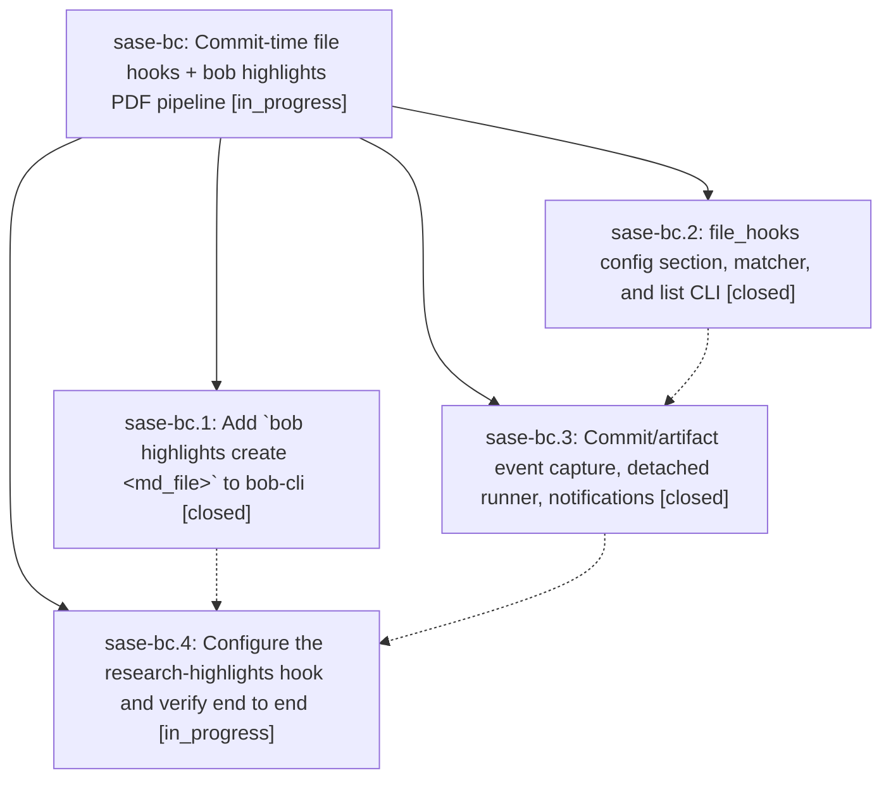

# Bead: sase-bc — Commit-time file hooks + bob highlights PDF pipeline

[Bead Pages](../README.md) / sase-bc

**Status:** ◐ in_progress · **Type:** plan · **Tier:** epic
**Owner:** `bryanbugyi34@gmail.com` · **Assignee:** `sase-bc.land`
**Created:** 2026-07-30 17:32:27 UTC
**Plan:** [202607/commit\_file\_hooks.md](https://github.com/sase-org/sase--plans/blob/main/202607/commit_file_hooks.md)

## Description

Files that sase agents add/modify/remove — via VCS commits or `sase artifact create` — automatically trigger user-configured per-file hook commands with rich success/failure notifications, and the first configured hook turns new consolidated research reports into Highlights-ready PDFs in the Obsidian vault.

## Phases

| Bead | Title | Status | Size | Agents | Commits |
|---|---|---|---|---:|---:|
| [sase-bc.1](sase-bc.1.md) | Add \`bob highlights create \<md\_file\>\` to bob-cli | ✓ closed | medium | 1 | 0 |
| [sase-bc.2](sase-bc.2.md) | file\_hooks config section, matcher, and list CLI | ✓ closed | medium | 1 | 1 |
| [sase-bc.3](sase-bc.3.md) | Commit/artifact event capture, detached runner, notifications | ✓ closed | medium | 1 | 1 |
| [sase-bc.4](sase-bc.4.md) | Configure the research-highlights hook and verify end to end | ◐ in_progress | small | 1 | 0 |

## Lineage

## Agents

| Agent | Bead | Commits |
|---|---|---:|
| [bbugyi200.athena.sase-bc.1](https://github.com/sase-org/sase--agents/blob/main/agents/bbugyi200.athena.sase-bc.1/README.md) | [sase-bc.1](sase-bc.1.md) | 0 |
| [bbugyi200.athena.sase-bc.2](https://github.com/sase-org/sase--agents/blob/main/agents/bbugyi200.athena.sase-bc.2/README.md) | [sase-bc.2](sase-bc.2.md) | 1 |
| [bbugyi200.athena.sase-bc.3](https://github.com/sase-org/sase--agents/blob/main/agents/bbugyi200.athena.sase-bc.3/README.md) | [sase-bc.3](sase-bc.3.md) | 1 |
| [bbugyi200.athena.sase-bc.4](https://github.com/sase-org/sase--agents/blob/main/agents/bbugyi200.athena.sase-bc.4/README.md) | [sase-bc.4](sase-bc.4.md) | 0 |
| [bbugyi200.athena.sase-bc.land](https://github.com/sase-org/sase--agents/blob/main/agents/bbugyi200.athena.sase-bc.land/README.md) | [sase-bc](README.md) | 0 |

## Commits

| Repo | Commit | Subject | Bead | Committed (UTC) |
|---|---|---|---|---|
| sase | [`57e41fd`](https://github.com/sase-org/sase/commit/57e41fd860155633e75aa73fc8eac831273bbf22) | feat(config): add file hook configuration and listing | [sase-bc.2](sase-bc.2.md) | 2026-07-30 18:03:44 |
| sase | [`f40c517`](https://github.com/sase-org/sase/commit/f40c517bfc7d0421d2a8df1fabb526b21964278e) | feat(file-hooks): run hooks for committed files | [sase-bc.3](sase-bc.3.md) | 2026-07-30 18:48:18 |
