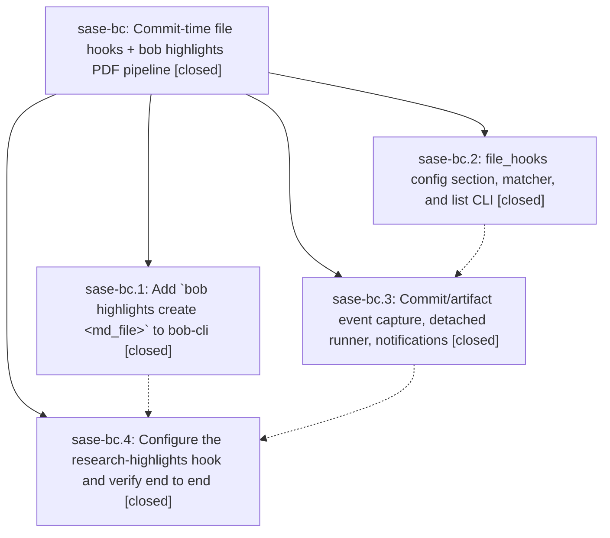

# Bead: sase-bc — Commit-time file hooks + bob highlights PDF pipeline

[Bead Pages](../README.md) / sase-bc

**Status:** ✓ closed · **Resolution:** done · **Type:** plan · **Tier:** epic
**Owner:** `bryanbugyi34@gmail.com` · **Assignee:** `sase-bc.land`
**Created:** 2026-07-30 17:32:27 UTC · **Closed:** 2026-07-30 19:38:01 UTC
**Plan:** [202607/commit\_file\_hooks.md](https://github.com/sase-org/sase--plans/blob/main/202607/commit_file_hooks.md)

## Description

Files that sase agents add/modify/remove — via VCS commits or `sase artifact create` — automatically trigger user-configured per-file hook commands with rich success/failure notifications, and the first configured hook turns new consolidated research reports into Highlights-ready PDFs in the Obsidian vault.

## Notes

[2026-07-30T19:38:01Z · sase-bc.land] Verified all four child phases as done against the linked plan, implementation, tests, and bead-tagged commits: bob-cli 4f72d29/c0525bb, sase 57e41fd/f40c517, and chezmoi 1a14721. Independently confirmed the live user-layer hook config, 10-page PDF with TOC/outlines and valid page-1 marker, generated Obsidian ref note, finished ADD batch 93a8b9bc with exit 0 and success notification 5434d10a, and no negative-glob draft run; 99 focused tests pass. Reviewed every sase commit since epic creation: artifact commits f921f42/ac2d5b2/be94f09 are ancestors of the hook engine and all later non-epic commits are non-overlapping, so no integration edit or duplication cleanup was needed.

[2026-07-30T19:39:42Z · sase-bc.land] Verified all four child beads, bead-tagged commits, source implementation, 99 focused tests, live PDF/ref-note output, success notification, and negative-glob exclusion; audited all post-start commits and found no unresolved integration or duplicate behavior; post-close Symvision passed cleanly.

## Phases

| Bead | Title | Status | Size | Agents | Commits |
|---|---|---|---|---:|---:|
| [sase-bc.1](sase-bc.1.md) | Add \`bob highlights create \<md\_file\>\` to bob-cli | ✓ closed | medium | 1 | 0 |
| [sase-bc.2](sase-bc.2.md) | file\_hooks config section, matcher, and list CLI | ✓ closed | medium | 1 | 1 |
| [sase-bc.3](sase-bc.3.md) | Commit/artifact event capture, detached runner, notifications | ✓ closed | medium | 1 | 1 |
| [sase-bc.4](sase-bc.4.md) | Configure the research-highlights hook and verify end to end | ✓ closed | small | 1 | 1 |

## Lineage

## Agents

| Agent | Bead | Commits |
|---|---|---:|
| [bbugyi200.athena.sase-bc.1](https://github.com/sase-org/sase--agents/blob/main/agents/bbugyi200.athena.sase-bc.1/README.md) | [sase-bc.1](sase-bc.1.md) | 0 |
| [bbugyi200.athena.sase-bc.2](https://github.com/sase-org/sase--agents/blob/main/agents/bbugyi200.athena.sase-bc.2/README.md) | [sase-bc.2](sase-bc.2.md) | 1 |
| [bbugyi200.athena.sase-bc.3](https://github.com/sase-org/sase--agents/blob/main/agents/bbugyi200.athena.sase-bc.3/README.md) | [sase-bc.3](sase-bc.3.md) | 1 |
| [bbugyi200.athena.sase-bc.4](https://github.com/sase-org/sase--agents/blob/main/agents/bbugyi200.athena.sase-bc.4/README.md) | [sase-bc.4](sase-bc.4.md) | 1 |
| [bbugyi200.athena.sase-bc.land](https://github.com/sase-org/sase--agents/blob/main/agents/bbugyi200.athena.sase-bc.land/README.md) | [sase-bc](README.md) | 1 |

## Commits

| Repo | Commit | Subject | Bead | Committed (UTC) |
|---|---|---|---|---|
| sase | [`57e41fd`](https://github.com/sase-org/sase/commit/57e41fd860155633e75aa73fc8eac831273bbf22) | feat(config): add file hook configuration and listing | [sase-bc.2](sase-bc.2.md) | 2026-07-30 18:03:44 |
| sase | [`f40c517`](https://github.com/sase-org/sase/commit/f40c517bfc7d0421d2a8df1fabb526b21964278e) | feat(file-hooks): run hooks for committed files | [sase-bc.3](sase-bc.3.md) | 2026-07-30 18:48:18 |
| chezmoi | [`chezmoi@1a14721`](https://github.com/bbugyi200/dotfiles/commit/1a14721daaeea1431400e0e039824d1f809c4f60) | feat(sase): render new research reports into Highlights PDFs | [sase-bc.4](sase-bc.4.md) | 2026-07-30 19:23:01 |
| sase--plans | [`sase--plans@8b062b8`](https://github.com/sase-org/sase--plans/commit/8b062b876b34e8fdc7f865c791eb3348fd80160f) | docs: mark file hooks epic complete | [sase-bc](README.md) | 2026-07-30 19:40:11 |
