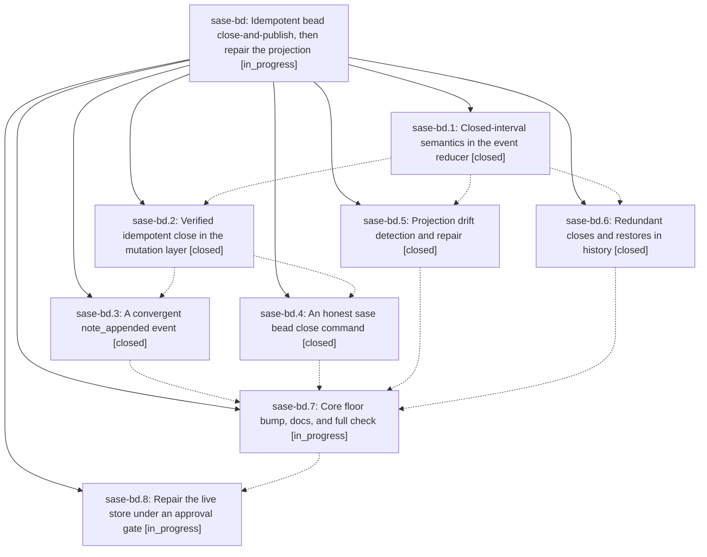

# Bead: sase-bd — Idempotent bead close-and-publish, then repair the projection

[Bead Pages](../README.md) / sase-bd

**Status:** ◐ in_progress · **Type:** plan · **Tier:** epic
**Owner:** `bryanbugyi34@gmail.com` · **Assignee:** `sase-bd.land`
**Created:** 2026-07-30 17:43:32 UTC
**Plan:** [202607/bead\_close\_integrity.md](https://github.com/sase-org/sase--plans/blob/main/202607/bead_close_integrity.md)

## Description

Closing an already-closed bead is a verified no-op that writes no event, no commit and no changed byte; a second close that arrives anyway cannot move a close timestamp or erase a close reason; concurrent note appends converge instead of overwriting each other; and the 313 bead rows already damaged by past duplicate closes are repaired by re-deriving `issues.jsonl` from the canonical event log rather than by rewriting history.

## Phases

| Bead | Title | Status | Size | Agents | Commits |
|---|---|---|---|---:|---:|
| [sase-bd.1](sase-bd.1.md) | Closed-interval semantics in the event reducer | ✓ closed | medium | 1 | 1 |
| [sase-bd.2](sase-bd.2.md) | Verified idempotent close in the mutation layer | ✓ closed | medium | 1 | 1 |
| [sase-bd.3](sase-bd.3.md) | A convergent note\_appended event | ✓ closed | medium | 1 | 1 |
| [sase-bd.4](sase-bd.4.md) | An honest sase bead close command | ✓ closed | medium | 1 | 1 |
| [sase-bd.5](sase-bd.5.md) | Projection drift detection and repair | ✓ closed | medium | 1 | 2 |
| [sase-bd.6](sase-bd.6.md) | Redundant closes and restores in history | ✓ closed | small | 1 | 1 |
| [sase-bd.7](sase-bd.7.md) | Core floor bump, docs, and full check | ◐ in_progress | small | 1 | 0 |
| [sase-bd.8](sase-bd.8.md) | Repair the live store under an approval gate | ◐ in_progress | small | 1 | 0 |

## Lineage

## Agents

| Agent | Bead | Commits |
|---|---|---:|
| [bbugyi200.athena.sase-bd.1](https://github.com/sase-org/sase--agents/blob/main/agents/bbugyi200.athena.sase-bd.1/README.md) | [sase-bd.1](sase-bd.1.md) | 1 |
| [bbugyi200.athena.sase-bd.2](https://github.com/sase-org/sase--agents/blob/main/agents/bbugyi200.athena.sase-bd.2/README.md) | [sase-bd.2](sase-bd.2.md) | 1 |
| [bbugyi200.athena.sase-bd.3](https://github.com/sase-org/sase--agents/blob/main/agents/bbugyi200.athena.sase-bd.3/README.md) | [sase-bd.3](sase-bd.3.md) | 1 |
| [bbugyi200.athena.sase-bd.4](https://github.com/sase-org/sase--agents/blob/main/agents/bbugyi200.athena.sase-bd.4/README.md) | [sase-bd.4](sase-bd.4.md) | 1 |
| [bbugyi200.athena.sase-bd.5](https://github.com/sase-org/sase--agents/blob/main/agents/bbugyi200.athena.sase-bd.5/README.md) | [sase-bd.5](sase-bd.5.md) | 2 |
| [bbugyi200.athena.sase-bd.6](https://github.com/sase-org/sase--agents/blob/main/agents/bbugyi200.athena.sase-bd.6/README.md) | [sase-bd.6](sase-bd.6.md) | 1 |
| [bbugyi200.athena.sase-bd.7](https://github.com/sase-org/sase--agents/blob/main/agents/bbugyi200.athena.sase-bd.7/README.md) | [sase-bd.7](sase-bd.7.md) | 0 |
| [bbugyi200.athena.sase-bd.8](https://github.com/sase-org/sase--agents/blob/main/agents/bbugyi200.athena.sase-bd.8/README.md) | [sase-bd.8](sase-bd.8.md) | 0 |
| [bbugyi200.athena.sase-bd.land](https://github.com/sase-org/sase--agents/blob/main/agents/bbugyi200.athena.sase-bd.land/README.md) | [sase-bd](README.md) | 0 |

## Commits

| Repo | Commit | Subject | Bead | Committed (UTC) |
|---|---|---|---|---|
| sase-core | [`sase-core@160ff9e`](https://github.com/sase-org/sase-core/commit/160ff9e7616fae351febd676792970e3dd654cc7) | fix(bead): preserve the first close in event reduction | [sase-bd.1](sase-bd.1.md) | 2026-07-30 17:55:34 |
| sase-core | [`sase-core@293ccb2`](https://github.com/sase-org/sase-core/commit/293ccb237ce21b8dd75a04346f32735d5b0b6835) | fix(bead): verify repeated closes before mutation | [sase-bd.2](sase-bd.2.md) | 2026-07-30 18:09:40 |
| sase-core | [`sase-core@81a82d5`](https://github.com/sase-org/sase-core/commit/81a82d5542f1160f24b5aa7314ce32d2732e8952) | feat(bead)!: add convergent note append events | [sase-bd.3](sase-bd.3.md) | 2026-07-30 18:29:21 |
| sase | [`6521dd3`](https://github.com/sase-org/sase/commit/6521dd3c28b95ef49731a154f87ced3c5dc500a7) | feat(bead): label redundant close history | [sase-bd.6](sase-bd.6.md) | 2026-07-30 18:37:48 |
| sase-core | [`sase-core@6468cb9`](https://github.com/sase-org/sase-core/commit/6468cb90b97394159b03ad2465f3f7b1d2b49770) | feat(beads): report projection drift diagnostics | [sase-bd.5](sase-bd.5.md) | 2026-07-30 18:50:04 |
| sase | [`5f682e2`](https://github.com/sase-org/sase/commit/5f682e2b1b0ebb7fb295c8cffef49ba495c70f8c) | fix(beads): report close mutation outcomes honestly | [sase-bd.4](sase-bd.4.md) | 2026-07-30 18:59:42 |
| sase | [`9fdae1e`](https://github.com/sase-org/sase/commit/9fdae1e1e1349d255f0800d3a4cc481d48159c00) | feat(beads): repair stale event projections | [sase-bd.5](sase-bd.5.md) | 2026-07-30 18:59:54 |
