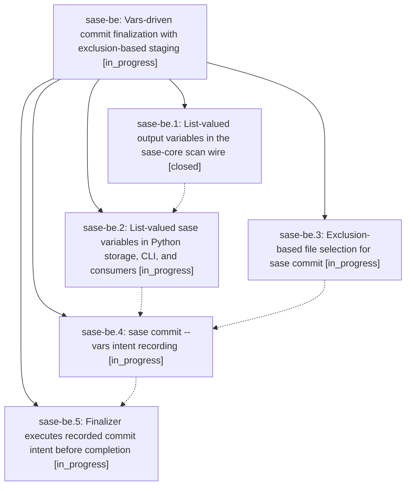

# Bead: sase-be — Vars-driven commit finalization with exclusion-based staging

[Bead Pages](../README.md) / sase-be

**Status:** ◐ in_progress · **Type:** plan · **Tier:** epic
**Owner:** `bryanbugyi34@gmail.com` · **Assignee:** `sase-be.land`
**Created:** 2026-07-30 20:05:54 UTC
**Plan:** [202607/commit\_vars\_finalizer.md](https://github.com/sase-org/sase--plans/blob/main/202607/commit_vars_finalizer.md)

## Description

Agents record commit intent (message, exclusions) as sase variables via `sase commit --vars`, the finalizer executes the commit deterministically before agent completion is recorded, and file staging becomes exclusion-based so changes the agent did not make surface as anomalies.

## Phases

| Bead | Title | Status | Size | Agents | Commits |
|---|---|---|---|---:|---:|
| [sase-be.1](sase-be.1.md) | List-valued output variables in the sase-core scan wire | ✓ closed | medium | 1 | 1 |
| [sase-be.2](sase-be.2.md) | List-valued sase variables in Python storage, CLI, and consumers | ◐ in_progress | medium | 1 | 0 |
| [sase-be.3](sase-be.3.md) | Exclusion-based file selection for sase commit | ◐ in_progress | medium | 1 | 0 |
| [sase-be.4](sase-be.4.md) | sase commit --vars intent recording | ◐ in_progress | medium | 1 | 0 |
| [sase-be.5](sase-be.5.md) | Finalizer executes recorded commit intent before completion | ◐ in_progress | medium | 1 | 0 |

## Lineage

## Agents

| Agent | Bead | Commits |
|---|---|---:|
| [bbugyi200.athena.sase-be.1](https://github.com/sase-org/sase--agents/blob/main/agents/bbugyi200.athena.sase-be.1/README.md) | [sase-be.1](sase-be.1.md) | 1 |
| [bbugyi200.athena.sase-be.2](https://github.com/sase-org/sase--agents/blob/main/agents/bbugyi200.athena.sase-be.2/README.md) | [sase-be.2](sase-be.2.md) | 0 |
| [bbugyi200.athena.sase-be.3](https://github.com/sase-org/sase--agents/blob/main/agents/bbugyi200.athena.sase-be.3/README.md) | [sase-be.3](sase-be.3.md) | 0 |
| [bbugyi200.athena.sase-be.4](https://github.com/sase-org/sase--agents/blob/main/agents/bbugyi200.athena.sase-be.4/README.md) | [sase-be.4](sase-be.4.md) | 0 |
| [bbugyi200.athena.sase-be.5](https://github.com/sase-org/sase--agents/blob/main/agents/bbugyi200.athena.sase-be.5/README.md) | [sase-be.5](sase-be.5.md) | 0 |
| [bbugyi200.athena.sase-be.land](https://github.com/sase-org/sase--agents/blob/main/agents/bbugyi200.athena.sase-be.land/README.md) | [sase-be](README.md) | 0 |

## Commits

| Repo | Commit | Subject | Bead | Committed (UTC) |
|---|---|---|---|---|
| sase-core | [`sase-core@3fdffb2`](https://github.com/sase-org/sase-core/commit/3fdffb27c2b0d024caf55454bb4c81adbd903cce) | feat(agent-scan)!: preserve list-valued output variables | [sase-be.1](sase-be.1.md) | 2026-07-30 20:17:33 |
