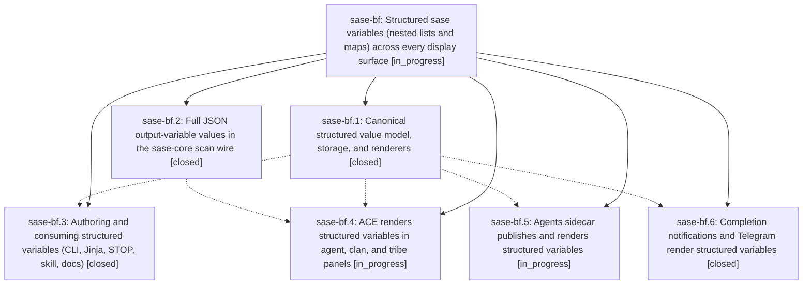

# Bead: sase-bf — Structured sase variables (nested lists and maps) across every display surface

[Bead Pages](../README.md) / sase-bf

**Status:** ◐ in_progress · **Type:** plan · **Tier:** epic
**Owner:** `bryanbugyi34@gmail.com` · **Assignee:** `sase-bf.land`
**Created:** 2026-07-30 21:00:14 UTC
**Plan:** [202607/structured\_sase\_variables.md](https://github.com/sase-org/sase--plans/blob/main/202607/structured_sase_variables.md)

## Description

A sase variable holds any JSON value — string, number, boolean, null, list, or map — nested arbitrarily, with one canonical validation model and one canonical renderer so ACE, the agents sidecar, Telegram, notifications, and the CLI all display structured values identically and beautifully.

## Phases

| Bead | Title | Status | Size | Agents | Commits |
|---|---|---|---|---:|---:|
| [sase-bf.1](sase-bf.1.md) | Canonical structured value model, storage, and renderers | ✓ closed | medium | 1 | 1 |
| [sase-bf.2](sase-bf.2.md) | Full JSON output-variable values in the sase-core scan wire | ✓ closed | medium | 1 | 2 |
| [sase-bf.3](sase-bf.3.md) | Authoring and consuming structured variables (CLI, Jinja, STOP, skill, docs) | ✓ closed | medium | 1 | 1 |
| [sase-bf.4](sase-bf.4.md) | ACE renders structured variables in agent, clan, and tribe panels | ◐ in_progress | medium | 1 | 0 |
| [sase-bf.5](sase-bf.5.md) | Agents sidecar publishes and renders structured variables | ◐ in_progress | medium | 1 | 0 |
| [sase-bf.6](sase-bf.6.md) | Completion notifications and Telegram render structured variables | ✓ closed | medium | 1 | 2 |

## Lineage

## Agents

| Agent | Bead | Commits |
|---|---|---:|
| [bbugyi200.athena.sase-bf.1](https://github.com/sase-org/sase--agents/blob/main/agents/bbugyi200.athena.sase-bf.1/README.md) | [sase-bf.1](sase-bf.1.md) | 1 |
| [bbugyi200.athena.sase-bf.2](https://github.com/sase-org/sase--agents/blob/main/agents/bbugyi200.athena.sase-bf.2/README.md) | [sase-bf.2](sase-bf.2.md) | 2 |
| [bbugyi200.athena.sase-bf.3](https://github.com/sase-org/sase--agents/blob/main/agents/bbugyi200.athena.sase-bf.3/README.md) | [sase-bf.3](sase-bf.3.md) | 1 |
| [bbugyi200.athena.sase-bf.4](https://github.com/sase-org/sase--agents/blob/main/agents/bbugyi200.athena.sase-bf.4/README.md) | [sase-bf.4](sase-bf.4.md) | 0 |
| [bbugyi200.athena.sase-bf.5](https://github.com/sase-org/sase--agents/blob/main/agents/bbugyi200.athena.sase-bf.5/README.md) | [sase-bf.5](sase-bf.5.md) | 0 |
| [bbugyi200.athena.sase-bf.6](https://github.com/sase-org/sase--agents/blob/main/agents/bbugyi200.athena.sase-bf.6/README.md) | [sase-bf.6](sase-bf.6.md) | 2 |
| [bbugyi200.athena.sase-bf.land](https://github.com/sase-org/sase--agents/blob/main/agents/bbugyi200.athena.sase-bf.land/README.md) | [sase-bf](README.md) | 0 |

## Commits

| Repo | Commit | Subject | Bead | Committed (UTC) |
|---|---|---|---|---|
| sase-core | [`sase-core@b49a17a`](https://github.com/sase-org/sase-core/commit/b49a17a4b038902064e2922b67b569ec9a761f55) | feat(agent-scan)!: preserve bounded JSON output variables | [sase-bf.2](sase-bf.2.md) | 2026-07-30 21:09:51 |
| sase | [`3c7e588`](https://github.com/sase-org/sase/commit/3c7e5887c2fa1b7195ac51fbbfd7dc2f754bed77) | feat: add structured output variable values | [sase-bf.1](sase-bf.1.md) | 2026-07-30 21:24:39 |
| sase | [`2b95bd3`](https://github.com/sase-org/sase/commit/2b95bd329fb0a8fa1b666b1019fed154b6870b7f) | feat(agent-scan): preserve structured output variables | [sase-bf.2](sase-bf.2.md) | 2026-07-30 21:46:05 |
| sase | [`6f7c560`](https://github.com/sase-org/sase/commit/6f7c56043164900af7c80d2fd7899018434828de) | feat(var): support structured output variables | [sase-bf.3](sase-bf.3.md) | 2026-07-30 21:57:02 |
| sase | [`738f7ec`](https://github.com/sase-org/sase/commit/738f7ec30eb930ad507c47d2cc851b368acf74d4) | test(notifications): cover structured output variables | [sase-bf.6](sase-bf.6.md) | 2026-07-30 22:00:20 |
| sase-telegram | [`sase-telegram@72114b0`](https://github.com/sase-org/sase-telegram/commit/72114b0b213eb8ae7da636601ba35a2d1f4010b7) | feat: render structured output variables | [sase-bf.6](sase-bf.6.md) | 2026-07-30 22:10:11 |
