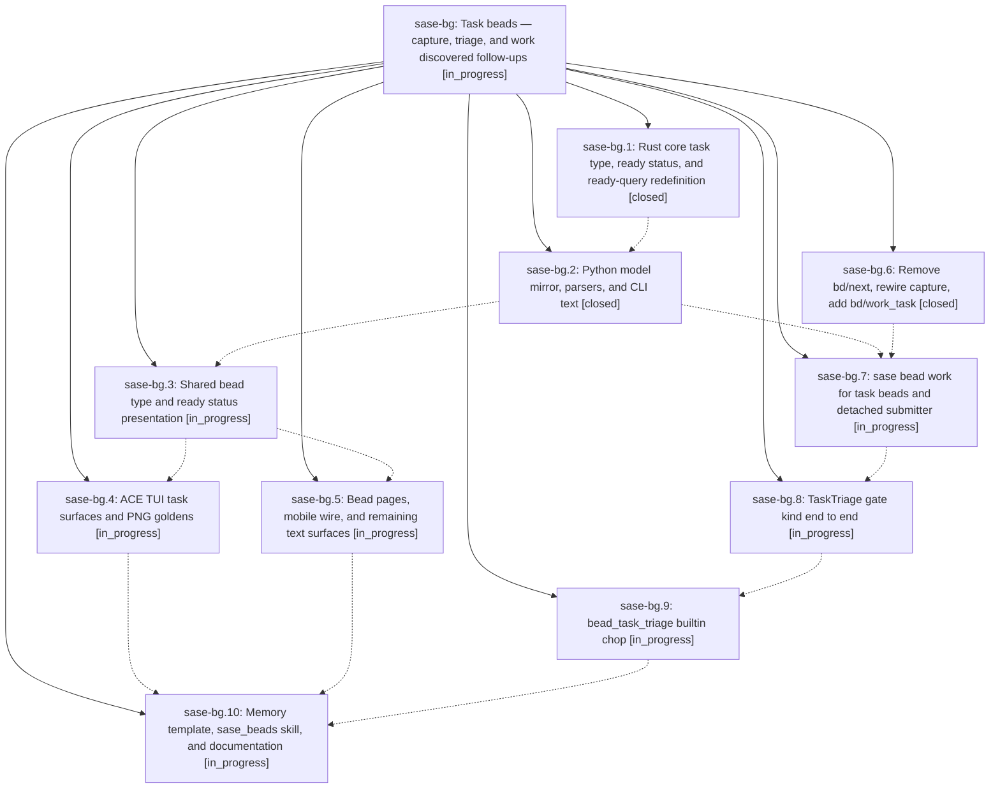

# Bead: sase-bg — Task beads — capture, triage, and work discovered follow-ups

[Bead Pages](../README.md) / sase-bg

**Status:** ◐ in_progress · **Type:** plan · **Tier:** epic
**Owner:** `bryanbugyi34@gmail.com` · **Assignee:** `sase-bg.land`
**Created:** 2026-07-30 22:55:14 UTC
**Plan:** [202607/task\_beads.md](https://github.com/sase-org/sase--plans/blob/main/202607/task_beads.md)

## Description

Discovered follow-up work has a first-class destination: phase agents record PROPOSED FOLLOW-UP notes, land agents file them as task beads and mark them ready, a builtin chop raises a per-bead triage gate whose default action launches a detached #bd/work_task agent, and the task type and ready status render beautifully on every bead surface.

## Phases

| Bead | Title | Status | Size | Agents | Commits |
|---|---|---|---|---:|---:|
| [sase-bg.1](sase-bg.1.md) | Rust core task type, ready status, and ready-query redefinition | ✓ closed | medium | 1 | 1 |
| [sase-bg.10](sase-bg.10.md) | Memory template, sase\_beads skill, and documentation | ◐ in_progress | medium | 1 | 0 |
| [sase-bg.2](sase-bg.2.md) | Python model mirror, parsers, and CLI text | ✓ closed | medium | 1 | 1 |
| [sase-bg.3](sase-bg.3.md) | Shared bead type and ready status presentation | ◐ in_progress | small | 1 | 0 |
| [sase-bg.4](sase-bg.4.md) | ACE TUI task surfaces and PNG goldens | ◐ in_progress | large | 1 | 0 |
| [sase-bg.5](sase-bg.5.md) | Bead pages, mobile wire, and remaining text surfaces | ◐ in_progress | small | 1 | 0 |
| [sase-bg.6](sase-bg.6.md) | Remove bd/next, rewire capture, add bd/work\_task | ✓ closed | medium | 1 | 1 |
| [sase-bg.7](sase-bg.7.md) | sase bead work for task beads and detached submitter | ◐ in_progress | large | 1 | 0 |
| [sase-bg.8](sase-bg.8.md) | TaskTriage gate kind end to end | ◐ in_progress | large | 1 | 0 |
| [sase-bg.9](sase-bg.9.md) | bead\_task\_triage builtin chop | ◐ in_progress | medium | 1 | 0 |

## Lineage

## Agents

| Agent | Bead | Commits |
|---|---|---:|
| [bbugyi200.athena.sase-bg.1](https://github.com/sase-org/sase--agents/blob/main/agents/bbugyi200.athena.sase-bg.1/README.md) | [sase-bg.1](sase-bg.1.md) | 1 |
| [bbugyi200.athena.sase-bg.10](https://github.com/sase-org/sase--agents/blob/main/agents/bbugyi200.athena.sase-bg.10/README.md) | [sase-bg.10](sase-bg.10.md) | 0 |
| [bbugyi200.athena.sase-bg.2](https://github.com/sase-org/sase--agents/blob/main/agents/bbugyi200.athena.sase-bg.2/README.md) | [sase-bg.2](sase-bg.2.md) | 1 |
| [bbugyi200.athena.sase-bg.3](https://github.com/sase-org/sase--agents/blob/main/agents/bbugyi200.athena.sase-bg.3/README.md) | [sase-bg.3](sase-bg.3.md) | 0 |
| [bbugyi200.athena.sase-bg.4](https://github.com/sase-org/sase--agents/blob/main/agents/bbugyi200.athena.sase-bg.4/README.md) | [sase-bg.4](sase-bg.4.md) | 0 |
| [bbugyi200.athena.sase-bg.5](https://github.com/sase-org/sase--agents/blob/main/agents/bbugyi200.athena.sase-bg.5/README.md) | [sase-bg.5](sase-bg.5.md) | 0 |
| [bbugyi200.athena.sase-bg.6](https://github.com/sase-org/sase--agents/blob/main/agents/bbugyi200.athena.sase-bg.6/README.md) | [sase-bg.6](sase-bg.6.md) | 1 |
| [bbugyi200.athena.sase-bg.7](https://github.com/sase-org/sase--agents/blob/main/agents/bbugyi200.athena.sase-bg.7/README.md) | [sase-bg.7](sase-bg.7.md) | 0 |
| [bbugyi200.athena.sase-bg.8](https://github.com/sase-org/sase--agents/blob/main/agents/bbugyi200.athena.sase-bg.8/README.md) | [sase-bg.8](sase-bg.8.md) | 0 |
| [bbugyi200.athena.sase-bg.9](https://github.com/sase-org/sase--agents/blob/main/agents/bbugyi200.athena.sase-bg.9/README.md) | [sase-bg.9](sase-bg.9.md) | 0 |
| [bbugyi200.athena.sase-bg.land](https://github.com/sase-org/sase--agents/blob/main/agents/bbugyi200.athena.sase-bg.land/README.md) | [sase-bg](README.md) | 0 |

## Commits

| Repo | Commit | Subject | Bead | Committed (UTC) |
|---|---|---|---|---|
| sase | [`cf4088f`](https://github.com/sase-org/sase/commit/cf4088f751c30827fb016c17d3697bbc02fb6cdc) | feat!: replace bd/next with task bead workflow | [sase-bg.6](sase-bg.6.md) | 2026-07-30 23:11:54 |
| sase-core | [`sase-core@2e3ff72`](https://github.com/sase-org/sase-core/commit/2e3ff7293926aedac27af4fa5f471a7a93fc1884) | feat(bead)!: add task beads and ready workflow | [sase-bg.1](sase-bg.1.md) | 2026-07-30 23:13:22 |
| sase | [`d0da0d9`](https://github.com/sase-org/sase/commit/d0da0d94f9f4a8c748c68c390c9016ef881566b8) | feat(bead)!: mirror task readiness in Python | [sase-bg.2](sase-bg.2.md) | 2026-07-30 23:52:42 |
