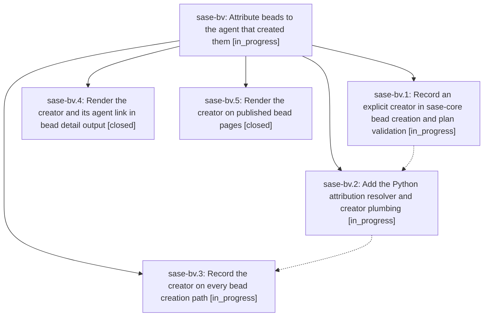

# Bead: sase-bv — Attribute beads to the agent that created them

[Bead Pages](../README.md) / sase-bv

**Status:** ◐ in_progress · **Type:** ▸ plan · **Tier:** epic
**Owner:** `bryanbugyi34@gmail.com` · **Created by:** `bryanbugyi34@gmail.com` · **Assignee:** `sase-bv.land`
**Created:** 2026-07-31 13:12:26 UTC
**Plan:** [202607/bead\_created\_by\_attribution.md](https://github.com/sase-org/sase--plans/blob/main/202607/bead_created_by_attribution.md)

## Description

Every newly created bead records the SASE agent responsible for it — epic and phase beads carry the agent that proposed the epic plan file, task beads carry the agent (or the human) that created them — and `sase bead show` plus the published bead page render that creator as a link to its `agents` sidecar page.

## Phases

| Bead | Title | Status | Size | Agents | Commits |
|---|---|---|---|---:|---:|
| [sase-bv.1](sase-bv.1.md) | Record an explicit creator in sase-core bead creation and plan validation | ◐ in_progress | medium | 1 | 0 |
| [sase-bv.2](sase-bv.2.md) | Add the Python attribution resolver and creator plumbing | ◐ in_progress | small | 1 | 0 |
| [sase-bv.3](sase-bv.3.md) | Record the creator on every bead creation path | ◐ in_progress | medium | 1 | 0 |
| [sase-bv.4](sase-bv.4.md) | Render the creator and its agent link in bead detail output | ✓ closed | medium | 1 | 1 |
| [sase-bv.5](sase-bv.5.md) | Render the creator on published bead pages | ✓ closed | small | 1 | 1 |

## Lineage

## Agents

| Agent | Bead | Commits |
|---|---|---:|
| [bbugyi200.athena.sase-bv.1](https://github.com/sase-org/sase--agents/blob/main/agents/bbugyi200.athena.sase-bv.1/README.md) | [sase-bv.1](sase-bv.1.md) | 0 |
| [bbugyi200.athena.sase-bv.2](https://github.com/sase-org/sase--agents/blob/main/agents/bbugyi200.athena.sase-bv.2/README.md) | [sase-bv.2](sase-bv.2.md) | 0 |
| [bbugyi200.athena.sase-bv.3](https://github.com/sase-org/sase--agents/blob/main/agents/bbugyi200.athena.sase-bv.3/README.md) | [sase-bv.3](sase-bv.3.md) | 0 |
| [bbugyi200.athena.sase-bv.4](https://github.com/sase-org/sase--agents/blob/main/agents/bbugyi200.athena.sase-bv.4/README.md) | [sase-bv.4](sase-bv.4.md) | 1 |
| [bbugyi200.athena.sase-bv.5](https://github.com/sase-org/sase--agents/blob/main/agents/bbugyi200.athena.sase-bv.5/README.md) | [sase-bv.5](sase-bv.5.md) | 1 |
| [bbugyi200.athena.sase-bv.land](https://github.com/sase-org/sase--agents/blob/main/agents/bbugyi200.athena.sase-bv.land/README.md) | [sase-bv](README.md) | 0 |

## Commits

| Repo | Commit | Subject | Bead | Committed (UTC) |
|---|---|---|---|---|
| sase | [`3b08766`](https://github.com/sase-org/sase/commit/3b087669e066c5552adf0154d2d202be45565045) | feat(bead-pages): render bead creators | [sase-bv.5](sase-bv.5.md) | 2026-07-31 13:26:22 |
| sase | [`2c15257`](https://github.com/sase-org/sase/commit/2c152578537e50209de8b6e750d4d179182a5e44) | feat(beads): show creator attribution links | [sase-bv.4](sase-bv.4.md) | 2026-07-31 13:39:42 |
