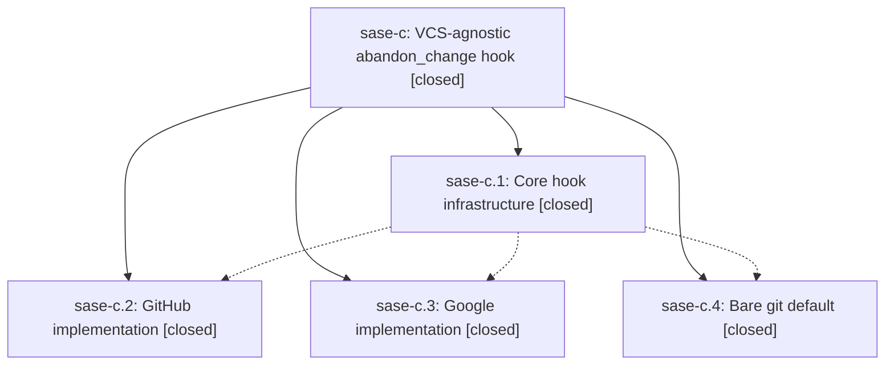

# Bead: sase-c — VCS-agnostic abandon\_change hook

[Bead Pages](../README.md) / sase-c

**Status:** ✓ closed · **Resolution:** (unrecorded) · **Type:** plan · **Tier:** epic
**Owner:** `bryanbugyi34@gmail.com`
**Created:** 2026-03-25 23:09:01 UTC · **Closed:** 2026-03-25 23:33:04 UTC
**Plan:** [202603/vcs\_abandon\_change.md](https://github.com/sase-org/sase--plans/blob/main/202603/vcs_abandon_change.md)

## Phases

| Bead | Title | Status | Size | Agents | Commits |
|---|---|---|---|---:|---:|
| [sase-c.1](sase-c.1.md) | Core hook infrastructure | ✓ closed | small | 0 | 1 |
| [sase-c.2](sase-c.2.md) | GitHub implementation | ✓ closed | small | 0 | 0 |
| [sase-c.3](sase-c.3.md) | Google implementation | ✓ closed | small | 0 | 0 |
| [sase-c.4](sase-c.4.md) | Bare git default | ✓ closed | small | 0 | 0 |

## Lineage

## Commits

| Commit | Subject | Bead | Committed (UTC) |
|---|---|---|---|
| [`ee3eaca`](https://github.com/sase-org/sase/commit/ee3eacae1ad1547376af509bf8d37b2504735dc7) | feat: Add vcs\_abandon\_change hook infrastructure for closing remote changes during revert/archive (sase-c.1) | [sase-c.1](sase-c.1.md) | 2026-03-25 23:19:14 |
