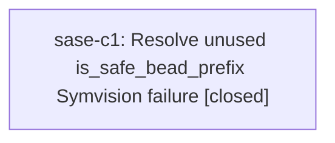

# Bead: sase-c1 — Resolve unused is\_safe\_bead\_prefix Symvision failure

[Bead Pages](../README.md) / sase-c1

**Status:** ✓ closed · **Resolution:** done · **Type:** ◆ task
**Owner:** `bryanbugyi34@gmail.com` · **Created by:** `bryanbugyi34@gmail.com` · **Assignee:** `sase-c1`
**Created:** 2026-07-31 13:39:32 UTC · **Closed:** 2026-07-31 14:12:02 UTC

## Description

Discovered while running just check for sase-bp. Symvision reports unused public function is_safe_bead_prefix in src/sase/bead/prefix_policy.py. The file is untouched by sase-bp; decide whether to remove the function, make it private, or add the intended caller, then rerun just check.

## Notes

[2026-07-31T14:12:02Z · sase-c1] Made the module-only is_safe_bead_prefix helper private and updated its three production callers plus focused test. Verified just _lint-symvision passes, all 14 prefix-policy tests pass, and just check clears formatting, Ruff, mypy, Symvision, size, SASE, and committed-plan validation. The full test stage reached 24,779 passes and failed only in unrelated existing work: 53 visual snapshots tracked by ready beads sase-c5 and sase-c6, Spark label casing already completed by sase-bo, and proposed_by schema expectations owned by active phase sase-bv.2.

## Lineage

## Agents

| Agent | Bead | Commits |
|---|---|---:|
| [bbugyi200.athena.sase-c1](https://github.com/sase-org/sase--agents/blob/main/agents/bbugyi200.athena.sase-c1/README.md) | [sase-c1](README.md) | 1 |

## Commits

| Repo | Commit | Subject | Bead | Committed (UTC) |
|---|---|---|---|---|
| sase | [`02e8d91`](https://github.com/sase-org/sase/commit/02e8d914c2a57815319578bfe6a4280cfc9c28d8) | refactor(bead): privatize prefix safety helper | [sase-c1](README.md) | 2026-07-31 14:13:38 |
