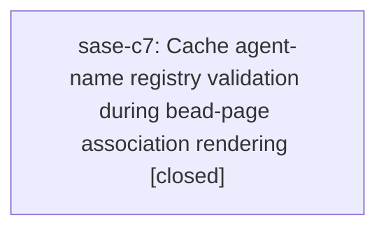

# Bead: sase-c7 — Cache agent-name registry validation during bead-page association rendering

[Bead Pages](../README.md) / sase-c7

**Status:** ✓ closed · **Resolution:** done · **Type:** ◆ task
**Owner:** `bryanbugyi34@gmail.com` · **Created by:** `bryanbugyi34@gmail.com` · **Assignee:** `sase-c7` · **Size:** medium
**Created:** 2026-07-31 14:03:08 UTC · **Closed:** 2026-07-31 14:38:24 UTC

## Description

This is a duplicate of the performance proposal from the four closed phase beads: publish bead-page associations repeatedly reloads registry family state through lane_ref_for_lane_name() -> get_reserved_family_names() for each association and recomputes _source_signature() each time. Host resolver should cache/bound-load registry state per publication build, with regression/performance coverage.

## Notes

[2026-07-31T14:38:24Z · sase-c7] Added a build-scoped reserved-family-name snapshot to HostedLinkResolver and refresh it once per bead association build, while preserving refreshes between builds and best-effort fallback behavior. Verified 60 focused lane/hosted-link/association/publication tests pass; the final three regression and commit-workflow checkpoint tests pass with association link building at 0.08s and the wrapper call at 0.02s; git diff --check, formatting, Ruff, mypy, pyscripts, changelog, toobig, SASE validation, and committed-plan validation pass. Full suite reached 24,803 passed and 7 skipped; its 53 unrelated visual failures are tracked by sase-c5 and the remaining stale proposed_by expectation was handled by sase-bv.2. The unrelated Symvision prefix failure encountered before tests was tracked by sase-c1.

[2026-07-31T14:39:24Z · sase-c7] Verified the focused association and hosted-link regressions pass (60 tests), the final three targeted regressions pass, and close/publication completed in 19.2 seconds; full checks were blocked only by already-tracked unrelated baseline failures.

## Lineage

## Agents

| Agent | Bead | Commits |
|---|---|---:|
| [bbugyi200.athena.sase-c7](https://github.com/sase-org/sase--agents/blob/main/agents/bbugyi200.athena.sase-c7/README.md) | [sase-c7](README.md) | 1 |

## Commits

| Repo | Commit | Subject | Bead | Committed (UTC) |
|---|---|---|---|---|
| sase | [`c82eff9`](https://github.com/sase-org/sase/commit/c82eff9a0234d037c8057c96e41fa9af1b530f28) | perf: snapshot agent registry during association builds | [sase-c7](README.md) | 2026-07-31 14:40:11 |
