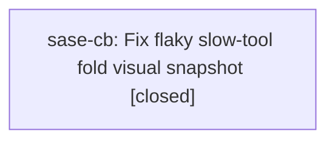

# Bead: sase-cb — Fix flaky slow-tool fold visual snapshot

[Bead Pages](../README.md) / sase-cb

**Status:** ✓ closed · **Resolution:** done · **Type:** ◆ task
**Owner:** `bryanbugyi34@gmail.com` · **Created by:** `bryanbugyi34@gmail.com` · **Assignee:** `sase-cb`
**Created:** 2026-07-31 14:53:43 UTC · **Closed:** 2026-07-31 15:47:08 UTC

## Description

The full parallel just check run failed tests/ace/tui/visual/test_ace_png_snapshots_agents_slow_tools.py::test_agents_slow_tool_calls_fold_levels_png_snapshots after 24,874 passes. The exact test passed immediately when rerun through just test-visual, indicating a contention/order-dependent visual flake unrelated to the LLM registry refactor. Investigate convergence or shared-state isolation under the default four-worker full suite.

## Notes

[2026-07-31T15:47:08Z · sase-cb] Stabilized the slow-tool fold visual fixture by priming its tool-source cache before ACE mounts, waiting for the loaded tools footer, and converging each call-after-refresh section-navigation retry before issuing another key. Verified the targeted four-worker PNG snapshot, 10 additional four-worker reruns, and the full just check default four-worker lane.

[2026-07-31T15:48:13Z · sase-cb] Post-completion verification: targeted four-worker PNG snapshot passed, 10 additional four-worker reruns passed, and full just check passed with the default four-worker test lane.

## Lineage

## Agents

| Agent | Bead | Commits |
|---|---|---:|
| [bbugyi200.athena.sase-cb](https://github.com/sase-org/sase--agents/blob/main/agents/bbugyi200.athena.sase-cb/README.md) | [sase-cb](README.md) | 1 |

## Commits

| Repo | Commit | Subject | Bead | Committed (UTC) |
|---|---|---|---|---|
| sase | [`e9ae2db`](https://github.com/sase-org/sase/commit/e9ae2dbacd07a438f11fcb6980c32e2bf1efd311) | test: stabilize slow-tool fold visual snapshot | [sase-cb](README.md) | 2026-07-31 15:48:41 |
