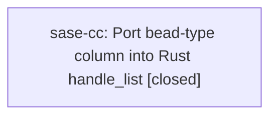

# Bead: sase-cc — Port bead-type column into Rust handle\_list

[Bead Pages](../README.md) / sase-cc

**Status:** ✓ closed · **Resolution:** done · **Type:** ◆ task
**Owner:** `bryanbugyi34@gmail.com` · **Created by:** `bryanbugyi34@gmail.com` · **Assignee:** `sase-cc`
**Created:** 2026-07-31 15:08:58 UTC · **Closed:** 2026-08-01 12:16:59 UTC

## Description

sase bead list compact rendering now shows a glyph-only type column (see plans sase/repos/plans/202607/bead_list_type_indicator.md and sase/repos/plans/202607/bead_list_glyph_only.md).
Python's _render_list_compact in src/sase/bead/cli_query.py is the only live implementation --
src/sase/main/bead_fast_path.py hard-defers `list` to argparse, so the Rust core's near-duplicate
handle_list (crates/sase_core/src/bead/cli.rs) still emits the old grammar and is dormant/unreachable today.

Follow-up: port the new `{type_glyph}<pad> {status_glyph} {id} · {title}{ ← parent_id}` grammar into Rust's
handle_list, and align Rust's duplicated status_icon/ANSI helpers with the shared Python presentation modules
(src/sase/bead_type_presentation.py, src/sase/bead_status_presentation.py) so the two stop drifting apart. Do this
before ever widening the fast path to include `list`, or the port will silently regress the feature.

## Notes

[2026-08-01T12:16:59Z · sase-cc] Ported Rust handle_list to the glyph-only type/status/id compact grammar with measured terminal-cell alignment, Python-parity type/status ANSI metadata, color handling, and focused regression coverage. Verified cargo fmt --all -- --check, cargo clippy --workspace --all-targets -- -D warnings, cargo test --workspace (including 1,156 sase_core tests plus binding/gateway/LSP/integration/doc suites), just install, and tests/main/test_bead_fast_path.py (15 passed). just check passed all format/lint stages but stopped at unrelated stale generated sase_gate copies (ready follow-up sase-d2). Independent just test completed 25,078 passes and exposed two deterministic stale SDD fixtures (sase-d3), one serially-passing xdist TUI flake (sase-d4), and an unmanaged opencode temp leak (sase-d5); all were kept out of this bead's scope.

[2026-08-01T12:18:56Z · sase-cc] Ported Rust handle_list to the glyph-only type/status/id compact grammar with measured terminal-cell alignment, Python-parity type/status ANSI metadata, color handling, and focused regression coverage. Verified cargo fmt --all -- --check, cargo clippy --workspace --all-targets -- -D warnings, cargo test --workspace (including 1,156 sase_core tests plus binding/gateway/LSP/integration/doc suites), just install, and tests/main/test_bead_fast_path.py (15 passed). just check passed all format/lint stages but stopped at unrelated stale generated sase_gate copies (ready follow-up sase-d2). Independent just test completed 25,078 passes and exposed two deterministic stale SDD fixtures (sase-d3), one serially-passing xdist TUI flake (sase-d4), and an unmanaged opencode temp leak (sase-d5); all were kept out of this bead's scope.

## Lineage

## Agents

| Agent | Bead | Commits |
|---|---|---:|
| [bbugyi200.athena.sase-cc](https://github.com/sase-org/sase--agents/blob/main/agents/bbugyi200.athena.sase-cc/README.md) | [sase-cc](README.md) | 2 |

## Commits

| Repo | Commit | Subject | Bead | Committed (UTC) |
|---|---|---|---|---|
| sase-core | [`sase-core@f6803eb`](https://github.com/sase-org/sase-core/commit/f6803ebc747eac6fd3237a5b1aa7895afa851d3c) | feat(bead): align Rust compact list presentation | [sase-cc](README.md) | 2026-08-01 12:19:42 |
| sase | [`21dab89`](https://github.com/sase-org/sase/commit/21dab89e667ad97aa6a11a7f20821b248fe1ab36) | test(bead): update compact list parity rationale | [sase-cc](README.md) | 2026-08-01 12:20:22 |
