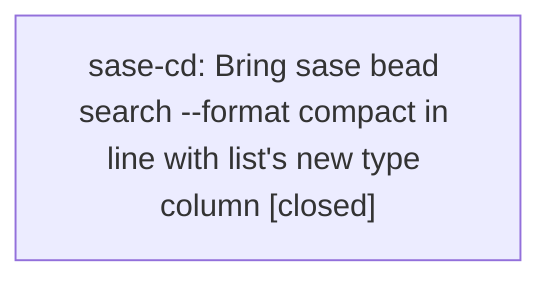

# Bead: sase-cd — Bring sase bead search --format compact in line with list's new type column

[Bead Pages](../README.md) / sase-cd

**Status:** ✓ closed · **Resolution:** done · **Type:** ◆ task
**Owner:** `bryanbugyi34@gmail.com` · **Created by:** `bryanbugyi34@gmail.com` · **Assignee:** `sase-cd`
**Created:** 2026-07-31 15:09:09 UTC · **Closed:** 2026-08-01 12:51:53 UTC

## Description

sase bead list's compact rendering now leads each row with an aligned, colored, glyph-only type indicator (see plans
sase/repos/plans/202607/bead_list_type_indicator.md and sase/repos/plans/202607/bead_list_glyph_only.md). `sase bead search --format compact` was left out of that
change on purpose: it is Rust-owned (crates/sase_core/src/bead/cli.rs render_search_compact); Python's
_render_search_compact in src/sase/bead/cli_query.py is only a fallback, so the change would have needed a
cross-repo edit to land the CLI-only tale cleanly.

Follow-up: add the same glyph-only type column to Rust's render_search_compact (and to the Python fallback) so
`sase bead search --format compact` and `sase bead list` stay visually consistent.

## Notes

[2026-08-01T12:51:53Z · sase-cd] Added the aligned, colored, glyph-only bead-type column to Rust render_search_compact and the Python fallback, reusing the shared measured-width/type-color helpers. Verified 10/10 Python compact-search tests, 4/4 focused Rust compact-search tests, the full sase_core suite (1,157 unit tests plus all parity suites), cargo fmt, Clippy with warnings denied, git diff checks, and live workspace CLI output in color=never/always modes. Main just check passed every lint/validation gate and 25,133 tests; its three unrelated persistent baseline failures are already handled by closed fix sase-d0 and the active Config Center snapshot work previously tracked as sase-d8.

[2026-08-01T12:52:30Z · sase-cd] Implemented the aligned colored glyph-only type column in Rust compact search and the Python fallback. Verified 10 Python search tests, 4 focused Rust tests, the full 1,157-test Rust suite plus parity suites, cargo fmt, Clippy, diff checks, and live color never/always CLI output. Main just check passed all lint and validation gates and 25,133 tests; its three unrelated baseline failures are already handled by sase-d0 and the active Config Center snapshot work.

[2026-08-01T12:53:53Z · sase-cd] Verified aligned and colored type-glyph prefixes in Rust and Python search renderers; focused Python and Rust tests, Rust format/Clippy/full suite, and the workspace live CLI path passed. Full SASE check reached 25,133 passing tests with three unrelated baseline failures already tracked elsewhere.

## Lineage

## Agents

| Agent | Bead | Commits |
|---|---|---:|
| [bbugyi200.athena.sase-cd](https://github.com/sase-org/sase--agents/blob/main/agents/bbugyi200.athena.sase-cd/README.md) | [sase-cd](README.md) | 1 |

## Commits

| Repo | Commit | Subject | Bead | Committed (UTC) |
|---|---|---|---|---|
| sase-core | [`sase-core@15630de`](https://github.com/sase-org/sase-core/commit/15630dec07a434c27d84e2a2877736a6b869dfd7) | fix(bead): align compact search type column | [sase-cd](README.md) | 2026-08-01 12:54:57 |
