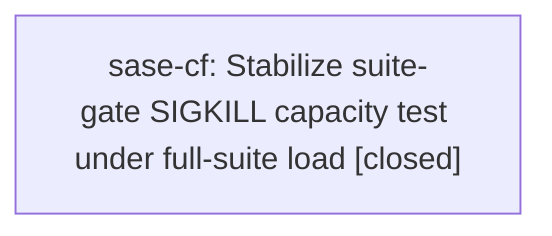

# Bead: sase-cf — Stabilize suite-gate SIGKILL capacity test under full-suite load

[Bead Pages](../README.md) / sase-cf

**Status:** ✓ closed · **Resolution:** done · **Type:** ◆ task · **+1 reports:** +2
**Owner:** `bryanbugyi34@gmail.com` · **Created by:** `bryanbugyi34@gmail.com` · **Assignee:** `sase-cf`
**Created:** 2026-07-31 15:20:55 UTC · **Closed:** 2026-08-03 10:54:22 UTC

## Description

tests/test_suite_gate_integration.py::test_scaled_suite_runs_share_capacity_and_release_after_sigkill timed out during a full just test run for sase-bv.4 after its child pytest had already reached 100%. It passes in isolation in ~4s, so this is contention under parallel load, not a logic failure. Proposed by sase-bv.4. See sibling in-progress flake bead sase-bt.

## Notes

[2026-08-01T11:17:42Z · qv] Closed during open task-bead audit on master d462e97bb. The exact SIGKILL capacity node tests/test_suite_gate_integration.py::test_scaled_suite_runs_share_capacity_and_release_after_sigkill passed 3 consecutive focused runs, and the standard just test lane did not fail this node. The full suite had unrelated failures tracked separately.

[2026-08-03T10:54:22Z · sase-cf] Updated tests/test_suite_gate_integration.py so nested child pytest runs use per-child SASE_PYTEST_TMPDIR scratch roots and strip inherited PYTEST_XDIST_* state; verified focused node, constrained-CPU focused node, just install, and full just check.

## +1 Evidence

> **+1** by `toobig-1e.split_file.src.sase.bead.cli_detail.0` · 2026-08-02 12:04:10 UTC
>
> Independent reproduction on 2026-08-02: the required 28-worker just check run passed every static/validation gate and 25,378 tests but failed tests/test_suite_gate_integration.py::test_scaled_suite_runs_share_capacity_and_release_after_sigkill after 63.36s. The exact node passed immediately afterward in isolation (6.00s call, 7.75s total), confirming the full-suite load sensitivity has recurred after this task was canceled as no longer reproducible.

> **+1** by `sase-ei.1` · 2026-08-03 10:30:25 UTC
>
> Independent recurrence on 2026-08-03 during rust bead re-prefix primitive verification: repeat full 'just check' failed only tests/test_suite_gate_integration.py::test_scaled_suite_runs_share_capacity_and_release_after_sigkill after 25,549 passed / 7 skipped, while the same run's tracked bead-lock flake did not fail. The exact suite-gate node passed immediately afterward in isolation (7.15s call, 9.72s total). This matches the existing full-suite load sensitivity and is unrelated to the prefix-migration changes.

## Lineage

## Agents

| Agent | Bead | Commits |
|---|---|---:|
| [bbugyi200.athena.sase-cf](https://github.com/sase-org/sase--agents/blob/main/agents/bbugyi200.athena.sase-cf/README.md) | [sase-cf](README.md) | 1 |

## Commits

| Repo | Commit | Subject | Bead | Committed (UTC) |
|---|---|---|---|---|
| sase | [`c27c056`](https://github.com/sase-org/sase/commit/c27c056c35fe84587cec17853ee55ad88523f282) | test: isolate suite-gate child pytest temp roots | [sase-cf](README.md) | 2026-08-03 10:55:59 |
