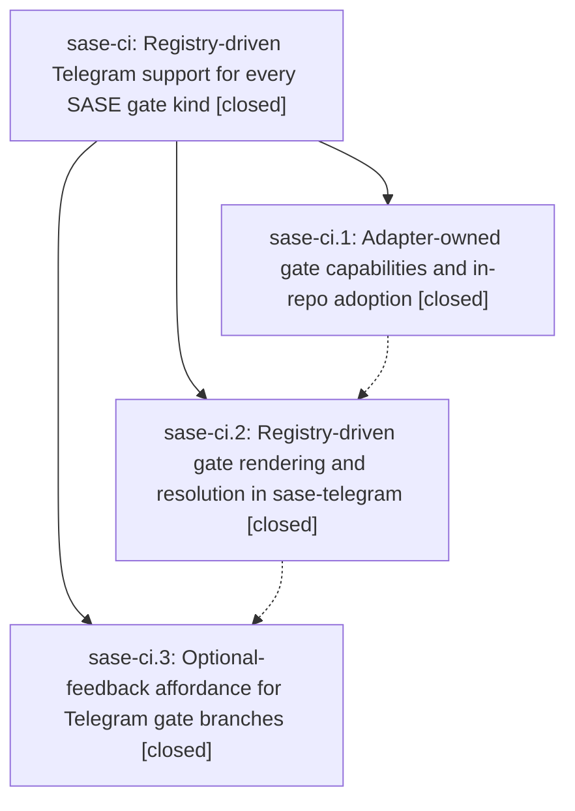

# Bead: sase-ci — Registry-driven Telegram support for every SASE gate kind

[Bead Pages](../README.md) / sase-ci

**Status:** ✓ closed · **Resolution:** done · **Type:** ▸ plan · **Tier:** epic
**Owner:** `bryanbugyi34@gmail.com` · **Created by:** [bbugyi200.athena.qh](https://github.com/sase-org/sase--agents/blob/main/agents/bbugyi200.athena.qh/README.md) · **Assignee:** `sase-ci.land`
**Created:** 2026-07-31 16:13:10 UTC · **Closed:** 2026-07-31 17:01:03 UTC
**Plan:** [202607/telegram\_generic\_gate\_support.md](https://github.com/sase-org/sase--plans/blob/main/202607/telegram_generic_gate_support.md)

## Description

Telegram renders and resolves every registered notification-gate kind — including TaskTriage and any kind added later — from the shared gate adapter registry, with the full option keyboard, command execution, and feedback contract that ACE already provides.

## Notes

[2026-07-31T17:01:03Z · sase-ci.land] Verified all three child beads are closed with resolution done, read every note and full note history with no lost revisions, audited the linked epic plan plus commits 6e5b36028, c3e6d16, and 0e73e3a against current source, and confirmed adapter-owned capabilities, registry-driven ACE/Telegram routing, end-to-end TaskTriage handling, inline previews, attachments, pending tracking, command execution, required feedback, and optional-feedback controls are implemented. Reviewed post-start commits 277c3c1 in sase and b217dfa in sase-telegram; the former only splits unrelated plan-command tests and the latter releases registry-driven gates as v0.4.4, so neither required integration changes. Fresh verification: sase lint and symvision stages passed; full sase tests passed 24,920 with 7 skipped; sase-telegram Ruff, mypy, and all 511 tests passed after applying its CI local-sase setup. Follow-ups: stale generated sase_beads provider skills were not refiled because ready task sase-ch already tracks them; the reciprocal plan/prompt link was not filed because it was repaired during landing and plan-links validation now passes; the fresh-install dependency mismatch was filed as ready task sase-cj.

[2026-07-31T17:02:28Z · sase-ci.land] Post-close integration recheck: upstream commit 9ca01b785 arrived during landing and only splits existing plan-approval response tests into helper/archive/epic modules; it changes no gate registry, ACE gate dispatch, Telegram integration, or feature behavior, so no additional integration change is needed.

[2026-07-31T17:03:45Z · sase-ci.land] Verified all child notes and epic commits against current source; core and Telegram test suites passed, interleaved changes introduced no conflicts or duplication, the worthwhile dependency follow-up was filed as sase-cj, existing sase-ch covers generated-skill drift, post-close Symvision passed, and the linked plan was finalized.

## Phases

| Bead | Title | Status | Size | Agents | Commits |
|---|---|---|---|---:|---:|
| [sase-ci.1](sase-ci.1.md) | Adapter-owned gate capabilities and in-repo adoption | ✓ closed | medium | 1 | 1 |
| [sase-ci.2](sase-ci.2.md) | Registry-driven gate rendering and resolution in sase-telegram | ✓ closed | medium | 1 | 1 |
| [sase-ci.3](sase-ci.3.md) | Optional-feedback affordance for Telegram gate branches | ✓ closed | small | 1 | 1 |

## Lineage

## Agents

| Agent | Bead | Commits |
|---|---|---:|
| [bbugyi200.athena.sase-ci.1](https://github.com/sase-org/sase--agents/blob/main/agents/bbugyi200.athena.sase-ci.1/README.md) | [sase-ci.1](sase-ci.1.md) | 1 |
| [bbugyi200.athena.sase-ci.2](https://github.com/sase-org/sase--agents/blob/main/agents/bbugyi200.athena.sase-ci.2/README.md) | [sase-ci.2](sase-ci.2.md) | 1 |
| [bbugyi200.athena.sase-ci.3](https://github.com/sase-org/sase--agents/blob/main/agents/bbugyi200.athena.sase-ci.3/README.md) | [sase-ci.3](sase-ci.3.md) | 1 |
| [bbugyi200.athena.sase-ci.land](https://github.com/sase-org/sase--agents/blob/main/agents/bbugyi200.athena.sase-ci.land/README.md) | [sase-ci](README.md) | 1 |

## Commits

| Repo | Commit | Subject | Bead | Committed (UTC) |
|---|---|---|---|---|
| sase | [`6e5b360`](https://github.com/sase-org/sase/commit/6e5b36028a879f2f86d2678d7d07dde30970ebef) | feat: derive gate behavior from adapter capabilities | [sase-ci.1](sase-ci.1.md) | 2026-07-31 16:28:17 |
| sase-telegram | [`sase-telegram@c3e6d16`](https://github.com/sase-org/sase-telegram/commit/c3e6d16ab342de959478f2e894ad105b56ba688e) | feat: drive Telegram gates from adapter registry | [sase-ci.2](sase-ci.2.md) | 2026-07-31 16:38:49 |
| sase-telegram | [`sase-telegram@0e73e3a`](https://github.com/sase-org/sase-telegram/commit/0e73e3a926605a94a60a74b0ed4d1b85dfcee5f1) | feat: add optional-feedback button to Telegram gate keyboards | [sase-ci.3](sase-ci.3.md) | 2026-07-31 16:47:00 |
| sase--plans | [`sase--plans@7557d6f`](https://github.com/sase-org/sase--plans/commit/7557d6fcbcb381b6407023cae85f735c5254dc3a) | docs: finalize Telegram generic gate support plan | [sase-ci](README.md) | 2026-07-31 17:04:16 |
