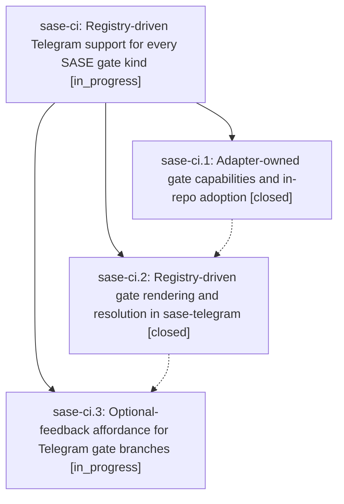

# Bead: sase-ci — Registry-driven Telegram support for every SASE gate kind

[Bead Pages](../README.md) / sase-ci

**Status:** ◐ in_progress · **Type:** ▸ plan · **Tier:** epic
**Owner:** `bryanbugyi34@gmail.com` · **Created by:** [bbugyi200.athena.qh](https://github.com/sase-org/sase--agents/blob/main/agents/bbugyi200.athena.qh/README.md) · **Assignee:** `sase-ci.land`
**Created:** 2026-07-31 16:13:10 UTC
**Plan:** [202607/telegram\_generic\_gate\_support.md](https://github.com/sase-org/sase--plans/blob/main/202607/telegram_generic_gate_support.md)

## Description

Telegram renders and resolves every registered notification-gate kind — including TaskTriage and any kind added later — from the shared gate adapter registry, with the full option keyboard, command execution, and feedback contract that ACE already provides.

## Phases

| Bead | Title | Status | Size | Agents | Commits |
|---|---|---|---|---:|---:|
| [sase-ci.1](sase-ci.1.md) | Adapter-owned gate capabilities and in-repo adoption | ✓ closed | medium | 1 | 1 |
| [sase-ci.2](sase-ci.2.md) | Registry-driven gate rendering and resolution in sase-telegram | ✓ closed | medium | 1 | 1 |
| [sase-ci.3](sase-ci.3.md) | Optional-feedback affordance for Telegram gate branches | ◐ in_progress | small | 1 | 0 |

## Lineage

## Agents

| Agent | Bead | Commits |
|---|---|---:|
| [bbugyi200.athena.sase-ci.1](https://github.com/sase-org/sase--agents/blob/main/agents/bbugyi200.athena.sase-ci.1/README.md) | [sase-ci.1](sase-ci.1.md) | 1 |
| [bbugyi200.athena.sase-ci.2](https://github.com/sase-org/sase--agents/blob/main/agents/bbugyi200.athena.sase-ci.2/README.md) | [sase-ci.2](sase-ci.2.md) | 1 |
| [bbugyi200.athena.sase-ci.3](https://github.com/sase-org/sase--agents/blob/main/agents/bbugyi200.athena.sase-ci.3/README.md) | [sase-ci.3](sase-ci.3.md) | 0 |
| [bbugyi200.athena.sase-ci.land](https://github.com/sase-org/sase--agents/blob/main/agents/bbugyi200.athena.sase-ci.land/README.md) | [sase-ci](README.md) | 0 |

## Commits

| Repo | Commit | Subject | Bead | Committed (UTC) |
|---|---|---|---|---|
| sase | [`6e5b360`](https://github.com/sase-org/sase/commit/6e5b36028a879f2f86d2678d7d07dde30970ebef) | feat: derive gate behavior from adapter capabilities | [sase-ci.1](sase-ci.1.md) | 2026-07-31 16:28:17 |
| sase-telegram | [`sase-telegram@c3e6d16`](https://github.com/sase-org/sase-telegram/commit/c3e6d16ab342de959478f2e894ad105b56ba688e) | feat: drive Telegram gates from adapter registry | [sase-ci.2](sase-ci.2.md) | 2026-07-31 16:38:49 |
