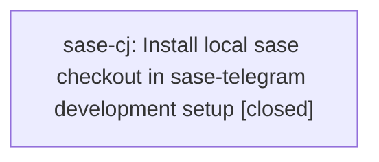

# Bead: sase-cj — Install local sase checkout in sase-telegram development setup

[Bead Pages](../README.md) / sase-cj

**Status:** ✓ closed · **Resolution:** done · **Type:** ◆ task · **+1 reports:** +1 · **↺ Reopened:** ↺2
**Owner:** `bryanbugyi34@gmail.com` · **Created by:** [bbugyi200.athena.sase-ci.land](https://github.com/sase-org/sase--agents/blob/main/agents/bbugyi200.athena.sase-ci.land/README.md) · **Assignee:** `sase-cj` · **Size:** large
**Created:** 2026-07-31 13:00:21 EDT · **Closed:** 2026-08-10 09:51:49 EDT

## Previously Closed

> ↺ Closed 2026-08-10T13:15:04Z · done
>
> (none)
>
> Reopened 2026-08-10T13:17:04Z by a status update

> ↺ Closed 2026-08-01T11:53:25Z · canceled
>
> Let's punt on this.
>
> Reopened 2026-08-08T03:46:29Z by a +1 from @vm

## Description

Proposed by sase-ci.3 while landing epic sase-ci. A fresh sase-telegram just install installs PyPI sase==0.14.0, so current tests and mypy cannot see newly added APIs such as GateAdapter.branch_actionable/default_feedback and sase.bead.task_gate. Update the Justfile setup/install path to install the local sase source checkout in development, matching .github/workflows/ci.yml, and verify a fresh just install followed by just check passes.

## Notes

[2026-08-10T13:10:32Z · ww] TRIAGE VERIFICATION 2026-08-10: STILL REPRODUCES. Read the sase-telegram checkout at origin/master (opened via sase repo open): Justfile line 10 '_setup' and line 13 'install' both run 'uv pip install -e ".[dev]"', and pyproject.toml line 15 declares 'sase>=0.1.0' with no local/editable override, so a fresh install still resolves sase from PyPI rather than the local source checkout. Nothing in the Justfile points at a local sase workspace. Kept as a top-seven task in the 2026-08-10 backlog triage.

[2026-08-10T13:51:49Z · sase-cj] Verified just install, focused Justfile tests, and just check passed in sase-telegram; final just check reported 580 passed.

## +1 Evidence

> **+1** by `vm` · 2026-08-07 23:46:29 EDT
>
> Reproduced again 2026-08-07 while implementing sase/repos/plans/202608/fix_broken_bead_telegram_command.md. A fresh 'just install' in sase-telegram (workspace sase_16) still resolves sase>=0.1.0 to PyPI sase==0.16.0, which now lacks sase.notification_gates.input_collection (added in local sase HEAD commit 7bbd82a47). This is more severe than the original report: importing sase_telegram.scripts.sase_tg_inbound now raises ModuleNotFoundError unconditionally, so the ENTIRE tests/test_inbound.py suite (189 tests) fails to collect on a clean checkout, unrelated to any specific plugin change (verified via git stash). Worked around locally with 'uv pip install -e <local-sase-workspace> --no-deps' into sase-telegram's .venv to get tests running again; not a durable fix. The Justfile install/setup path still needs to point at the local sase source checkout for development, matching .github/workflows/ci.yml, per the original proposal.

## Lineage

## Agents

| Agent | Bead | Commits |
|---|---|---:|
| [bbugyi200.athena.sase-cj](https://github.com/sase-org/sase--agents/blob/main/families/bbugyi200.athena.sase-cj.md) | [sase-cj](README.md) | 1 |

## Commits

| Repo | Commit | Subject | Bead | Committed |
|---|---|---|---|---|
| sase-telegram | [`sase-telegram@d29f358`](https://github.com/sase-org/sase-telegram/commit/d29f3580b58b13fe7f0cfef9a861c79482e2eb17) | build: install local sase checkouts in development | [sase-cj](README.md) | 2026-08-10 09:52:32 EDT |
