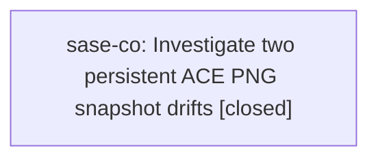

# Bead: sase-co — Investigate two persistent ACE PNG snapshot drifts

[Bead Pages](../README.md) / sase-co

**Status:** ✓ closed · **Resolution:** done · **Type:** ◆ task
**Owner:** `bryanbugyi34@gmail.com` · **Created by:** [bbugyi200.athena.sase-cn](https://github.com/sase-org/sase--agents/blob/main/agents/bbugyi200.athena.sase-cn/README.md) · **Assignee:** `sase-co` · **Size:** small
**Created:** 2026-07-31 18:57:02 UTC · **Closed:** 2026-07-31 19:16:09 UTC

## Description

Discovered while verifying sase-cn after a dependency-floor-only change. The full just check and an isolated rerun both fail: (1) tests/ace/tui/visual/test_ace_png_snapshots_models_panel_navigation.py::test_models_panel_builtin_selection_effort_step_png_snapshot — 1118 changed pixels, 1104 material; (2) tests/ace/tui/visual/test_ace_png_snapshots_notification_sent_at.py::test_notification_sent_at_png_snapshot — 830 changed pixels, 802 material. Reproduce with: just test-visual <both node IDs>. No presentation code or snapshot files changed in sase-cn. Inspect .pytest_cache/sase-visual artifacts, determine whether the rendering change is intentional or flaky, and update implementation/goldens only with evidence.

## Notes

[2026-07-31T19:16:09Z · sase-co] Root-caused both drifts to real (non-flaky) causes and fixed each.

(1) models_panel_builtin_effort_picker_120x40: golden rendered 'Append an effort to Gemini 3.5 Flash (High).'; actual renders 'Append an effort to gemini-3.6-flash-high.'. Fallout from fe397e363 (fix(llm): refresh Antigravity model catalog), which switched _TIER_TO_MODEL / llm_known_model_names from agy display names to stable slugs and updated the text tests but missed this PNG golden. Change is intentional -> regenerated the golden.

(2) notification_sent_at_120x40: diff was confined to an 8-char run in the attachment path line: golden '/var/tmp/sase-0eb6951e/pytest-of-bryan/pyte' vs actual '/var/tmp/sase-b41c1bce/...'. tools/run_pytest sets TMPDIR to /var/tmp/sase-<sha256(REPO_ROOT)[:8]>, so tmp_path renders a workspace-path-dependent hash into the snapshot; the golden could only ever pass in the workspace that generated it. Fixed the test rather than the golden: monkeypatched NotificationModal._shorten_path to a fixed display path so the pane renders deterministically while the real tmp_path file is still opened and previewed, then regenerated the golden.

Verified: both node IDs pass; full 'just test-visual' 393 passed / 1 skipped; full 'just test' 24965 passed / 7 skipped; just check lint+fmt all green. 'just check' still fails at the SASE validation step on pre-existing plan<->prompt link errors for 202607/sase_beads_memory.md, unrelated to this work — filed as sase-cq (ready).

## Lineage

## Agents

| Agent | Bead | Commits |
|---|---|---:|
| [bbugyi200.athena.sase-co](https://github.com/sase-org/sase--agents/blob/main/agents/bbugyi200.athena.sase-co/README.md) | [sase-co](README.md) | 1 |

## Commits

| Repo | Commit | Subject | Bead | Committed (UTC) |
|---|---|---|---|---|
| sase | [`7404e4a`](https://github.com/sase-org/sase/commit/7404e4ab1bb2c1e8f147651a0ae3bce9ade859c2) | test(visual): fix two stale ACE PNG snapshot goldens | [sase-co](README.md) | 2026-07-31 19:17:10 |
