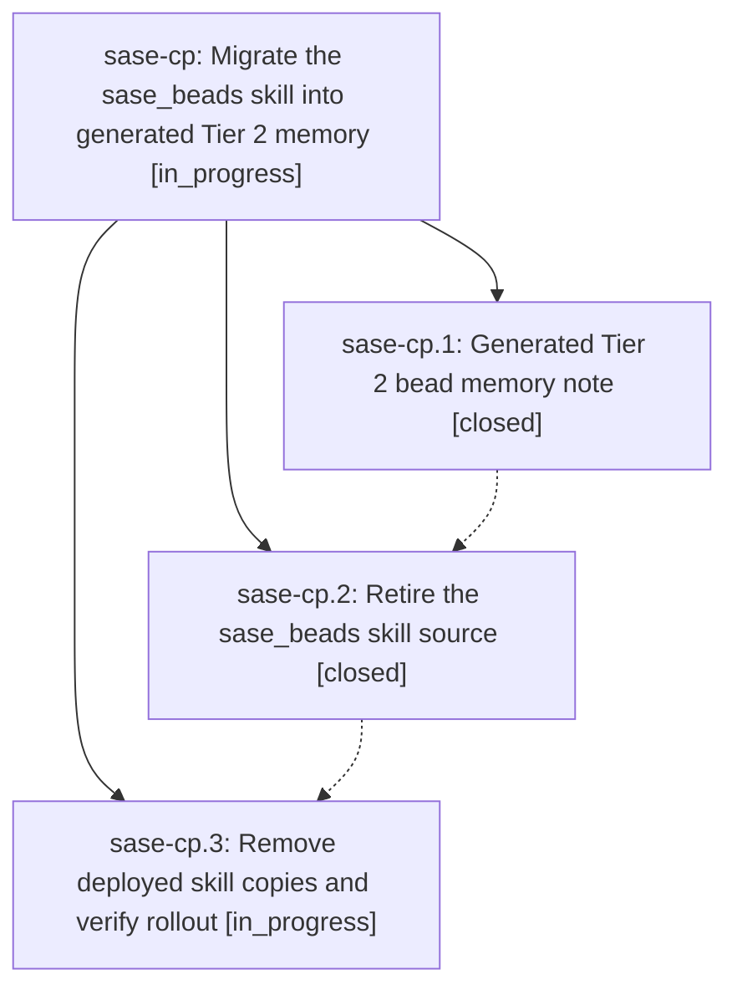

# Bead: sase-cp — Migrate the sase\_beads skill into generated Tier 2 memory

[Bead Pages](../README.md) / sase-cp

**Status:** ◐ in_progress · **Type:** ▸ plan · **Tier:** epic
**Owner:** `bryanbugyi34@gmail.com` · **Created by:** [bbugyi200.athena.qn](https://github.com/sase-org/sase--agents/blob/main/agents/bbugyi200.athena.qn/README.md) · **Assignee:** `sase-cp.land`
**Created:** 2026-07-31 19:00:51 UTC
**Plan:** [202607/sase\_beads\_memory.md](https://github.com/sase-org/sase--plans/blob/main/202607/sase_beads_memory.md)

## Description

`sase bead` guidance lives in a concise, auto-generated `sase/memory/sase_beads.md` long-term memory note that every sase-managed project and the home root receive automatically, and no copy of the `/sase_beads` skill remains in the sase repo, the chezmoi repo, or the home directory.

## Phases

| Bead | Title | Status | Size | Agents | Commits |
|---|---|---|---|---:|---:|
| [sase-cp.1](sase-cp.1.md) | Generated Tier 2 bead memory note | ✓ closed | medium | 1 | 1 |
| [sase-cp.2](sase-cp.2.md) | Retire the sase\_beads skill source | ✓ closed | small | 1 | 1 |
| [sase-cp.3](sase-cp.3.md) | Remove deployed skill copies and verify rollout | ◐ in_progress | small | 1 | 0 |

## Lineage

## Agents

| Agent | Bead | Commits |
|---|---|---:|
| [bbugyi200.athena.sase-cp.1](https://github.com/sase-org/sase--agents/blob/main/agents/bbugyi200.athena.sase-cp.1/README.md) | [sase-cp.1](sase-cp.1.md) | 1 |
| [bbugyi200.athena.sase-cp.2](https://github.com/sase-org/sase--agents/blob/main/agents/bbugyi200.athena.sase-cp.2/README.md) | [sase-cp.2](sase-cp.2.md) | 1 |
| [bbugyi200.athena.sase-cp.3](https://github.com/sase-org/sase--agents/blob/main/agents/bbugyi200.athena.sase-cp.3/README.md) | [sase-cp.3](sase-cp.3.md) | 0 |
| [bbugyi200.athena.sase-cp.land](https://github.com/sase-org/sase--agents/blob/main/agents/bbugyi200.athena.sase-cp.land/README.md) | [sase-cp](README.md) | 0 |

## Commits

| Repo | Commit | Subject | Bead | Committed (UTC) |
|---|---|---|---|---|
| sase | [`d6a2cce`](https://github.com/sase-org/sase/commit/d6a2cce1f0e7464aa36dd3e22b77b95e57bef298) | feat(memory): generate Tier 2 bead workflow note | [sase-cp.1](sase-cp.1.md) | 2026-07-31 19:25:30 |
| sase | [`642b4f4`](https://github.com/sase-org/sase/commit/642b4f490b302311ce5b737ac76d3720f4404f01) | feat(memory): retire bundled sase\_beads skill source | [sase-cp.2](sase-cp.2.md) | 2026-07-31 19:43:03 |
